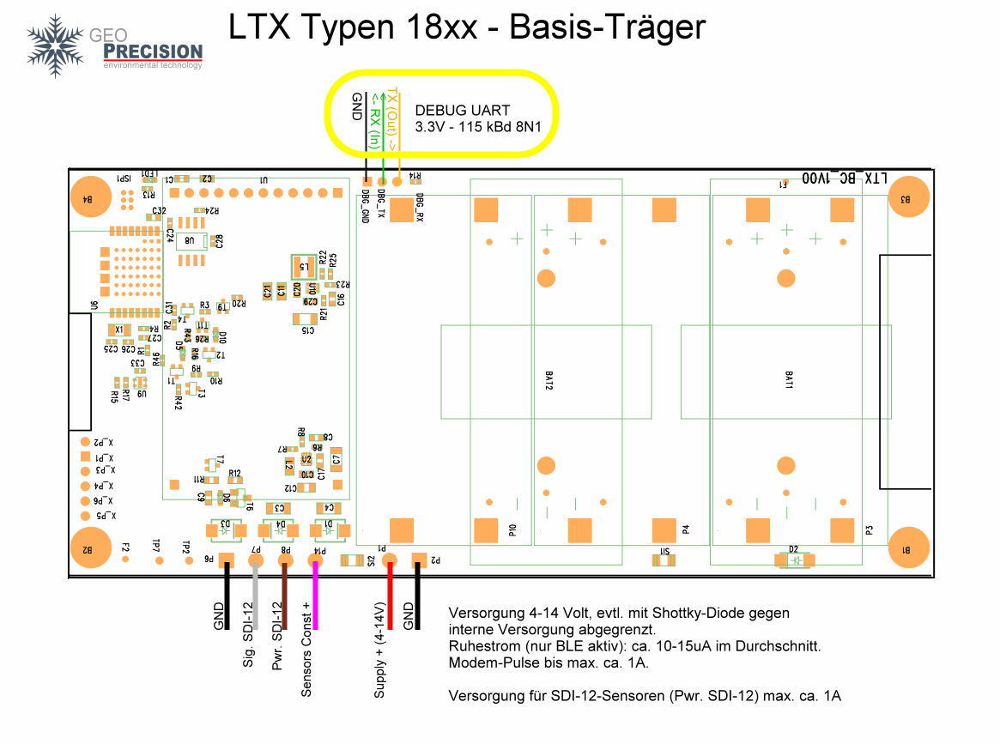
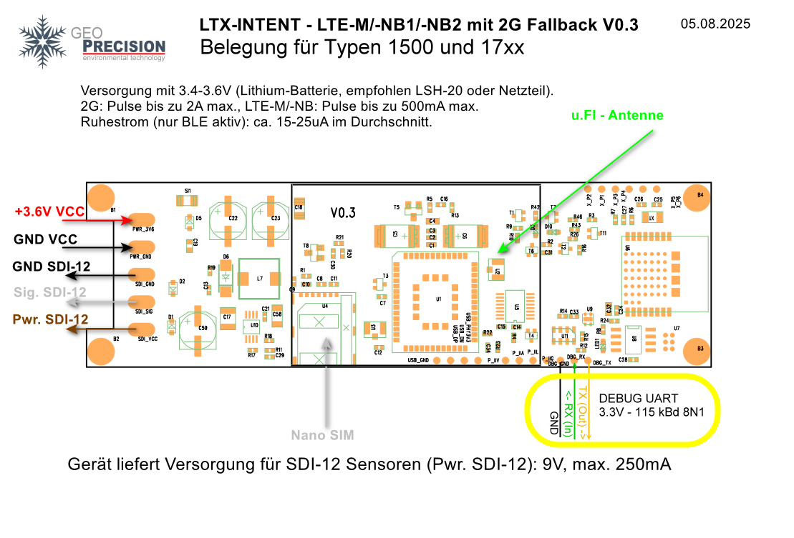
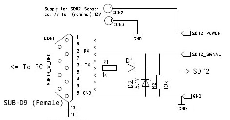

# Diagnose und Fehlerbehebung mit Debug-UART und SDI-12-Terminal

**Zielgruppe:** Hardware-Entwicklung, Inbetriebnahme und technischer Service  
**Stand:** 2026-07-29

## Inhalt

- [Diagnose und Fehlerbehebung mit Debug-UART und SDI-12-Terminal](#diagnose-und-fehlerbehebung-mit-debug-uart-und-sdi-12-terminal)
  - [Inhalt](#inhalt)
  - [1. Überblick](#1-überblick)
  - [2. Debug-UART des LTX-Loggers](#2-debug-uart-des-ltx-loggers)
    - [2.1 Eigenschaften und benötigte Ausrüstung](#21-eigenschaften-und-benötigte-ausrüstung)
    - [2.2 Sicher anschließen](#22-sicher-anschließen)
    - [2.3 Anschluss bei den Typen 18xx](#23-anschluss-bei-den-typen-18xx)
    - [2.4 Anschluss bei den Typen 1500 und 17xx](#24-anschluss-bei-den-typen-1500-und-17xx)
    - [2.5 Terminal einrichten und Konsole bedienen](#25-terminal-einrichten-und-konsole-bedienen)
    - [2.6 Wichtige Diagnosekommandos](#26-wichtige-diagnosekommandos)
      - [Messung über den Logger auslösen](#messung-über-den-logger-auslösen)
      - [SDI-12-Versorgung für die Diagnose schalten](#sdi-12-versorgung-für-die-diagnose-schalten)
      - [Einzelnes SDI-12-Kommando durch den Logger senden](#einzelnes-sdi-12-kommando-durch-den-logger-senden)
      - [Vollständigen SDI-12-Messablauf ausführen](#vollständigen-sdi-12-messablauf-ausführen)
    - [2.7 Grenzen und typische Fehler](#27-grenzen-und-typische-fehler)
  - [3. SDI-12-Bus direkt untersuchen](#3-sdi-12-bus-direkt-untersuchen)
    - [3.1 Wann die Busbeobachtung hilft](#31-wann-die-busbeobachtung-hilft)
    - [3.2 Adapter und Verdrahtung](#32-adapter-und-verdrahtung)
    - [3.3 SDI12Term installieren und starten](#33-sdi12term-installieren-und-starten)
    - [3.4 Minimale Bedienung](#34-minimale-bedienung)
      - [Schritt 1: Bus scannen](#schritt-1-bus-scannen)
      - [Schritt 2: Sensor gezielt identifizieren](#schritt-2-sensor-gezielt-identifizieren)
      - [Schritt 3: Messung starten](#schritt-3-messung-starten)
    - [3.5 Logger-Funktion von SDI12Term](#35-logger-funktion-von-sdi12term)
    - [3.6 LTX-Logger und SDI12Term parallel verwenden](#36-ltx-logger-und-sdi12term-parallel-verwenden)
    - [3.7 Diagnosematrix](#37-diagnosematrix)
  - [4. Empfohlener Ablauf bei der Fehlersuche](#4-empfohlener-ablauf-bei-der-fehlersuche)
  - [5. Weiterführende Links](#5-weiterführende-links)

---

## 1. Überblick

Für die Fehlersuche ist die lokale serielle Konsole häufig besser geeignet als
das Bluetooth-Terminal des BLX-Dashboards. Sie benötigt keinen Aufbau einer
Bluetooth-Verbindung, bleibt während BLE-Verbindungswechseln sichtbar und
erlaubt die direkte Eingabe der meisten Logger-Kommandos.

Jede der hier beschriebenen LTX-Platinen besitzt dazu eine Debug-UART mit
`3,3 V`-TTL-Pegeln. Die UART ist eine **Service- und Diagnoseschnittstelle**;
sie ist nicht mit dem SDI-12-Bus zu verwechseln.

Für SDI-12-Probleme stehen damit zwei komplementäre Diagnoseebenen zur
Verfügung:

1. Über die **Debug-UART** werden Logger-Kommandos eingegeben und die vom
   Logger interpretierten Ergebnisse betrachtet.
2. Mit einem zusätzlichen **SDI-12-zu-RS-232-Adapter** und dem Windows-Programm
   **SDI12Term** wird der tatsächliche ASCII-Verkehr auf dem SDI-12-Bus
   beobachtet, protokolliert oder aktiv erzeugt.

> [!IMPORTANT]
> Debug-UART und SDI-12 verwenden unterschiedliche elektrische Pegel und
> unterschiedliche serielle Formate. Einen UART-TTL-Adapter niemals direkt an
> die SDI-12-Datenleitung und einen RS-232-Ausgang niemals direkt an die
> Debug-UART anschließen.

---

## 2. Debug-UART des LTX-Loggers

### 2.1 Eigenschaften und benötigte Ausrüstung

| Eigenschaft | Wert |
|---|---|
| Elektrischer Pegel | `3,3 V` TTL |
| Baudrate | `115200 Bd` (oft verkürzt als 115 kBd angegeben) |
| Datenformat | `8N1`: 8 Datenbits, keine Parität, 1 Stoppbit |
| Flusssteuerung | keine |
| Leitungen | `GND`, `RX (In)`, `TX (Out)` |
| Mehrverbrauch | ungefähr `500 µA` zusätzlicher Ruhestrom bei angeschlossener Debug-UART |

Benötigt werden:

- ein USB-UART-Adapter mit **3,3-V-Logikpegeln**;
- drei Leitungen für `GND`, `RX` und `TX`;
- je ein Serienwiderstand von etwa `330 Ω` in der RX- und TX-Leitung;
- ein Terminalprogramm, zum Beispiel **PuTTY**, **TeraTerm** oder ein anderes
  Standard-Serial-Terminal.

> [!CAUTION]
> Vor dem Anschließen prüfen, dass der Adapter wirklich 3,3-V-TTL-Pegel
> verwendet. Manche Adapter liefern am TX-Pin 5 V; echte RS-232-Schnittstellen
> arbeiten sogar mit positiven und negativen Spannungen. Beides kann die
> LTX-Platine beschädigen.

### 2.2 Sicher anschließen

Logger und UART-Adapter sollten beim Verdrahten ausgeschaltet sein.

| Debug-UART auf der LTX-Platine | USB-UART-Adapter | Hinweis |
|---|---|---|
| `GND` | `GND` | gemeinsames Bezugspotenzial herstellen |
| `TX (Out)` | `RX` | über ca. `330 Ω` führen |
| `RX (In)` | `TX` | über ca. `330 Ω` führen |
| — | `3V3`/`5V`/`VCC` | **nicht verbinden** |

Die Datenleitungen werden also gekreuzt. Die in RX und TX eingesetzten
`330-Ω`-Widerstände begrenzen bei vertauschten Pins, falscher
Pin-Konfiguration oder kurzzeitig gegeneinander treibenden Ausgängen den
Fehlerstrom. Sie ersetzen jedoch keine Prüfung des richtigen Spannungspegels.

Empfohlene Reihenfolge:

1. Spannungsfreiheit prüfen.
2. `GND` verbinden.
3. Adapter-`RX` über `330 Ω` mit Logger-`TX (Out)` verbinden.
4. Adapter-`TX` über `330 Ω` mit Logger-`RX (In)` verbinden.
5. Die Versorgungsleitung des Adapters offenlassen.
6. Terminal öffnen und erst dann den Logger einschalten.

> [!NOTE]
> Für Ruhestrommessungen muss die Debug-UART wieder vollständig getrennt
> werden. Der Mehrverbrauch von ungefähr `500 µA` kann bei
> Low-Power-Messungen größer als der eigentliche Ruhestrom des Loggers sein und
> das Ergebnis damit dominieren.

### 2.3 Anschluss bei den Typen 18xx

Die Debug-UART liegt an den im Bild markierten Pads `DBG_GND`, `DBG_RX` und
`DBG_TX`. Die Pfeile in der Vergrößerung beziehen sich auf die Platine:
`RX (In)` ist ein Eingang, `TX (Out)` ein Ausgang.



### 2.4 Anschluss bei den Typen 1500 und 17xx

Bei diesen Platinen befinden sich die markierten Debug-Pads an der unteren
Platinenkante. Auch hier gilt: Adapter-TX an `DBG_RX`, Adapter-RX an `DBG_TX`
und GND an `DBG_GND`.



### 2.5 Terminal einrichten und Konsole bedienen

Im Terminalprogramm den ermittelten COM-Port mit folgenden Parametern öffnen:

```text
115200 Baud
8 Datenbits
keine Parität
1 Stoppbit
keine Flusssteuerung
```

Der Logger sendet auch ohne Benutzereingabe alle paar Sekunden ein einzelnes
Statuszeichen. Dadurch lässt sich bereits prüfen, ob Versorgung, Firmware,
Takt und Logger-TX grundsätzlich arbeiten.

| Zeichen | Zustand |
|---|---|
| `.` | reguläres Lebenszeichen |
| `o` | Aufbau einer Bluetooth-Verbindung |
| `*` | Bluetooth-Verbindung vollständig aufgebaut |

Mit `Enter` wird die Kommandozeile aktiviert; anschließend erscheint der
Prompt:

```text
>
```

Nun können Kommandos wie im Bluetooth-Terminal eingegeben werden. Die Eingabe
wird jeweils mit `Enter` abgeschlossen. Die vollständige Referenz steht in
[LTX-Logger Kommando-Referenz](../ltx_kommandos/LTX_Kommandos.md).

Wenn keine lesbaren Zeichen erscheinen:

- COM-Port und `115200 8N1` prüfen;
- sicherstellen, dass keine Hardware-Flusssteuerung aktiviert ist;
- gemeinsame Masse prüfen;
- RX und TX versuchsweise auf korrekte Kreuzung kontrollieren;
- den Adapter auf 3,3-V-TTL-Pegel prüfen;
- beachten, dass manche Terminalprogramme den COM-Port exklusiv belegen.

### 2.6 Wichtige Diagnosekommandos

#### Messung über den Logger auslösen

```text
e
```

`e` löst eine normale Messung sofort aus.

```text
e1
```

`e1` erzwingt zusätzlich die Ausgabe bzw. Erfassung der HK-Werte
(Housekeeping-Werte). Weitere Flags und Kommandos sind in der
[Kommando-Referenz](../ltx_kommandos/LTX_Kommandos.md#gemeinsame-logger-kommandos)
beschrieben.

#### SDI-12-Versorgung für die Diagnose schalten

```text
z+
z-
```

`z+` schaltet die SDI-12-Sensorversorgung vorübergehend ein; `z-` schaltet sie
wieder aus. Die manuelle Einschaltzeit ist aus Sicherheitsgründen begrenzt.

#### Einzelnes SDI-12-Kommando durch den Logger senden

```text
z0I
```

Das kleine `z` sendet ein direktes SDI-12-Kommando und gibt die Antwortzeilen
aus. Das abschließende SDI-12-`!` wird an der Logger-Konsole nicht eingegeben.
Das Beispiel fragt die Identifikation des Sensors mit Adresse `0` ab.

#### Vollständigen SDI-12-Messablauf ausführen

```text
Z0M
```

Das große `Z` führt einen vollständigen Messablauf aus, einschließlich der für
das Messkommando erforderlichen Warte- und Datenabfrage. Mit einer
Broadcast-Adresse kann beispielsweise folgender Test verwendet werden:

```text
Z?M
```

Bei mehreren Sensoren am Bus sollte für reproduzierbare Ergebnisse stets die
konkrete Sensoradresse statt `?` verwendet werden.

Wenn ein Sensor nach dem Einschalten eine Vorlaufzeit benötigt, kann diese in
Millisekunden vorangestellt werden:

```text
Z*3000 0M
```

Dieses Beispiel versorgt den Sensor, wartet 3000 ms und startet danach die
Messung an Adresse `0`. Ohne Angabe verwendet der Logger eine kurze
Standard-Vorlaufzeit. Einzelheiten und Grenzwerte stehen im Abschnitt
[SDI-12-Kommandos](../ltx_kommandos/LTX_Kommandos.md#sdi-12-kommandos).

### 2.7 Grenzen und typische Fehler

> [!IMPORTANT]
> Das SDI-12-Debugging mit `zdbg`, `zdbg0` oder `zdbg1` ist über die lokale
> Debug-UART eingeschränkt: Die detaillierten SDI-12-Debugausgaben werden nur
> an das Bluetooth-Terminal ausgegeben. Für Rohdaten an der Werkbank ist daher
> der im nächsten Kapitel beschriebene parallele SDI-12-Adapter die verlässlichere
> Methode.

| Beobachtung | Wahrscheinliche Ursache | Prüfung |
|---|---|---|
| keinerlei Zeichen | falscher COM-Port, fehlende Masse, Logger ohne Versorgung | COM-Port, GND und Versorgung messen |
| unlesbare Zeichen | falsche Baudrate oder falsches Datenformat | exakt `115200 8N1` einstellen |
| Ausgabe sichtbar, Eingaben wirkungslos | RX/TX nicht gekreuzt oder Adapter-TX hat falschen Pegel | Signalweg Adapter-TX → Logger-RX prüfen |
| Ruhestrom unerwartet hoch | Debug-UART noch angeschlossen | alle drei Debug-Leitungen trennen und erneut messen |
| Logger antwortet, Sensor nicht | Fehler liegt wahrscheinlich auf Versorgung, Masse, Datenleitung oder im SDI-12-Protokoll | Bus mit SDI12Term parallel beobachten |

---

## 3. SDI-12-Bus direkt untersuchen

### 3.1 Wann die Busbeobachtung hilft

Die Logger-Konsole zeigt in erster Linie, wie die Firmware ein Kommando
verarbeitet. Bei Timing-, Pegel-, Adress- oder Verkabelungsproblemen ist der
tatsächliche Verkehr auf der Eindraht-Datenleitung oft aussagekräftiger.

Eine parallele Beobachtung beantwortet unter anderem folgende Fragen:

- Wird überhaupt ein SDI-12-BREAK und ein Kommando gesendet?
- Verwendet der Logger die erwartete Sensoradresse?
- Antwortet der Sensor und ist die Antwort vollständig?
- Wie lang ist die vom Sensor gemeldete Messzeit?
- Kommt nach `M!` ein Service Request?
- Werden anschließend `D0!`, `D1!` usw. gesendet?
- Sind mehrere Sensoren auf dieselbe Adresse eingestellt und kollidieren ihre
  Antworten?

### 3.2 Adapter und Verdrahtung

Das Projekt SDI12Term verwendet einen einfachen passiven Adapter zwischen
einer **echten RS-232-Schnittstelle** und SDI-12. Die Projektskizze zeigt einen
SUB-D9-Anschluss, eine Diode, Schutz-/Koppelwiderstände und die getrennte
Sensorversorgung.



Wichtige Anschlüsse aus der Skizze:

- SUB-D9 Pin 2: `RX` des PCs;
- SUB-D9 Pin 3: `TX` des PCs, über Widerstand und Diode angekoppelt;
- SUB-D9 Pin 5: `GND`;
- `SDI12_SIGNAL`: an die SDI-12-Datenleitung;
- `GND`: an die gemeinsame Busmasse;
- `SDI12_POWER`: externe Versorgung des Sensors, falls nicht der LTX-Logger
  die Sensorversorgung bereitstellt.

> [!CAUTION]
> Ein als „USB-TTL“, „FTDI“ oder „UART 3,3 V“ angebotener Adapter ist kein
> Ersatz für USB-RS-232. Für die gezeigte Schaltung muss der Adapter echte
> RS-232-Pegel und die üblichen DB9-Signale bereitstellen. Vor dem Aufbau die
> Pinbelegung des konkret verwendeten USB-RS-232-Adapters prüfen.

Für den Parallelbetrieb mit einem LTX-Logger werden grundsätzlich nur
`SDI12_SIGNAL` und `GND` zusätzlich auf den vorhandenen Bus gelegt. Die
Versorgung darf nur aus einer kontrollierten Quelle kommen:

- Versorgt der LTX-Logger den Sensor, keine zweite Sensorversorgung parallel
  aufschalten.
- Wird extern versorgt, Spannungsbereich, Strombedarf und Masseführung des
  Sensors sowie die Schaltung des konkreten LTX-Typs prüfen.
- Vor dem Verbinden die Potenzialdifferenz zwischen den Massepunkten messen.
- Bei langen Leitungen den Adapter möglichst nahe am Logger anschließen und
  eine kurze, saubere Masseverbindung verwenden.

> [!WARNING]
> SDI-12 ist ein Single-Master-Bus. Während der LTX-Logger aktiv kommuniziert,
> darf SDI12Term nur mithören. Ein gleichzeitig vom PC gesendetes Kommando kann
> zu Buskollisionen, verstümmelten Telegrammen und falschen Diagnoseergebnissen
> führen. Für aktive PC-Tests Logger-Kommunikation stoppen oder den Sensor vom
> Logger trennen, ohne dabei die notwendige Versorgung und Masse zu verlieren.

### 3.3 SDI12Term installieren und starten

SDI12Term ist ein kleines Windows-Konsolenprogramm. Das Repository enthält
sowohl den C-Quellcode als auch eine kompilierte `SDI12Term.exe`. Zum hier
ausgewerteten Stand meldet der Quellcode Version `1.08` vom `17.12.2024`.

1. Das Repository öffnen oder klonen:
   [joembedded/SDI12Term](https://github.com/joembedded/SDI12Term).
2. Die vorhandene EXE aus dem Repository verwenden oder das Programm für eine
   kontrollierte Entwicklungsumgebung selbst aus dem
   [Quellcode](https://github.com/joembedded/SDI12Term/blob/master/SDI12Term.c)
   bauen.
3. Den COM-Port des RS-232-Adapters im Windows-Geräte-Manager ermitteln.
4. Eine Eingabeaufforderung im Verzeichnis der EXE öffnen.

Ohne Parameter versucht das Programm `COM1` zu öffnen:

```powershell
.\SDI12Term.exe
```

Für beispielsweise `COM7`:

```powershell
.\SDI12Term.exe -c7
```

Die Option hat die Form `-cNR`, wobei `NR` zwischen 1 und 255 liegt. Kann der
gewählte Port nicht geöffnet werden, scannt das Programm die COM-Ports, zeigt
verfügbare Ports an und beendet sich. Danach wird es mit dem richtigen
`-c`-Parameter erneut gestartet.

Die Schnittstellenparameter sind fest auf die SDI-12-Übertragung eingestellt:

```text
1200 Baud, 7 Datenbits, gerade Parität, 1 Stoppbit (1200 7E1)
```

SDI12Term erzeugt vor jedem aktiv gesendeten Kommando automatisch das für
SDI-12 erforderliche BREAK-Signal. Ein anderes Terminalprogramm mit lediglich
`1200 7E1` ist deshalb nicht automatisch ein gleichwertiger Ersatz.

### 3.4 Minimale Bedienung

Nach dem Start zeigt SDI12Term sein Menü. Die wichtigsten Tasten sind:

| Eingabe | Funktion |
|---|---|
| vollständiges Kommando bis `!` | Kommando sofort mit vorangestelltem BREAK senden |
| `Tab`, danach `s` | Adressen `0` bis `9` mit Identifikationskommandos scannen |
| `Tab`, danach `l` | zyklische Protokollierung starten |
| `Esc` | Logger-Modus bzw. Programm beenden |

Anders als an der LTX-Konsole gehört das abschließende `!` bei SDI12Term zur
Eingabe. `Enter` sendet das Kommando nicht; eine unvollständige Eingabe wird
nach etwa drei Sekunden verworfen.

#### Schritt 1: Bus scannen

`Tab` und anschließend `s` drücken. SDI12Term fragt nacheinander die Adressen
`0` bis `9` mit `<Adresse>I!` ab. Alternativ kann bei nur einem angeschlossenen
Sensor eine Broadcast-Identifikation eingegeben werden:

```text
?I!
```

Das erste Zeichen der Antwort ist die tatsächliche Sensoradresse. Sind mehrere
Sensoren angeschlossen, können gleichzeitige Antworten auf `?I!` kollidieren.
In diesem Fall die Adressen einzeln scannen.

#### Schritt 2: Sensor gezielt identifizieren

Für einen gefundenen Sensor mit Adresse `5`:

```text
5I!
```

Eine beispielhafte Antwort beginnt so:

```text
513...
```

Sie enthält Adresse, SDI-12-Version und Hersteller-/Sensorkennung. Die genaue
Feldinterpretation ist der Dokumentation des Sensors zu entnehmen.

#### Schritt 3: Messung starten

```text
5M!
```

Beispielantwort:

```text
50012
```

Das Format der Antwort ist `atttn`:

- `a`: Sensoradresse, hier `5`;
- `ttt`: maximale Messdauer in Sekunden, hier `001`;
- `n`: erwartete Anzahl der Messwerte, hier `2`.

Nach Ablauf der angegebenen Zeit oder nach dem Service Request des Sensors
wird der erste Datenblock abgefragt:

```text
5D0!
```

Beispielantwort:

```text
5+0.00180+26.15
```

Falls noch nicht alle angekündigten Werte übertragen wurden, folgen
`5D1!`, `5D2!` usw. Die Einheit und Reihenfolge der Werte hängen vom Sensor
und Messkommando ab.

SDI12Term prüft erkannte CRC-geschützte Antworten automatisch und kennzeichnet
das Ergebnis mit `CRC OK` oder `CRC ERROR`.

### 3.5 Logger-Funktion von SDI12Term

Für sporadische Fehler und Stabilitätstests kann SDI12Term mehrere Kommandos
zyklisch ausführen und alle Antwortzeilen in `logfile.dat` im aktuellen
Arbeitsverzeichnis anhängen.

1. `Tab`, danach `l` drücken.
2. Entscheiden, ob eine vorhandene `logfile.dat` gelöscht werden soll.
3. Eine durch Leerzeichen getrennte Kommandoliste eingeben.
4. Optional einen Kommentar für den Dateikopf eingeben.
5. Eine Periode von mindestens fünf Sekunden angeben.
6. Mit `Esc` beenden.

Beispiel für Sensoradresse `5`:

```text
5M! *1 5D0!
```

`*1` ist keine SDI-12-Nachricht, sondern eine Anweisung an den eingebauten
Logger, eine Sekunde zu warten. Warteanweisungen von `*1` bis höchstens `*60`
sind möglich. Das Standardbeispiel des Programms lautet `?M! *1 ?D0!`; für
einen Bus mit mehreren Sensoren ist jedoch eine konkrete Adresse vorzuziehen.

> [!NOTE]
> Die feste Pause muss zur vom Sensor gemeldeten Messdauer passen. Bei variabler
> oder längerer Messzeit ist ein manuell nachvollzogener Ablauf bzw. eine an den
> Sensor angepasste Pause zuverlässiger. Der Quellcode nennt fehlende Retries
> für langsam aufwachende Sensoren ausdrücklich als noch offene Erweiterung.

### 3.6 LTX-Logger und SDI12Term parallel verwenden

Der größte Diagnosegewinn entsteht, wenn die LTX-Konsole und der rohe
SDI-12-Verkehr gleichzeitig sichtbar sind:

```text
PC-Terminal 1 ── USB-UART 3,3 V ── Debug-UART des LTX-Loggers
                                      │
                                      ├── SDI-12-Signal ── Sensor(en)
                                      │          │
PC-Terminal 2 ── USB-RS-232 ── SDI-12/RS-232-Adapter
```

Vorgehen zum passiven Mitschneiden:

1. Debug-UART wie in Kapitel 2 anschließen.
2. SDI-12/RS-232-Adapter mit `GND` und `SDI12_SIGNAL` parallel auf den Bus
   legen; keine zweite Versorgung aufschalten.
3. SDI12Term mit dem richtigen COM-Port starten und zunächst **nichts senden**.
4. An der LTX-Konsole `Z0M` oder ein zum Sensor passendes Kommando auslösen.
5. LTX-Ausgabe und rohe Buszeichen mit Zeitbezug vergleichen.
6. Für längere Beobachtungen die Konsolenausgabe des Fensters sichern oder die
   Logger-Funktion nur in einem getrennten aktiven Sensortest verwenden.

Worauf dabei zu achten ist:

- Der Logger erwartet an seiner Konsole kein abschließendes `!`; auf dem Bus
  muss dieses Zeichen trotzdem erscheinen.
- Nach `M!` muss eine syntaktisch plausible `atttn`-Antwort folgen.
- Danach folgt gegebenenfalls ein einzelnes Adresszeichen als Service Request.
- Erst anschließend werden Daten mit `D0!`, bei Bedarf `D1!` usw. abgefragt.
- Überlagerte oder verstümmelte Antworten sprechen häufig für doppelte
  Adressen, Masse-/Pegelprobleme oder einen zweiten aktiven Master.

### 3.7 Diagnosematrix

| Rohbeobachtung am Bus | Interpretation | Nächster Schritt |
|---|---|---|
| kein Logger-Kommando sichtbar | Logger sendet nicht, Busversorgung/Modus falsch oder Adapter hört nicht korrekt mit | `z+`, LTX-Kommando und Adapterverdrahtung prüfen; Signal zusätzlich mit Oszilloskop kontrollieren |
| Kommando sichtbar, keine Sensorantwort | Sensor ohne Versorgung, falsche Adresse, Leitungsfehler oder Sensor defekt | Versorgung direkt am Sensor messen, Adressen scannen, Einzelaufbau testen |
| Antwort auf `?I!` unlesbar | mehrere Sensoren antworten gleichzeitig oder Signalqualität schlecht | Sensoren einzeln anschließen bzw. Adressen `0` bis `9` einzeln scannen |
| `M!` antwortet, aber keine Daten | Wartezeit nicht eingehalten, Service Request fehlt oder falsches `D`-Kommando | `ttt` auswerten, ausreichend warten, `D0!` bis `D9!` prüfen |
| Daten vollständig in SDI12Term, LTX meldet Fehler | Firmware-Parsing, Konfiguration oder erwartete Anzahl/Einheit prüfen | LTX-Kanalparameter und Kommandoformat mit Referenz vergleichen |
| `CRC ERROR` | Übertragungsfehler oder ungültige CRC-Antwort | Masse, Leitungslänge, Störungen und Versorgungseinbruch mit Oszilloskop prüfen |
| sporadische Ausfälle beim Funkbetrieb | Versorgungseinbruch oder EMV-Einkopplung möglich | Sensor- und Logger-Versorgung sowie SDI-12-Signal während Funkpulsen aufzeichnen |

> [!TIP]
> SDI12Term zeigt die logische Zeichenfolge. Für Flankenform, Pegel,
> Anstiegszeit, Überschwingen und Versorgungseinbrüche bleibt ein Oszilloskop
> bzw. Logikanalysator mit analoger Pegelkontrolle das maßgebliche Werkzeug.

---

## 4. Empfohlener Ablauf bei der Fehlersuche

1. **Sichtprüfung:** Steckverbinder, Polarität, Masseführung, Lötstellen und
   Sensoradresse kontrollieren.
2. **Versorgung messen:** Spannung im Leerlauf und während Messung/Funkaktivität
   direkt an Logger und Sensor erfassen.
3. **Debug-UART anschließen:** `115200 8N1`, 3,3-V-TTL und Serienwiderstände
   verwenden; Lebenszeichen prüfen.
4. **Logger-Selbsttest:** Mit `e` bzw. `e1` eine Messung auslösen und die
   Ausgabe sichern.
5. **SDI-12 gezielt testen:** Versorgung mit `z+` einschalten, Sensor mit
   `z0I` identifizieren und mit `Z0M` messen.
6. **Bus passiv beobachten:** SDI12Term-Adapter parallel anschließen und den
   vom Logger ausgelösten Ablauf mitschneiden.
7. **Sensor isolieren:** Bei unklarer Busantwort nur einen Sensor anschließen
   und aktiv mit SDI12Term testen.
8. **Langzeittest:** Passende Kommandofolge zyklisch in `logfile.dat`
   protokollieren; Versorgung und Temperaturbedingungen mit dokumentieren.
9. **Ruhestrom erneut prüfen:** Nach Abschluss alle Debugadapter entfernen.

Für einen reproduzierbaren Fehlerbericht mindestens festhalten:

- LTX-Gerätetyp, Hardware- und Firmwarestand;
- Sensorhersteller, Typ, Seriennummer und SDI-12-Adresse;
- Versorgungsspannungen und gemessener Strom;
- vollständiges gesendetes Kommando und rohe Antwort;
- verwendeter Adapter und COM-Port;
- Busaufbau, Leitungslänge und Zahl der Teilnehmer;
- Zeitpunkt sowie Bedingungen, unter denen der Fehler auftrat;
- relevante Konsolen- und `logfile.dat`-Ausschnitte.

---

## 5. Weiterführende Links

- [LTX-Logger Kommando-Referenz](../ltx_kommandos/LTX_Kommandos.md) – lokale
  Referenz für `e`, `z...`, `Z...` und weitere Logger-Kommandos
- [SDI12Term-Repository](https://github.com/joembedded/SDI12Term) – Projekt,
  Quellcode und kompilierte Windows-Version
- [SDI12Term README](https://github.com/joembedded/SDI12Term/blob/master/README.md) –
  Projektbeschreibung, Installationshinweise und Beispiele
- [SDI12Term.c](https://github.com/joembedded/SDI12Term/blob/master/SDI12Term.c) –
  Implementierung von COM-Port-Auswahl, Bus-Scan, Bedienung, CRC-Prüfung und
  Logger-Funktion
- [Adaptergrafik im SDI12Term-Repository](https://github.com/joembedded/SDI12Term/blob/master/Img/connector.jpg) –
  Original der hier verwendeten RS-232/SDI-12-Schaltung
- [SDI-12 Support Group](https://www.sdi-12.org/) – Spezifikationen und
  weiterführende Informationen zum SDI-12-Standard

