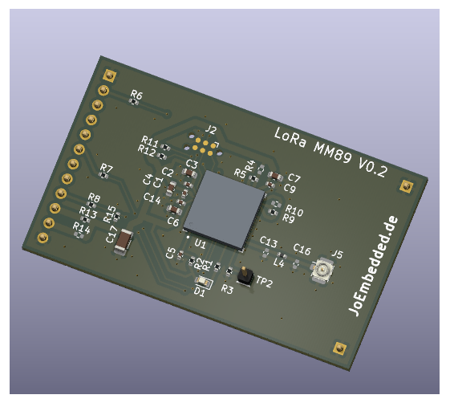
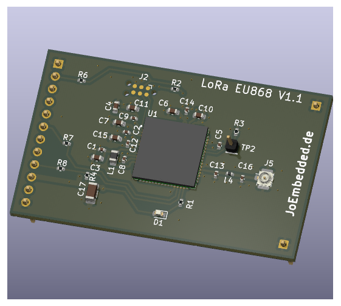

# Energie-Vergleich LoRa-Module EU868

**Stand:** 29.07.2026 / JW

> Es wurden 3 Module (LTX-Shields) verglichen. Ein LTX-Shield enthält im wesentlichen nur das LoRa-Funkmodul und einen 50Ω-UFL-Anschluss. Als Firmware auf dem LoRa-Modul wurde die AT-Firmware von STM (Basis ‘AN5481’) in einer angepassten Version implementiert (zusätzliche Events, Watchdog, etc.).

Für die Übersichtstabelle wurden 2 typische Nutzlängen verwendet:
- **10 Bytes:** typisch für einfachen Temperatur-/Feuchte-Sensor
- **40 Bytes:** typisch für kleine Wetterstation mit 8–10 Kanälen

---

## Inhaltsverzeichnis

- [Testbedingungen](#testbedingungen)
- [ADR bei stationären und mobilen Geräten](#adr-bei-stationären-und-mobilen-geräten)
  - [Einfluss von `NbTrans`](#einfluss-von-nbtrans)
- [Module im Vergleich](#module-im-vergleich)
- [Energieverbrauch @ 3.3 V — unconfirmed TX (mC)](#energieverbrauch--33v--unconfirmed-tx-mc)
  - [1 Byte Nutzdaten](#1-byte-nutzdaten-aus-messung-in-mc)
  - [51 Bytes Nutzdaten](#51-bytes-nutzdaten-aus-messung-in-mc)
- [Auswirkung auf die Batterielebensdauer](#auswirkung-auf-die-batterielebensdauer-2200-mah--33v-nur-tx-energie-in-jahren-j)
  - [10 Bytes — Intervall 10 min](#10-bytes-unconfirmed--intervall-10-min-52560-paketejahr)
  - [10 Bytes — Intervall 60 min](#10-bytes-unconfirmed--intervall-60-min-8760-paketejahr)
  - [40 Bytes — Intervall 10 min](#40-bytes--intervall-10-min-52560-paketejahr)

## Testbedingungen
- Messdaten: März 2026 / JoEm
- Versorgungsspannung: 3.3V, Funkband: EU868
- Sendeleistung: ~12 dBm (Spektrumanalyzer @ 868.5 MHz)
- ADR und DCS deaktiviert (AT+ADR=0, AT+DCS=0)
- Eine Uplink-Übertragung pro Frame (`AT+NBTRANS=1`)
- LoRaWAN-Version 1.0.4, Firmware: V1.4
- Messung: Sende-Peak bis "+EVT:FINISH" (inkl. RX-Slots), Nordic PPK2

Die Messwerte sind damit Werte für jeweils **fest eingestellte Datenraten**.
Sie bilden keine vom Network Server während des Betriebs optimierte
ADR-Verbindung ab.

## ADR bei stationären und mobilen Geräten

Für die Energie- und Funkplanung gelten unterschiedliche Prioritäten:

| Einsatz | ADR | Planungshinweis |
|---|:---:|---|
| stationär, stabile Funkstrecke | `1` | Bevorzugte Einstellung: Der Network Server kann Datenrate, Sendeleistung und `NbTrans` optimieren. Eine höhere Datenrate und geringere Sendeleistung können Batterie und Netzkapazität sparen. `NbTrans` sollte trotzdem überwacht werden. |
| stationär, schwache aber stabile Funkstrecke | meist `1`, alternativ `0` | ADR kann weiterhin die bestmöglichen Parameter finden, bei Paketverlusten aber `NbTrans` erhöhen. Wenn ein vorhersehbares Energiebudget wichtiger ist, kann nach praktischen Funkmessungen stattdessen `ADR=0`, die höchste noch zuverlässige feste Datenrate und `NbTrans=1` gewählt werden. |
| mobil oder schnell wechselnde Funkdämpfung | häufig `0` | Verhindert, dass eine am vorherigen Standort optimierte Einstellung vorübergehend ungeeignet ist. Datenrate, Sendeleistung und `NbTrans` müssen dann vom Gerät bzw. für den Anwendungsfall festgelegt werden. |
| mobil, aber lange Stillstandsphasen | abhängig von der Gerätefunktion | ADR kann während stabiler Phasen vorteilhaft sein, wenn die Anwendung den Mobilitätszustand erkennt und ADR zuverlässig umschaltet. |

Die LoRaWAN-Spezifikation empfiehlt, ADR wann immer möglich zu aktivieren, um
Batterielaufzeit und Netzkapazität zu verbessern. Ein schlechtes Link-Budget
allein ist daher noch kein zwingender Grund für `ADR=0`. Bei schnell oder
fortlaufend wechselnder Funkdämpfung soll dagegen die Anwendung die Parameter
steuern. Für eine feste EU868-Konfiguration kommen je nach vor Ort geprüftem
Link-Budget beispielsweise `DR0`, `DR1` oder `DR2` infrage. Gewählt werden sollte
die höchste Datenrate, die noch ausreichend zuverlässig funktioniert.

`ADR=0` vergrößert nicht automatisch die Anzahl erreichbarer Gateways. Eine
niedrige Datenrate wie EU868 `DR0` erhöht jedoch die Link-Budget-Reserve. Damit
können unter ungünstigen oder veränderten Empfangsbedingungen mehr Gateways
den Uplink empfangen. Der Preis dafür ist eine längere Sendezeit sowie eine
höhere Batterie- und Netzbelastung. Deshalb sollte nicht pauschal `DR0`, sondern
die robusteste **erforderliche** bzw. die höchste noch zuverlässig nutzbare
Datenrate gewählt werden. Eine geräteseitige Strategie mit mehreren
Datenraten ist besser als eine unnötig konservative feste Datenrate, sofern die
Firmware sie unterstützt.

Der Einfluss auf das Energiebudget ist erheblich: Beim STM32MOC benötigt ein
gemessener Uplink bei `DR0` gegenüber `DR5` etwa das 11-Fache (1 Byte) bzw. das
14-Fache (51 Bytes) der Energie. Für ein mobiles Gerät mit festem `DR0` muss die
Laufzeit daher anhand der `DR0`-Zeile geplant werden, nicht anhand einer für
stationären ADR-Betrieb typischen hohen Datenrate. Zusätzliche Join-Vorgänge,
Paketverluste und Wiederholungen sind als Reserve einzuplanen.

### Einfluss von `NbTrans`

`NbTrans` legt die Gesamtzahl der Übertragungen je Uplink-Frame fest. Die
Tabellen in diesem Dokument basieren auf `NbTrans=1`. Bei gleicher Datenrate
kann `NbTrans=3` die Funk-Airtime und die Energie des Sende-/Empfangszyklus
annähernd verdreifachen, wenn alle drei Übertragungen ausgeführt werden. Dadurch
kann selbst bei `DR0` oder `DR1` ein erheblicher zusätzlicher Verbrauch
entstehen. Der genaue Faktor ist nicht immer exakt drei, da ein Downlink in RX1
oder RX2 weitere Wiederholungen beendet und die RX-/Verarbeitungsanteile den
Messwert beeinflussen.

Bei `ADR=1` darf der Network Server `NbTrans` verändern. Der aktuelle
Standard-ADR-Algorithmus von ChirpStack erhöht den Wert abhängig von erkannten
Paketverlusten schrittweise bis `3` und senkt ihn bei besserer Erfolgsrate wieder.
Der technisch zulässige LoRaWAN-Bereich ist `1...15`, Default ist `1`. Wer ein
deterministischeres Energiebudget benötigt, kann `ADR=0`, eine praktisch
erprobte feste Datenrate und `AT+NBTRANS=1` verwenden; die dadurch entfallende
Redundanz kann allerdings die Zustellwahrscheinlichkeit verringern.

Technische Grundlage ist die
[LoRaWAN-Link-Layer-Spezifikation 1.0.4, Abschnitte 4.3.1.1 und 5.2](https://lora-alliance.org/wp-content/uploads/2021/11/LoRaWAN-Link-Layer-Specification-v1.0.4.pdf).
Die adaptive Begrenzung auf `3` ist eine Implementierungsentscheidung des
[ChirpStack-Standard-ADR-Algorithmus](https://github.com/chirpstack/chirpstack/blob/master/chirpstack/src/adr/default.rs),
nicht die Obergrenze der LoRaWAN-Spezifikation.

## Module im Vergleich

| Modul | Standby | TX-PA-Typ | I\_TX\_max | Bemerkung |
|-------|---------|-----------|-----------|-----------|
| **STM32MOC (LP-Mode)** | 2.4 µA | LP-PA | 29 mA | **Referenz** |
| **RAK3172LP-SIP** | 3.3 µA | LP-PA | 38 mA | auch als ST50H; min. 3.0V (TCXO) |
| **RAK3172-SIP** | 3.3 µA | HP-PA | 91 mA | auch als ST50HE; min. 3.0V (TCXO) |

> **RAK3172-SIP:** Der HP-TX-Amplifier wird auch bei 14 dBm im 20-dBm-Bias betrieben (EU868 erlaubt max. 14 dBm) — dadurch 3× höherer TX-Strom als beim STM32MOC.

| STM32WL5MOC Shield | RAK3172(LP)-SIP Shield |
|:------------------:|:------------------:|
|  |  |

## Energieverbrauch @ 3.3V — unconfirmed TX (mC)

### 1 Byte Nutzdaten (aus Messung in mC)

| DR | STM32MOC | RAK3172LP-SIP | RAK3172-SIP |
|:--:|:--------:|:---------:|:-----------:|
| 0  | 39.8     | 50.2      | 121.6       |
| 1  | 21.0     | 27.3      | 61.6        |
| 2  | 11.7     | 15.9      | 31.8        |
| 3  | 7.1      | 10.3      | 17.0        |
| 4  | 5.1      | 7.7       | 10.5        |
| 5  | 3.6      | 6.3       | 6.8         |

Der RAK3172LP benötigt je nach Datenrate 26 % bis 75 % mehr Energie als der STM32MOC. Der RAK3172-SIP (HP-PA) verbraucht trotz gleicher Sendeleistung das 1,9- bis 3,1-fache des STM32MOC.

### 51 Bytes Nutzdaten (aus Messung in mC)

| DR | STM32MOC | RAK3172LP | RAK3172-SIP |
|:--:|:--------:|:---------:|:-----------:|
| 0  | 80.5     | 100.2     | 253.4       |
| 1  | 46.0     | 57.8      | 142.5       |
| 2  | 21.9     | 28.4      | 64.9        |
| 3  | 13.4     | 17.9      | 37.2        |
| 4  | 8.5      | 11.9      | 21.6        |
| 5  | 5.8      | 8.6       | 12.5        |

Der RAK3172LP benötigt je nach Datenrate 24 % bis 48 % mehr Energie als der STM32MOC. Der RAK3172-SIP (HP-PA) verbraucht das 2,2- bis 3,1-fache des STM32MOC.

> **Fazit TX-Energie:**
> - **LP-PA vs. HP-PA:** Der RAK3172-SIP verbraucht trotz gleicher Ausgangsleistung (14 dBm) zwei- bis dreimal mehr als der STM32MOC — Ursache ist der hohe Bias-Strom des HP-Amplifiers, der zwar 20 dBm kann, in EU868 aber nur 14 dBm senden darf.
> - **STM32MOC vs. RAK3172LP-SIP (beide LP-PA):** Der STM32MOC liegt 20 % bis 75 % unter dem RAK3172LP-SIP. Ursache sind vermutlich der 3-V-TCXO des RAK3172LP-SIP (vs. 1,8-V-TCXO im STM32MOC) sowie interne Multiplexer.

---

## Auswirkung auf die Batterielebensdauer (2200 mAh @ 3.3V, nur TX-Energie) in Jahren (J)

### 10 Bytes unconfirmed — Intervall 10 min (52.560 Pakete/Jahr)

> 10 Bytes: z.B. typisch für einfachen Temperatur-/Feuchte-Sensor

| DR | STM32MOC | RAK3172LP-SIP | RAK3172-SIP |
|:--:|:--------:|:---------:|:-----------:|
| 0  | **3.2 J** | 2.5 J | 1.0 J |
| 2  | **11.1 J** | 8.3 J | 4.0 J |
| 5  | **37.6 J** | 22.5 J | 19.3 J |

### 10 Bytes unconfirmed — Intervall 60 min (8.760 Pakete/Jahr)

| DR | STM32MOC | RAK3172LP-SIP | RAK3172-SIP |
|:--:|:--------:|:---------:|:-----------:|
| 0  | **19.0 J** | 14.9 J | 6.2 J |
| 2  | **66.9 J** | 49.9 J | 23.9 J |
| 5  | **225.7 J** | 134.8 J | 115.9 J |

### 40 Bytes — Intervall 10 min (52.560 Pakete/Jahr)

> 40 Bytes: z.B. typisch für kleine Wetterstation mit 8–10 Kanälen. Bei dieser Paketgröße unterscheiden sich confirmed und unconfirmed um weniger als 5 %, daher wird hier nur eine Tabelle (unconfirmed) angegeben.

| DR | STM32MOC | RAK3172LP-SIP | RAK3172-SIP |
|:--:|:--------:|:---------:|:-----------:|
| 0  | **2.1 J** | 1.7 J | 0.7 J |
| 2  | **7.7 J** | 5.8 J | 2.6 J |
| 5  | **27.4 J** | 18.6 J | 13.5 J |

---

> **Hinweis:** Nur TX-Energie berücksichtigt. Sensorauslesen, MCU-Betrieb und Standby-Verluste reduzieren die tatsächliche Batterielebensdauer.

***

**Firmware- und Datenblatt-Archiv:** [https://joembedded.de/x3/ltx_firmware/index.php](https://joembedded.de/x3/ltx_firmware/index.php)
