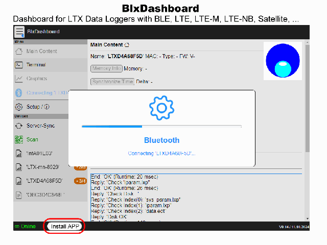

# LTX-Logger Dokumentation – Übersicht

Stand: 2026-05-08

Einstiegsdokument für die LTX-Logger-Dokumentation. Alle inhaltlichen Dokumente liegen im selben Verzeichnis `content/`.

---

> [!IMPORTANT]
> **An diesem Dokument und Unter-Dokumenten wird noch gearbeitet!**
> Bitte bei ungeklärten Fragen direkt melden!

## Gerätetypen und Hardware

### [logger_Zusammenfassung.md](ltx_typen/logger_Zusammenfassung.md)
Übersicht aller LTX-Logger-Varianten mit SDI-12-Unterstützung (Typen 1500–3000).
Beschreibt verfügbare Mobilfunk- und Funktechnologien (LTE Cat1, LTE-M, NB-IoT, LoRa EU868), Hardware-Baukästen („BoPla"-Trägerplatine, „2-Zoll"-Logger), Energiebetrachtungen sowie eine Jahresbetrieb-Beispielberechnung.

### [LTX_T1720_LoRaWAN.MD](ltx_typen/LTX_T1720_LoRaWAN.MD)
Kurz-Datenblatt für den SDI-12-Datenlogger LTX Typ 1720 mit LoRaWAN EU868.
Enthält Merkmale, technische Daten, lokale Datensicherung, Hinweise zum LoRaWAN-Modem sowie den Vergleich zum LTX Typ 1820 (gleicher Modemkern, unterschiedliche Batterie- und Gehäusekonzepte).

---

## BLX Dashboard

*Bluetooth-App zur Bedienung und Konfiguration von LTX-Loggern.*

### [blx_commands.md](blx_dashboard/blx_commands.md)
Vollständige Kommando-Referenz für das BLX Dashboard (Web-App zur BLE-Kommunikation mit LTX-Loggern).
Beschreibt alle SysCommands (beginnen mit `.`), den internen Browser-Store (IndexedDB), Audio-Funktionen,
Verbindungsverwaltung, Dateioperationen (`.get`, `.put`, `.fput`, `.del`, `.firmware`), Skript-Ausführung (`.crun`/`.expect`) sowie konfigurierbare Store-Variablen (`#blxDash_#badgeURL`, `#blxDash_#AutoPINURL`).

- Quellen: 
  - [github.com/joembedded/blxdashboard 🔒](https://github.com/joembedded/blxdashboard) *Quelle, für Collaborators* 
  - [github.com/joembedded/ltx_ble_demo](https://github.com/joembedded/ltx_ble_demo) *(öffentlich, lauffähige APP)*

---

## Kommandos

### [LTX_Kommandos.md](ltx_kommandos/LTX_Kommandos.md)
Vollständige Kommando-Referenz für alle LTX-Logger der Typen 1500–3000.
Behandelt alle Kommunikationswege (BLE, UART, Mobilfunk-Downlink, LoRa-Downlink), allgemeine BLE-Kommandos, Datei- und Speicherkommandos, das Parameterkommando `x...`/`xWrite`, SDI-12-Kommandos sowie die modemspezifischen Kommandos für Mobilfunk- und LoRa-Geräte.

---

## Parameter

### [ltx_parameter_referenz.md](ltx_parameter/ltx_parameter_referenz.md)
Detailreferenz der LTX-Parameterdateien `iparam.lxp` und `sys_param.lxp`.
Erklärt das Dateiformat (zeilenweise ASCII), alle Kanalparameter, Systemparameter (Netzwerk, Batterie, Speicher), das Konzept von Housekeeping (HK), Linearisierung und Energieberechnung sowie den Einzelzugriff auf Parameter über `x...`-Kommandos.

---

## Datenfiles

### [ltx_fileformat_edt.md](ltx_datenfiles/ltx_fileformat_edt.md)
Referenz des LTX Easy-Data-Textformats (`*.edt`) für Messwertdateien wie `data.edt`, `data.edt.bak` und `data.edt.old`.
Beschreibt Dateirotation und BLE-Synchronisation, Info-Tags (`<...>`), Tabellenköpfe (`!U`), Messzeilen (`!`), UTC- und Relativzeiten, Kanal-/HK-Zuordnung, Fehlerwerte, alarmierte Werte sowie Base64-codierte Binärpayloads (`$...`) inklusive Token-Referenz und Empfehlungen zur Speicheroptimierung.

> Hinweis: neben regulären Datenfiles sind auf den Geräten auch andere Filestypen, z.B. Logdateien, Firmware oder Kalibrierdaten möglich. Genauere Beschreibungen folgen. *todo*

---

## LoRa

### [ltx_lora_at_kommandos.md](lora/ltx_lora_at_kommandos.md)
Referenz aller LoRaWAN-AT-Kommandos für LTX-Geräte der Typen 1720/1730 und 1820/1830.
Basis ist der STM32CubeWL-Stack (AN5481 v1.0.4) mit LTX-projektspezifischen Erweiterungen. Dokumentiert Schlüssel/EUIs (`AT+DEUI`, `AT+NWKKEY`, …), Join- und Sendebefehle (`AT+JOIN`, `AT+SEND`), Netzwerkverwaltung (ADR, DR, Frequenzband, TX-Power) sowie LTX-Erweiterungen wie `AT+XSTATE`, `AT+RECV` und `AT+SAVECFG`.

### [lora_payload.md](lora/lora_payload.md)
Kompakte, optisch strukturierte Zusammenfassung des LTX-LoRa-Payload-Formats und des lokalen Payload-Decoders.
Beschreibt Uplink-Decoding für ChirpStack/TTN, `fPort`-Zuordnung, Float16/Float32-Messwerte, Housekeeping-Kanäle, Fehlercodes sowie Downlink-Kommandos auf `fPort 10`.

### [energie_vergleich.md](lora/energie_vergleich.md)
Messtechnischer Vergleich von drei LoRa-EU868-Modulen (STM32WL5MOC, RAK3172LP-SIP, RAK3172-SIP) hinsichtlich Standby-Strom und Sendestrom bei typischen Nutzlastlängen (10 und 40 Bytes).
Gibt Orientierung bei der Modulauswahl in Bezug auf Energieverbrauch und Batterielebensdauer.

---

## Dateisystem

### [Jesfs_zusammenfassung.md](ltx_filesystem/jesfs_zusammenfassung.md)
Kompakter Überblick (rein informativ) zu JesFS (Jo's Embedded Serial File System) für serielle NOR-Flash-Speicher.
Beschreibt Funktionsprinzip, Logging-Eignung auf LTX-Datenloggern sowie praktische Einsatzempfehlungen für robuste, flash-schonende Messdatenspeicherung.

---

## Mobilfunk

### [mobileErrors.md](ltx_mobile/mobileErrors.md)
Strukturierte Fehlercode-Referenz für häufige Mobilfunkprobleme in LTX-Projekten.
Enthält die Bereiche Modem Basic, UDP, HTTP, Content, GPRS_TRANSFER und LFTP mit typischen Fehlercodes und Kurzbeschreibung.

---

## Schnellübersicht

| Dokument | Thema | Zielgruppe |
|---|---|---|
| [logger_Zusammenfassung.md](ltx_typen/logger_Zusammenfassung.md) | Gerätetypen, Hardware, Funkoptionen | Projektplanung, Inbetriebnahme |
| [LTX_T1720_LoRaWAN.MD](ltx_typen/LTX_T1720_LoRaWAN.MD) | Typ-1720-Datenblatt, LoRaWAN, Energieversorgung | Geräteauswahl, LoRa-Projekte |
| [blx_commands.md](blx_dashboard/blx_commands.md) | BLX Dashboard SysCommands, Store, Dateioperationen | BLE-App-Nutzung, Inbetriebnahme |
| [LTX_Kommandos.md](ltx_kommandos/LTX_Kommandos.md) | Alle Kommandos (BLE, UART, LoRa, Mobilfunk) | Integration, Service |
| [ltx_parameter_referenz.md](ltx_parameter/ltx_parameter_referenz.md) | Parameterdateien, `x...`-Kommandos | Parametrierung, Konfiguration |
| [ltx_fileformat_edt.md](ltx_datenfiles/ltx_fileformat_edt.md) | EDT-Messdatenformat, CSV-Expansion, Payload-Decoding | Datenanalyse, Import, Service |
| [ltx_lora_at_kommandos.md](lora/ltx_lora_at_kommandos.md) | LoRaWAN-AT-Kommandos (vollständig) | LoRa-Inbetriebnahme |
| [lora_payload.md](lora/lora_payload.md) | LoRa-Payload, Uplink-Decoder, Downlink-Kommandos | Plattform-Integration |
| [energie_vergleich.md](lora/energie_vergleich.md) | LoRa-Modulvergleich Stromverbrauch | Hardware-Auswahl |
| [jesfs_zusammenfassung.md](ltx_filesystem/jesfs_zusammenfassung.md) | JesFS-Dateisystem für Logger | Speicher-/Firmware-Konzept |
| [mobileErrors.md](ltx_mobile/mobileErrors.md) | Häufige Mobilfunk-Fehlercodes | Service, Diagnose |
