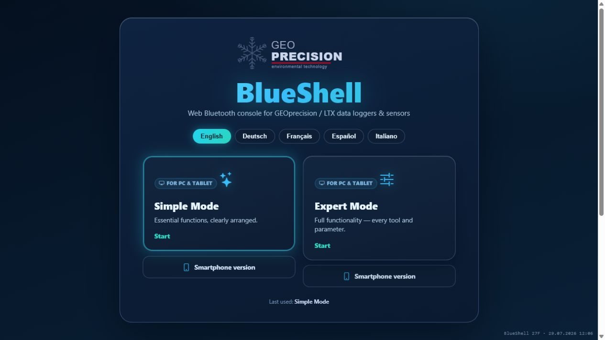

[Back to the LTX documentation overview](https://github.com/joembedded/ltx_docu/blob/master/editiert/ltx_docu_dateiliste.md)

This guide explains how to start a manual data transfer from a mobile-network LTX data logger to its configured server or LTX Microcloud by using a GeoPrecision browser app. The screenshots show the original BLX Dashboard, but the same terminal commands are available in all current app versions.

```text
BLX Dashboard --Bluetooth--> LTX data logger --mobile network--> server
```

> **Important:** The app sends only the start command over Bluetooth. The phone does not upload the measurement data and no PC-side data or log file is required. The logger performs the transfer through its own configured mobile-network connection.

{ height=102mm }

*The terminal input is located below `*** BLX Terminal ***`. Enter commands in the field beginning with `>` and send them with the check-mark button.*

> **Note:** The first supplied video demonstrates the BLX Dashboard controls with a Type 470 sensor. Device types below 1000 are sensors, not the data loggers covered by this procedure. Only the Bluetooth scan, PIN and terminal controls are used as an interface example. The second video shows the logger-side mobile internet transfer in older BlueShell software; its PC data-download and session-log functions are not required here.

# 1. Where to get the software

Choose the application according to the product and task. Every GeoPrecision app version provides a terminal in which `i1`, `i129` and the other supported logger commands can be entered. If the terminal is not visible in the default layout, open the application's terminal, expert or service view.

| Requirement | Recommended software |
|---|---|
| Regular operation, measurements and data reading | The GeoPrecision app recommended for the product; if none is specified, use the newest general-purpose version |
| Terminal commands `i1`, `i129` and advanced service work | Any GeoPrecision app version or the original BLX Dashboard; all versions accept the same commands in their terminal. Use the original BLX Dashboard when its additional diagnostic text is useful |
| Development of a customer-specific variant | Original BLX Dashboard source code after collaborator access has been granted |

## 1.1 User-friendly GeoPrecision apps

For regular operation, use an application from the [GeoPrecision app download directory](https://geo-precision.com/media/index.php?dir=apps). The directory contains several variants. Select them in this order:

1. Use the version recommended by GeoPrecision for the specific product or configuration.
2. If no product-specific version is recommended, use the newest general-purpose version listed in the directory.
3. Use a special-purpose variant only when the product documentation or GeoPrecision explicitly assigns it to the application.

[Open BS27F directly](https://geo-precision.com/media/apps/BS27F/BlueShell27F.html) or select **BS27F** in the app directory. BS27F is the current example of the user-friendly GeoPrecision software at the publication date of this guide and is not automatically the correct choice for every product. It offers a clearly arranged Simple Mode and a more comprehensive Expert Mode. Use the newest or product-recommended application and open its terminal when following the transfer procedure in this document.

{ width=148mm }

*BS27F provides a user-friendly choice between Simple Mode, Expert Mode and smartphone layouts. The exact functions available depend on the selected mode and application version.*

> **Version notice:** GeoPrecision publishes new application versions on an ongoing basis. BS27F is current when this guide was prepared, but newer versions will follow. Always check the app directory first and use the version recommended for the product or, if none is specified, the newest general-purpose version.

## 1.2 PWA operation and browser requirements

All GeoPrecision apps described here, including the original BLX Dashboard, are Progressive Web Apps (PWAs) developed for use in a browser. Traditional app installation is not required: open the application's HTTPS link in a supported browser and connect to the logger. Where the browser offers **Install App** or **Add to Home Screen**, this is an optional convenience that provides a launcher icon or a separate app-style window; it is not required for operation.

On desktop computers, use Google Chrome, Microsoft Edge or another compatible Chromium-based derivative. These browsers provide the Web Bluetooth interface required for communication with the logger. Firefox cannot be used for this procedure because, as of August 2026, it still does not provide the required Web Bluetooth support.

The standard browser environment on iOS does not currently expose the Web Bluetooth access required by this PWA. On an iPhone or iPad, the app can instead be opened in a compatible sandbox browser such as [Bluefy - Web BLE Browser](https://apps.apple.com/gb/app/bluefy-web-ble-browser/id1492822055), which is available free of charge in the Apple App Store as of August 2026. Browser support can change; check the current app notes and browser documentation when deploying a later version.

## 1.3 Original BLX Dashboard for special requirements

For regular operation, the newest or product-recommended application from the GeoPrecision download directory is normally sufficient and is the preferred choice. The original BLX Dashboard remains available as a universal tool for very specific requirements, uncommon configurations and advanced service work. It accepts the same terminal commands as the other versions, but can provide more extensive text output for diagnostics. Its broad range of functions is usually unnecessary for routine operation.

- [Public BLX Dashboard demo project and source package: joembedded/ltx_ble_demo](https://github.com/joembedded/ltx_ble_demo)
- [BLX Dashboard command documentation](https://github.com/joembedded/ltx_docu/blob/master/editiert/blx_dashboard/blx_commands.md)

{ width=142mm }

*BLX Dashboard is a Progressive Web App and runs directly in a supported browser. Installation is optional; the available Install App function only adds a convenient launcher and app-style window.*

## 1.4 Original source code for customers and developers

[EXCLUSIVE ACCESS - BLX Dashboard original source code for authorized collaborators](https://github.com/joembedded/blxdashboard)

The complete application is developed in plain HTML, JavaScript and CSS, making it straightforward for customers and developers to understand, adapt and create their own variants. The original BLX Dashboard contains a much broader set of service, configuration and diagnostic functions than regular operation requires. For this reason, its GitHub repository is private (locked) and requires explicit collaborator authorization. Without access, GitHub may display a not-found page even though the link is correct.

> **Free collaborator access:** Requests are welcome at any time. We are happy to grant customers and developers free access to the complete original source code and add them to the repository as collaborators. Please contact us with the GitHub account that should be authorized. The source may be used as the basis for individual application variants, and we are also glad to assist with their planning, adaptation and implementation.

# 2. Requirements and supported devices

Before starting, make sure that:

- a supported GeoPrecision PWA or the original BLX Dashboard is open on a Bluetooth-capable phone, tablet or computer;
- Bluetooth is enabled and the LTX logger is within range;
- the logger PIN or the device label containing the scannable credentials is available;
- the logger already has a valid APN, mobile-network and server configuration;
- measurement data is available for transfer; and
- the target server or LTX Microcloud is online.

The internet-transfer command is available on the following mobile-network loggers listed in the command reference:

| Device group | Device types | Manual mobile transfer |
|---|---|---|
| Mobile-network LTX logger | 1500, 1700, 1750, 1800, 1801, 1850 | Supported with `i1` or `i129` |
| LTX sensor | Types below 1000, including the Type 470 shown in the first video | Not supported; UI example only |
| Logger without a modem | 2000, 3000 | Not available |

LoRaWAN loggers use a different radio path and are covered by the separate [LTX LoRaWAN commissioning guide](https://github.com/joembedded/ltx_docu/blob/master/editiert/ltx_lorawan_howto/ltx_lorawan_howto.md). The exact command behavior is documented in the [LTX Logger Command Reference](https://github.com/joembedded/ltx_docu/blob/master/editiert/ltx_kommandos/LTX_Kommandos.md).

# 3. Connect the app to the logger

1. Open the selected GeoPrecision app. The screenshots in this guide show the original BLX Dashboard, but the connection sequence is the same in the other versions.
2. Select the blue **Bluetooth** icon in the left toolbar.
3. Start a scan and select the required LTX logger. Identify the correct unit by its name or MAC address.
4. Wait until the main screen shows **Info: Connected**.

{ height=104mm }

*A Bluetooth connection can already exist while protected commands are still locked. `PIN required` means that authorization must be completed before continuing.*

> **Tip:** If more than one device is listed, compare the complete MAC address with the device label. Do not select a logger only because it has a similar name.

# 4. Unlock the logger

If the app shows **PIN required**, authorize the connection before sending the transfer command:

1. Enter the device PIN in the **PIN** field and select **Set PIN**; or
2. select **Scan** and scan the device label if the label contains the required credentials.
3. Wait until the PIN message disappears and the device type and firmware information are shown.

Allow camera access only when you intend to use the Scan function. If authorization fails, check the complete scanned label or enter the PIN again. Reconnecting Bluetooth alone does not bypass the PIN protection.

# 5. Start the manual transfer

With the logger connected and unlocked:

1. Select the terminal input field below `*** BLX Terminal ***`.

2. Enter the normal manual-transfer command:

```text
i1
```

3. Select the check-mark button to send the command.

4. Keep the logger powered and allow the radio transfer to finish.

5. Watch the terminal for the final status. A successful transfer normally ends with `Transfer OK` followed by `(End):OK` or an equivalent final `OK`, depending on the firmware.

`i1` starts the normal manual-transfer routine with useful progress messages. The logger applies its stored APN, network and server configuration and transfers the data selected by that firmware and configuration.

For extended troubleshooting, use:

```text
i129
```

`i129` combines verbose output with the firmware's debug flag and therefore prints substantially more internal transfer detail. Use it when `i1` fails or when support personnel need a detailed trace.

> **Important:** Do not enter `e` when the intention is to upload data. `e` starts an immediate measurement, but it does not start the server transfer. To acquire a fresh value and then upload it, wait for `e` to finish before sending `i1`.

| Command | Purpose | Use in this procedure |
|---|---|---|
| `i1` | Start a manual mobile internet transfer with progress output | Recommended |
| `i129` | Start the same transfer with very detailed debug output | Troubleshooting only |
| `e` | Take an immediate measurement without uploading it | Optional, before `i1` |

Do not select legacy functions such as **Load Data to Disk** or **View Data from Disk**. Those functions copy files to the PC and are unrelated to the direct logger-to-server transfer described here.

> **Note:** Bluetooth can be slow or disconnect temporarily while the modem is active. Wait for the transfer cycle to finish, then reconnect if necessary.

> **Caution:** The `i129` output can contain network, server and device details. Do not publish an unredacted diagnostic trace or send it to anyone who is not authorized to receive the device configuration.

# 6. Verify the transfer

Check the result at two levels:

1. **Logger:** Confirm that the terminal reports a successful completion, normally `Transfer OK` and a final `(End):OK` or equivalent `OK`.
2. **Server or LTX Microcloud:** Open the device view and confirm that a new record or a newer timestamp has arrived for the correct logger.

Do not use the app's **Online** indicator as proof of a server upload. It indicates the state of the dashboard application, not the success of the logger's radio transfer.

Typical progress output can include these stages. Exact wording and protocols vary with firmware and configuration:

```text
Internet Transfer -> Modem Power On -> network search -> IP address
-> server connection -> send data -> wait for reply -> Transfer OK -> (End):OK
```

# 7. Troubleshooting

| Symptom | Likely cause | Action |
|---|---|---|
| `PIN required` remains visible | The logger is connected but not authorized | Enter the correct PIN or scan the correct device label, then wait for device information to load |
| `i1` is rejected or no transfer starts | A sensor or logger without a mobile modem was selected, the command was entered incorrectly, or authorization is missing | Use a supported mobile-network logger, enter lowercase `i1` without spaces, and confirm that the PIN has been accepted |
| Bluetooth disconnects after `i1` | The logger or app temporarily loses the BLE link while the modem is active | Wait for the transfer cycle to finish and reconnect; do not immediately send repeated commands |
| Logger reports a network or transfer error | Mobile registration, APN, server settings or radio coverage is not ready | Check the logger's mobile communication configuration and radio coverage before retrying; use `i129` if a detailed trace is needed |
| Logger reports success but no new Microcloud data appears | Server URL, device API key, webhook or device assignment is incorrect | Check the server-side device configuration and the timestamp for the correct logger |
| A current measurement is missing | No new measurement was taken before the transfer | Send `e`, wait for the measurement to finish, then send `i1` |

The terminal command `?` can also be used during troubleshooting to request signal and modem information.

> **Caution:** Avoid rapid repeated transfers. Network searches and modem operation consume battery power. Correct the reported cause, wait for the current cycle to finish, and then retry once.

# 8. Quick checklist

- [ ] Correct mobile-network LTX logger selected by name or MAC address
- [ ] **Info: Connected** shown
- [ ] PIN accepted and device information loaded
- [ ] Lowercase `i1` sent from the BLX terminal, or `i129` for diagnostics
- [ ] Logger returned `Transfer OK` and a final `OK`
- [ ] New record or timestamp visible on the server or in the LTX Microcloud

# 9. References

- [LTX Logger Command Reference](https://github.com/joembedded/ltx_docu/blob/master/editiert/ltx_kommandos/LTX_Kommandos.md)
- [LTX LoRaWAN commissioning guide](https://github.com/joembedded/ltx_docu/blob/master/editiert/ltx_lorawan_howto/ltx_lorawan_howto.md)
- [GeoPrecision app download directory](https://geo-precision.com/media/index.php?dir=apps)
- [BS27F web application](https://geo-precision.com/media/apps/BS27F/BlueShell27F.html)
- [Public BLX Dashboard demo project](https://github.com/joembedded/ltx_ble_demo)
- [BLX Dashboard original source code - exclusive collaborator access](https://github.com/joembedded/blxdashboard)
- [BLX Dashboard command documentation](https://github.com/joembedded/ltx_docu/blob/master/editiert/blx_dashboard/blx_commands.md)
- [MDN: Web Bluetooth API and browser compatibility](https://developer.mozilla.org/en-US/docs/Web/API/Web_Bluetooth_API)
- [MDN: Installing and running Progressive Web Apps](https://developer.mozilla.org/en-US/docs/Web/Progressive_web_apps/Guides/Making_PWAs_installable)
- [Bluefy - Web BLE Browser in the Apple App Store](https://apps.apple.com/gb/app/bluefy-web-ble-browser/id1492822055)
- [LTX documentation repository](https://github.com/joembedded/ltx_docu)

---

*Document version 1.4, 4 August 2026. Verify the logger firmware, network configuration and server assignment before use in a production installation.*
