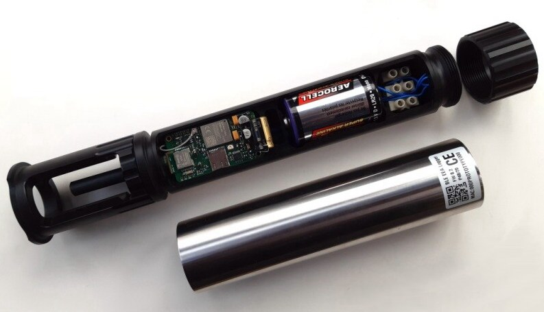
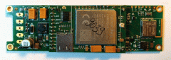
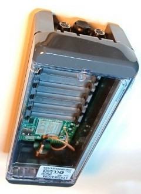

# LTX Typ 1720 – SDI-12-Datenlogger mit LoRaWAN

Der **LTX Typ 1720** ist ein kompakter, batteriebetriebener Datenlogger für
SDI-12-Sensoren. Er kombiniert die energieeffiziente Datenübertragung über
**LoRaWAN EU868** mit einem lokalen Messwertspeicher und einem
**Bluetooth-Low-Energy-Zugang** für Service und Konfiguration vor Ort.

Das schlanke 2"-Rundgehäuse eignet sich besonders für Messstellen, an denen
lange Batterielaufzeiten, kleine Gehäuseabmessungen und eine unabhängige lokale
Datensicherung gefordert sind.

*Das 2"-Rundgehäusekonzep; Innenaufbau und Bestückung können je nach
Geräteausführung abweichen.*

## Wesentliche Merkmale

- LoRaWAN **Version 1.0.4**, Geräteklasse A
- Funkbereich **EU868**, maximale Sendeleistung 14 dBm
- Bidirektionale Kommunikation über LoRaWAN
- SDI-12-Schnittstelle nach Version 1.3, auch für Low-Voltage-Sensoren
- Bis zu **20 Messkanäle** als Fließkommawerte (passen inkl. HK-Werte in die 51 Bytes Uplink)
- Lokaler Messwertspeicher, standardmäßig **8 MB**
- Ringspeicher- oder Linearspeicherbetrieb
- Bluetooth Low Energy (BLE) für Konfiguration, Diagnose und Datenzugriff vor Ort
- Bedienung mit der PWA **BLX Dashboard** auf Android- und Windows-Geräten
- Energieoptimierter Batteriebetrieb mit einer Lithium-D-Zelle
- Übertragung von HK-Werten (Housekeeping-Werten), also internen
    Geräte-Zustandswerten für Diagnose, Betriebssicherheit und Auswertung:
    Batteriespannung, bereits verbrauchtes Energiebudget, interne Temperatur,
    interne Feuchte (wichtig für Dichte-Überwachung) und barometrischer
    Luftdruck (zur Kompensation bei Drucksonden für Wasserpegel)

## Technische Daten

| Eigenschaft | Wert |
|---|---|
| Gerätetyp | LTX Typ 1720 |
| Anwendung | Autonomer Datenlogger für SDI-12-Sensoren |
| Sensorschnittstelle | SDI-12 Version 1.3 |
| Anzahl Messkanäle | bis zu 20 |
| Messintervall | 120 bis 86.400 Sekunden, konfigurierbar |
| LoRaWAN | Version 1.0.4, Klasse A |
| Frequenzbereich | EU868, 863 bis 870 MHz |
| Sendeleistung | maximal 14 dBm |
| Nutzdaten pro Uplink | bis zu 51 Byte, abhängig von Datenrate und Netzparametern |
| Datenübertragung | zyklisch, bidirektional; ADR-Unterstützung |
| Lokale Kommunikation | Bluetooth Low Energy, ab BLE 4.2 |
| Lokaler Speicher | 8 MB Standard, bis zu 16 MB bestückbar |
| Speicherbetrieb | Ringspeicher oder linear |
| Speicherkapazität | typisch ca. 400.000 historische Messwerte im Ringspeicherbetrieb bei 8 MB |
| Versorgung | 3,4 bis 3,6 V |
| Batterie | 1 × Lithium-D-Zelle, typisch 12 Ah |
| Sensorversorgung | intern geschaltet, ca. 9 V; optional 5V bis 12 V |
| Leiterplattenformat | ca. 35 mm × 115 mm |
| Gehäuse | schlankes 2"-Rundgehäuse |

Die tatsächlich erreichbare Batterielaufzeit hängt insbesondere vom
Messintervall, dem angeschlossenen Sensor, der LoRaWAN-Datenrate, der
Empfangssituation und der Anzahl der Übertragungen ab. Bei stationären
Messstellen kann **Adaptive Data Rate (ADR)** den Energieverbrauch deutlich
reduzieren.
Als kleine Orientierung zum Energieverbrauch siehe die Projekt-Messwerte in
[logger_Zusammenfassung.md, Abschnitt "4. Energiebetrachtung"](logger_Zusammenfassung.md#4-energiebetrachtung--beispiel-tensiomark-3-sensoren)
und [Abschnitt "5. Jahresbetrieb"](logger_Zusammenfassung.md#5-jahresbetrieb--beispielberechnung).

## Lokale Datensicherung

Im Gegensatz zu einem reinen Funkinterface zeichnet Typ 1720 die Messdaten
zusätzlich lokal auf. Im standardmäßigen Ringspeicherbetrieb werden bei vollem
Speicher automatisch die ältesten Datensätze überschrieben. Alternativ stoppt
der Linearspeicherbetrieb die Aufzeichnung, sobald der Speicher vollständig
belegt ist. Gespeicherte Daten und Diagnoseinformationen können vor Ort über
Bluetooth mit dem BLX Dashboard abgerufen werden.

## LoRaWAN-Funkmodul

LoRa-EU868-Shield für die Logger Typ 1720 und Typ 1820.

Der **LTX Typ 1720** verwendet denselben LoRaWAN-Modemkern wie der
**LTX Typ 1820**. Unterschiede liegen vor allem in der Energieversorgung und
im Gehäusekonzept:

- **Typ 1820:** 6 x 1,5 V Batterieversorgung, größeres Gehäuse
- **Typ 1720:** 1 x 3,6 V Lithium-D-Zelle, schlankes 2"-Rundgehäuse

Die wichtigsten Modem-Kenndaten (Stromaufnahme, Modulvergleich,
Sendeverhalten EU868) sind hier zusammengefasst:
[Energie-Vergleich LoRa-Module EU868](../lora/energie_vergleich.md)

| Typ 1720 (PCB-Vorschau) | Typ 1820 (Gehäusevorschau) |
|:--:|:--:|
|  |  |

Der Typ 1720 kann mit LoRaWAN-Netzen wie **ChirpStack**, **The Things Stack**
und kompatiblen Netzbetreiber-Plattformen eingesetzt werden. Die kompakten
Payloads minimieren die Funkzeit und damit den Energiebedarf.

## Konfiguration und Software

Die Inbetriebnahme und Wartung erfolgen lokal per Bluetooth mit dem
**BLX Dashboard**. Darüber lassen sich unter anderem Sensorabfragen,
Messintervalle, Geräteparameter und Diagnoseinformationen bearbeiten.

*BLX Dashboard: Bluetooth-App zur Bedienung und Konfiguration von LTX-Loggern vor Ort.*

Für die Cloud-Anbindung stehen offene Softwarekomponenten zur Verfügung:

- [BLX Dashboard](https://github.com/joembedded/ltx_ble_demo)
- [LTX Payload Decoder](https://github.com/joembedded/payload-decoder)
- [LTX Microcloud](https://github.com/joembedded/LTX_Server)

---

*Kurz-Datenblatt · Stand: März 2026 · Technische Änderungen vorbehalten*
