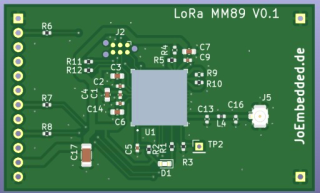
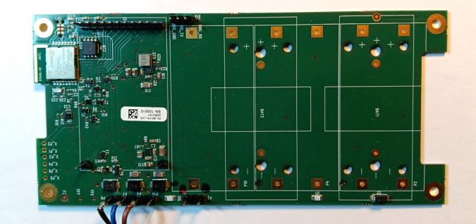
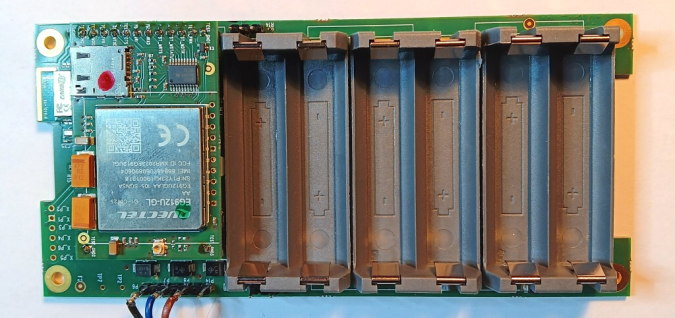
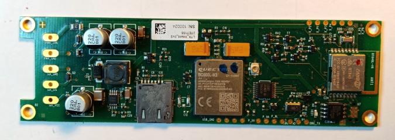
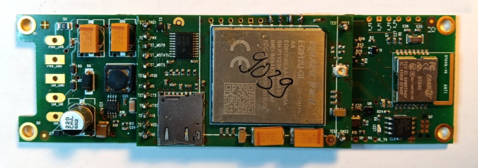
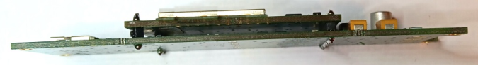
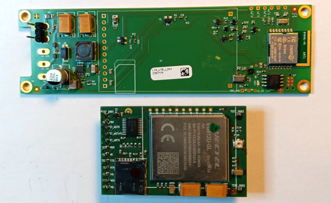
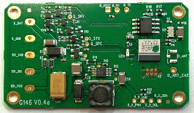

# Zusammenfassung: LTX Logger mit SDI-12 – Varianten

**Version:** V0.3 / 28.04.2026 / JoEm

---

## Inhaltsverzeichnis

- [Zusammenfassung: LTX Logger mit SDI-12 - Varianten](#zusammenfassung-ltx-logger-mit-sdi-12---varianten)
  - [Inhaltsverzeichnis](#inhaltsverzeichnis)
  - [1. Übersicht](#1-übersicht)
  - [2. Mobilfunk- und Funktechnologien](#2-mobilfunk--und-funktechnologien)
    - [2.1 LTE Cat1 – „klassisches 4G"](#21-lte-cat1--klassisches-4g)
    - [2.2 LTE-M](#22-lte-m)
    - [2.3 LTE-NB (NB-IoT)](#23-lte-nb-nb-iot)
    - [2.4 Generelles zu Mobilfunk](#24-generelles-zu-mobilfunk)
      - [HTTPS-Overhead gegenüber HTTP](#https-overhead-gegenüber-http)
    - [2.5 Mobilfunk-Shields](#25-mobilfunk-shields)
    - [2.6 GNSS (Positionierung)](#26-gnss-positionierung)
    - [2.7 LoRa EU868-Shield(s)](#27-lora-eu868-shields)
  - [3. Hardware-Baukasten](#3-hardware-baukasten)
    - [3.1 „BoPla"-Trägerplatine](#31-bopla-trägerplatine)
      - [Mechanische Daten](#mechanische-daten)
      - [Interne Versorgung](#interne-versorgung)
      - [SDI-12 Versorgung](#sdi-12-versorgung)
      - [Varianten](#varianten)
    - [3.2 „2-Zoll"-Trägerplatine und "Midi"-Logger](#32-2-zoll-trägerplatine-und-midi-logger)
      - [Mechanische Daten](#mechanische-daten-1)
      - [Versorgung](#versorgung)
      - [Extras](#extras)
      - [Varianten](#varianten-1)
      - [Beispiele 'in Bildern'](#beispiele-in-bildern)
  - [4. Energiebetrachtung – Beispiel Tensiomark (3 Sensoren)](#4-energiebetrachtung--beispiel-tensiomark-3-sensoren)
    - [Sensorparameter (TensioMark)](#sensorparameter-tensiomark)
    - [4.1 „BoPla"](#41-bopla)
    - [4.2 „2-Zoll"](#42-2-zoll)
  - [5. Jahresbetrieb – Beispielberechnung](#5-jahresbetrieb--beispielberechnung)
  - [6. Wichtige Stichworte](#6-wichtige-stichworte)

---

## 1. Übersicht

Hier werden die Systeme und Varianten der **LTX Logger mit SDI-12-Schnittstelle** zusammengefasst. Es gibt zwei mechanisch unterschiedliche Trägersysteme („BoPla" und „2-Zoll") mit verschiedenen Funkoptionen (LTE Cat1, LTE-450 Cat1, LTE-M/NB, LoRa). Alle Varianten unterstützen SDI-12, Bluetooth Low Energy (BLE) und verfügen über einen integrierten Speicher.

Der Fokus liegt auf einem **modularen Baukastensystem** mit klar definierten Hardware- und Kommunikationsvarianten.

| Typ | Plattform | Funk / Modem | Bemerkung |
|---|---|---|---|
| 1500 | 2-Zoll / Midi | LTE-M / NB / 2G | Modem direkt integriert |
| 1700 | 2-Zoll / Midi | LTE Cat1 / 2G | — |
| 1710 | 2-Zoll / Midi | LTE-M / NB / 2G | als Shield, technisch identisch zu Typ1500 |
| 1720 | 2-Zoll / Midi | LoRa EU868 | — |
| 1730 | 2-Zoll / Midi | LoRa GLOBAL | max. 20 dBm, nur zur Info |
| 1750 | 2-Zoll / Midi | LTE-450 Cat1 / 2G | 450 MHz, nur zur Info |
| 1790 | 2-Zoll / Midi | ohne Funk | Modem optional nachrüstbar |
| 1800 | BoPla | LTE Cat1 / 2G | — |
| 1810 | BoPla | LTE-M / NB / 2G | — |
| 1820 | BoPla | LoRa EU868 | — |
| 1830 | BoPla | LoRa GLOBAL | max. 20 dBm, nur zur Info |
| 1850 | BoPla | LTE-450 Cat1 / 2G | 450 MHz, nur zur Info |
| 1890 | BoPla | ohne Funk | Modem optional nachrüstbar |

> [!NOTE]
> Aktuell wird ausschließlich ein Logger **mit integriertem Speicher** vorgesehen. Eine „Light"-Variante ohne Speicher ("reines Datenübertragungs-System") ist technisch möglich, wird aber **nicht priorisiert**, um:
>
> - die Variantenvielfalt gering zu halten,
> - als **Verkaufsargument** zu dienen,
> - typische Offline-/Backup-Anforderungen direkt abzudecken,
>- spätere Webshop-Optionen offen zu halten.

---

## 2. Mobilfunk- und Funktechnologien

### 2.1 LTE Cat1 – „klassisches 4G"

Unter „LTE" oder „4G" versteht man üblicherweise LTE Cat1.

| Eigenschaft | Wert |
|---|---|
| Bandbreite | ca. 5–10 MBit/s |
| Netzabdeckung | vergleichbar mit früherem 2G |
| HTTPS | problemlos möglich (Tabelle weiter unten) |
| Verfügbarkeit | weltweit in praktisch allen LTE-Netzen |
| Firmware-Updates | geeignet für größere Datenmengen |

**Empfohlenes Modem:** Quectel EG912U-GL (LTE Cat1 mit 2G-Fallback)

> [!NOTE]
> Ein Modem mit LTE Cat1 kann in jedem Netz arbeiten, das als „LTE" oder „4G" bezeichnet wird.

> [!IMPORTANT]
> **KRITIS:** Das LTE Cat1 Modem steht auch in einer **450 MHz**-Version zum Einsatz für kritische Infrastruktur zur Verfügung. Der Netzzugang zum 450 MHz-LTE-Netz erfordert allerdings spezielle **Akkreditierung**, da das 450 MHz-Band in Europa üblicherweise für hoheitliche Verwendungen reserviert ist.

---

### 2.2 LTE-M

LTE-M ist ein Sub-Protokoll innerhalb bestimmter LTE-Netze.

| Eigenschaft | Wert |
|---|---|
| Datenrate | ab ca. 380 kBit/s |
| Reichweite | deutlich besser als LTE Cat1 |
| Einsatz | sehr gut für M2M-Kommunikation |
| HTTPS | stabil möglich |

**Empfohlenes Modem:** Quectel BG600L-M3 (LTE-M / NB1 / NB2 + 2G-Fallback)

> [!NOTE]
> LTE-M ist **nicht automatisch** in jedem LTE-Netz enthalten. Die Verfügbarkeit ist länderabhängig (siehe z.B. **Länderübersicht 1NCE:** <https://www.1nce.com/de-de/1nce-connect/laenderabdeckung>):

| Land (Beispielliste) | Verfügbare Technologien |
|---|---|
| Deutschland | LTE, LTE-M, LTE-NB2 (und 2G) |
| Schweiz | LTE, LTE-M, LTE-NB2 (kein 2G) |
| Polen | LTE, LTE-M (und 2G) |
| Italien | LTE, LTE-NB (und 2G) |
| Tunesien | nur LTE (und 2G)|
| Australien | LTE, LTE-M (kein 2G)|
| ... | ... |

---

### 2.3 LTE-NB (NB-IoT)

LTE-NB existiert in zwei Klassen:

| Klasse | Datenrate |
|---|---|
| NB1 | ca. 60 kBit/s |
| NB2 | ca. 130 kBit/s |

Eigenschaften:

- Sehr hohe Reichweite
- Sehr gute Gebäudedurchdringung
- Ideal für kleine Datenmengen
- HTTPS nur eingeschränkt sinnvoll; TCP (HTTP) „ok", aber nicht optimal
- UDP sehr effizient
- Funktional nahe an LoRaWAN bei paketbasierter Übertragung (via UDP)

**Empfohlenes Modem:** Quectel BG600L-M3 (LTE-M / NB1 / NB2 + 2G-Fallback)

> [!NOTE]
> Auch LTE-NB ist **nicht automatisch** Bestandteil eines LTE-Netzes. Die Unterstützung ist landesspezifisch, siehe oben.

---

### 2.4 Generelles zu Mobilfunk

Informationen zur Netzverfügbarkeit können z.B. über Netzbetreiber oder über SIM-Anbieter wie 1NCE abgefragt werden:

- **Länderübersicht 1NCE:** <https://www.1nce.com/de-de/1nce-connect/laenderabdeckung>

Dort ist ersichtlich, welche Länder LTE, LTE-M oder LTE-NB unterstützen.

> [!NOTE]
> Es existiert kein Modem, das gleichzeitig LTE Cat1 und LTE-M/NB in einem einzigen Modul kombiniert.

**LTX-Server (Open-Source):** <https://github.com/joembedded/LTX_server>

---

#### HTTPS-Overhead gegenüber HTTP

Verschlüsselung erzeugt Daten-Overhead. Hier eine Zusammenstellung mit Vergleich gegenüber 'reinem' HTTP:

| Kategorie | HTTP | HTTPS TLS 1.2 | HTTPS TLS 1.3 |
|---|---|---|---|
| TLS-Handshake extra| — | +2 Round-Trips | +1 Round-Trip |
| TLS-Handshake-Daten | — | ~5–8 KB | ~4–6 KB |
| Zertifikat + Chain | — | ~2–4 KB | ~2–4 KB |
| Record-Header | — | +5 Byte/Record | +5 Byte/Record |

> [!IMPORTANT]
> Gegenüber HTTP hat HTTPS einen deutlichen Overhead, also nur wenn wirklich nötig einsetzen.

### 2.5 Mobilfunk-Shields

- **Quectel EG912U-GL** – LTE Cat1 mit 2G-Fallback
  (**optional** auch als **450 MHz**-Version für **KRITIS** (kritische Infrastruktur))
  → Sichtbar in den Bildern bei Typ1700 und Typ1800
  

- **Quectel BG600L-M3** – LTE-M / NB1 / NB2 + 2G-Fallback
  → Im Typ1500 direkt integriert; als Shield für Typ1510 und Typ1810

### 2.6 GNSS (Positionierung)

Beide Modems verfügen über einen integrierten **GNSS-Empfänger** (optional aktivierbar). Bei einigermaßen freier Sicht zum Himmel – auch in Innenräumen in Fensternähe – ist nach ca. 30–120 Sekunden eine Position verfügbar. Das Quectel BG600L-M3 verfügt über eine A-GPS-Funktion (‘Assisted GPS’). Damit wird (wenn eingebucht) die Position schneller gefunden.

| Modem | Stromaufnahme (Suche) |
|---|---|
| Quectel EG912U-GL | ca. 60 mA @ 3.6 V |
| Quectel BG600L-M3 | ca. 70 mA @ 3.6 V |

---

### 2.7 LoRa EU868-Shield(s)

| Eigenschaft | Wert |
|---|---|
| Frequenzband | EU868 |
| max. Sendeleistung | 14 dBm (25 mW) |
| Energieverbrauch | sehr gering |
| max. Nutzdaten | 51 Bytes (ausreichend für 10–20 Kanäle mit HK) |
| Einsatz | zyklische Sensordatenübertragung |

Geeignet für energieoptimierte Langzeitmessungen mit kleinen Datenmengen.

**LTX Payload-Handler:** <https://github.com/joembedded/payload-decoder>

*LoRa EU868 – Shield für Typ1720 und Typ1820*

---

## 3. Hardware-Baukasten

Es existieren zwei mechanisch unterschiedliche Trägersysteme. Alle Varianten verfügen über:

- **SDI-12** Version 1.3, Low-Voltage-fähig
- **BLE** (Bluetooth Low Energy ab Version 4.2)
- **Speicher:** Default 8 MB (für bis zu 500.000 Messwerte)
- **HK-Werte:**
  - Batterie-Spannung
  - Interne Temperatur
  - Interne Feuchte
  - Energieverbrauch (mAh)

---

### 3.1 „BoPla"-Trägerplatine

Passt in Polycarbonat und ALU-Variante (ALU: Externe BLE Antenne möglich):

*„BoPla" Trägerplatine – Leer (Typ1890)*

*„BoPla" mit LTE-Modem und AA-Batteriehalter (Typ1800)*

#### Mechanische Daten

| Parameter | Wert |
|---|---|
| PCB-Größe | 70 mm × 147 mm |
| Externe Versorgung | 5–14 V |

#### Interne Versorgung

| Variante | Kapazität |
|---|---|
| 6 × AA Alkali (nominal 9 V) | ca. 2 Ah |
| 6 × AA Lithium (nominal 9 V) | ca. 3,5 Ah |
| 2 × D-Zelle Lithium 3,6 V (nominal 7,2 V) | typ. 12 Ah je Zelle |

Zusätzlich kann eine externe Versorgung von 5–14 V angeschlossen werden. Das System **priorisiert automatisch die höhere Spannung**, wobei interne Batterien als Backup dienen können.

#### SDI-12 Versorgung

Standard-SDI-12 benötigt 9,6–14 V (nominal 12 V). Viele Sensoren haben geringere Minimalspannungen:

| Sensor | Mindestspannung |
|---|---|
| TensioMark | 7,5 V |
| Low-Voltage-SDI-12 | 3,6 V |

Die Platine stellt eine hochgesteppte SDI-12-Spannung von **9,6 V** bereit.

#### Varianten

| Typ | Funk |
|---|---|
| Typ1890 | Logger ohne Funk - Modem optional nachrüstbar|
| Typ1800 | LTE Cat1 / 2G |
| _Typ1850_ | _LTE-450 Cat1 / 2G (450 MHz)_ **nur zur Info**|
| Typ1810 | LTE-M / NB / 2G |
| Typ1820 | LoRa EU868 |
| _Typ1830_ | _LoRa GLOBAL mit max. 20 dBm Sendeleistung_ **nur zur Info**|

---

### 3.2 „2-Zoll"-Trägerplatine und "Midi"-Logger

#### Mechanische Daten

| PCB-Größe | Wert | Modem |
|---|---|---|
| Typ1500 - Typ1790 | 35 mm × 115 mm | möglich oder integriert |
| Typ2000 | 56 mm × 32 mm | nicht möglich |

#### Versorgung

- **3,4–3,6 V**
- 1 × Lithium D-Zelle (ca. 12 Ah)

#### Extras

- Zusätzlicher interner HK-Kanal für barometrischen Druck (mBar)
- Für SDI-12 intern ein Step-Up auf ca. 9 V (optional 12 V) vorhanden

#### Varianten

| Typ | Funk |
|---|---|
| Typ1790 | Logger ohne Funk - Modem optional nachrüstbar |
| Typ1500 | LTE-M / NB / 2G – Modem direkt integriert |
| Typ1710 | LTE-M / NB / 2G als Shield (**technisch identisch zu Typ1500, rein mechanischer Unterschied**) |
| Typ1700 | LTE Cat1 / 2G |
| _Typ1750_ | _LTE-450 Cat1 / 2G (450 MHz)_ **nur zur Info**|
| Typ1720 | LoRa EU868 |
| _Typ1730_ | _LoRa GLOBAL mit max. 20 dBm Sendeleistung_ **nur zur Info**|
| Typ2000 | Kleiner Logger ('Midi'), kein Modem, präzise Uhr (max. +/- 60 sec/Jahr) |

#### Beispiele 'in Bildern'

Einige Bilder:

*Typ1500 – mit LTE-M/-NB-Modem direkt auf PCB*

*Typ1700 – mit aufgelötetem LTE Cat1-Modem*

*Typ1700 – Seitenansicht*

*„2-Zoll" (ohne Funk: Typ1790), darunter Shield LTE Cat1*

*Typ2000 – Kleiner Logger ('Midi'), kein Modem, mit präziser Uhr*

---

## 4. Energiebetrachtung – Beispiel Tensiomark (3 Sensoren)

### Sensorparameter (TensioMark)

| Parameter | Wert |
|---|---|
| Messdauer | ca. 3 Sekunden pro Sensor |
| Stromaufnahme | ca. 40 mA pro Sensor |
| Mindestspannung | 7,5 V |

---

### 4.1 „BoPla"

**Versorgung direkt bei Batteriespannung (6 × AA, 9 V)**

3 Sensoren bei 1 Messung pro Stunde:

$$\approx 0{,}1\,\text{mAh/h}$$

| Batterie | Kapazität | Anzahl Messungen (ohne Funk) |
|---|---|---|
| 6 × AA Alkali | 2 Ah | ≈ 20.000 |
| 6 × AA Lithium | 3,5 Ah | ≈ 35.000 |

**Energiebedarf pro Funk-Übertragung:**

| Technologie | Energiebedarf |
|---|---|
| LTE | ca. 0,1 mAh |
| LoRa | ca. 0,005–0,05 mAh |

---

### 4.2 „2-Zoll"

**Versorgung über Step-Up (3,6 V → 9 V)**

3 Sensoren bei 1 Messung pro Stunde:

$$\approx 0{,}3\,\text{mAh/h}$$

| Batterie | Kapazität | Anzahl Messungen (ohne Funk) |
|---|---|---|
| 1 × Lithium D-Zelle | 12 Ah | ≈ 40.000 |

**Energiebedarf pro Funk-Übertragung:**

| Technologie | Energiebedarf |
|---|---|
| LTE | ca. 0,3 mAh |
| LoRa | ca. 0,01–0,1 mAh |

---

## 5. Jahresbetrieb – Beispielberechnung

Eine häufige Kombination an den LTX-Loggern sind 3 **TensioMark-Sensoren (Matrix-Potential im Boden)**. Hierfür eine überschlägige Energieberechnung für 1 Jahr:

1 Jahr ≈ 8.760 Stunden (365 × 24 h). Bei **1 Messung pro Stunde mit 3 TensioMark-Sensoren**:

| Plattform | Verbrauch / Jahr | Batteriekapazität | Auslastung |
|---|---|---|---|
| BoPla | 0,1 mAh/h × 8.760 h = **876 mAh** | 2.000–3.500 mAh | < 50 % |
| 2-Zoll | 0,3 mAh/h × 8.760 h = **2.628 mAh** | 12.000 mAh | ca. 22 % |

> [!TIP]
> Selbst unter Berücksichtigung regelmäßiger Mobilübertragungen bleibt ausreichend Energiereserve. **Ein Jahresbetrieb mit einem Batteriesatz ist bei beiden Plattformen realistisch.**

---

## 6. Wichtige Stichworte

- **Modularer Logger-Baukasten** – klar definierte Hardware- und Kommunikationsvarianten
- **Mechanische Plattformen** – „BoPla" (70 × 147 mm) und „2-Zoll" (35 × 115 mm) (und „Midi" (56 × 32 mm))
- **Flexible Funkoptionen** – LTE Cat1, LTE-450 Cat1, LTE-M, NB-IoT, LoRa EU868
- **SDI-12-kompatibel** – inkl. Low-Voltage-Unterstützung ab 3,6 V
- **Weltweiter LTE-Einsatz möglich** – LTE Cat1 funktioniert in jedem LTE-Netz
- **Länderabhängige LTE-M/NB-Verfügbarkeit** – Prüfung über Netzbetreiber (z.B. 1NCE) erforderlich
- **Jahresbetrieb mit 3 × TensioMark und 1 Batteriesatz** realistisch bei 1 Messung/Stunde

---

*Referenzen:*
- *1NCE Länderabdeckung: <https://www.1nce.com/de-de/1nce-connect/laenderabdeckung>*
- *LTX-Server (Open-Source): <https://github.com/joembedded/LTX_server>*
- *LTX Payload-Handler: <https://github.com/joembedded/payload-decoder>*
- *TensioMark: <https://www.geoprecision.com>*
