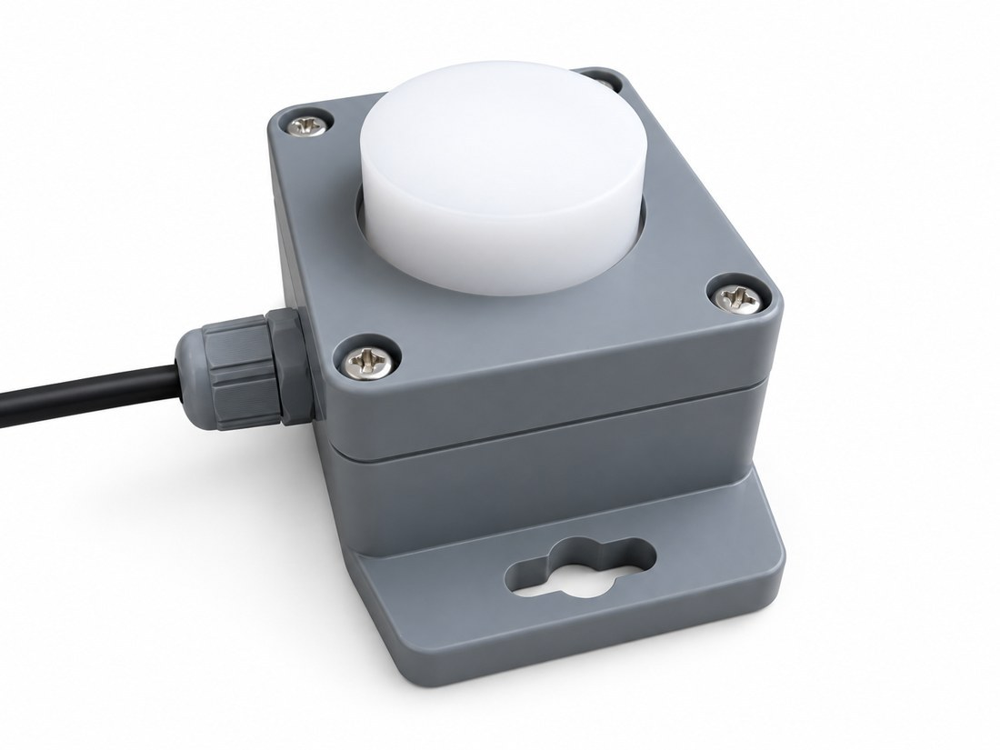
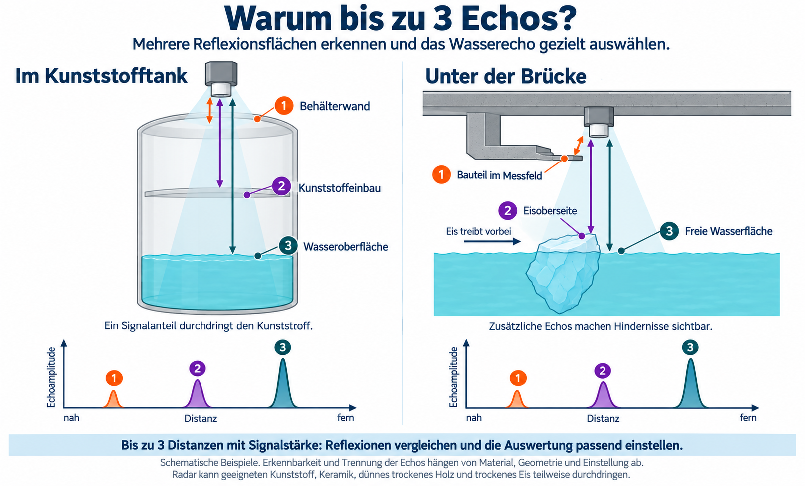

# Produktprofil

Der **Aquatos Radar Typ 0470** von **TerraTransfer** ist ein Distanzsensor auf Basis der Open-SDI12-Blue-Plattform (OSX). Er erfasst Entfernungen zu Wasseroberflächen und anderen geeigneten Reflexionsflächen bis **12 m**, optional bis **20 m**. Die Parametrierung und Diagnose erfolgen vor Ort mit dem **BLX Dashboard über Bluetooth**. Die **SDI-12-Schnittstelle V1.3** verbindet den Sensor mit einem Datenlogger.

{width=145mm}

| Messung | Ausstattung |
|---|---|
| Typische Genauigkeit **≤ 2 mm**, Auflösung **1 mm** | **Bis zu 3 Echos**, jeweils Distanz und Signalstärke |
| Anwendungsbereich **0,10 bis 12 m**, optional bis 20 m | Standard-Radaroptik mit **ca. 10°** Öffnungswinkel |
| Berührungsloses 60-GHz-PCR-Messprinzip | **SDI-12 V1.3** und **Bluetooth Low Energy** |

**Anwendungen:** Pegelmessstellen an Bächen, Flüssen und Kanälen, Rückhaltebecken und Behälter sowie Messstellen unter Brücken oder in Schächten. Das Radarsignal kann geeignete nichtleitende Behälterwände durchdringen. So lässt sich beispielsweise der Füllstand eines Kunststofftanks von außen messen, ohne eine Öffnung für den Sensor vorzusehen.

Die Auswertung mehrerer Echos hilft, zusätzliche Reflexionen durch Einbauten, Trennschichten oder treibendes Eis zu beurteilen.

<!-- pagebreak -->

# Technische Daten

Die folgenden Angaben gelten für den **Radarsensor Typ 0470**.

| Parameter | Radarsensor Typ 0470 |
|------------------------------------|----------------------------------------------------------------|
| Messprinzip | 60-GHz-Radar, Pulsed Coherent Radar (PCR) |
| Anwendungsbereich | 0,10 bis 12 m; optional bis 20 m |
| Typische Genauigkeit / Auflösung | ≤ 2 mm / 1 mm |
| Messbereich ab Werk | 0,25 bis 3,00 m; Start und Ende parametrierbar |
| Radaroptik | Standard ca. 10° Öffnungswinkel; angepasste Optiken auf Anfrage |
| Echoauswertung | Bis zu 3 Distanzen, jeweils mit Signalstärke in dB |
| Sortierung | Nach Abstand oder Signalstärke einstellbar |
| Ausgabe | Distanz in m; Signalstärke in dB; optional Versorgungsspannung |
| Schnittstellen | SDI-12 V1.3; Bluetooth Low Energy; SDI-12-Kommandos über BLE |
| Versorgung | 3,6 bis 16 V DC; kein Verpolschutz |
| Strom während der Messung | Kurzzeitig bis zu 100 mA |
| Ruhestrom / BLE verbunden | < 30 µA bei 4 V im Deep Sleep / < 60 µA bei 4 V im Connected Mode |
| Startbereitschaft | Ca. 250 ms nach Einschalten; dies ist nicht die Dauer einer Radarmessung |
| Betriebstemperatur | -40 °C bis +85 °C |
| Schutzart | IP67 |
| Konformität / Frequenzband | CE-konform; RoHS; 60-GHz-Band global sehr verbreitet |

{height=68mm}


<!-- pagebreak -->

# Mehrere Echos verstehen

An einer Materialgrenze wird ein Teil des Radarsignals reflektiert. Metalle reflektieren nahezu vollständig, flüssiges Wasser sehr stark. Geeignete Kunststoffe, Keramiken, Glas sowie dünnes, trockenes Holz oder Wassereis können einen Teil des Signals durchlassen. Dieser Anteil kann an einer dahinterliegenden Fläche ein weiteres Echo erzeugen. Zusammensetzung, Dicke und Feuchte bestimmen, wie gut das Signal ein Material durchdringt.

Der Typ 0470 wertet **bis zu drei Echos pro Messung** aus und liefert für jedes Echo Distanz und Signalstärke.

{width=170mm}

## Im Kunststofftank

Die **Behälterwand**, ein **Kunststoffeinbau** und die **Wasseroberfläche** erzeugen im Beispiel je ein Echo. Der Einbau veranschaulicht ein drittes Echo. Die Tankmessung im Betriebs-Datenblatt zeigt zwei Echos: eine schwache Reflexion an der PE-Behälterwand und die Hauptreflexion am Wasser.

## Unter der Brücke bei Eisgang

Ein **Bauteil im Messfeld**, die **Eisoberseite** und die **freie Wasserfläche neben dem Eisblock** liefern im Beispiel drei Reflexionen. Das Wasserecho wird neben dem Eis erfasst. Durchgefrorenes Wassereis ohne flüssigen Wasserfilm kann ebenfalls teilweise durchlässig sein; ob eine Messung durch die Eisschicht gelingt, muss an der Messstelle geprüft werden.

## Nutzen für die Auswertung

Messfenster, Empfindlichkeit und Sortierung helfen, das gewünschte Echo auszuwählen. Ein starkes oder nahes Echo muss nicht von der Wasseroberfläche stammen. Der Sensor erkennt keine Materialnamen; auch die Nummern in der Grafik sind **keine festen Kanalzuordnungen**. Ob sich Echos trennen lassen, hängt von Material, Abstand der Flächen, Geometrie und Einstellung ab.

<!-- pagebreak -->

# Radaroptik, Einbau und Anschluss

## Radaroptik

Die Wellenlänge beträgt etwa **5 mm**. Der interne Radarstrahler erzeugt ohne fokussierende Optik eine breite Keule von etwa **60° bis 90°**. Die Standardoptik bündelt diese auf **ca. 10°**. Ihre Austrittsfläche kann je nach Ausführung plan oder als Kalotte gestaltet sein. Kunststofflinsen können zusätzlich in Nebenrichtungen abstrahlen; in engen Einbausituationen ist dies bei der Ausrichtung zu beachten. Angepasste Optiken sind auf Anfrage möglich.

## Montage

Den Sensor senkrecht über der gewünschten Reflexionsfläche an einer Brücke, Wandhalterung oder einem Ausleger befestigen. Befestigung und Kabelführung so auslegen, dass sich die Ausrichtung nicht verändert. Wände, Einbauten und weitere Objekte im Messfeld beim Raw Scan prüfen. Die Bündelung reduziert deren Einfluss, schließt Störreflexionen aber nicht grundsätzlich aus.

Bei einer Messung durch eine geeignete Behälterwand lässt sich die Radaroptik häufig direkt an der Wand montieren. Die Signalqualität anschließend am Einbauort prüfen. Der Abstand zur Wand in den Beispielen veranschaulicht deren zusätzliches Echo.

Bei Montage und Kabeldurchführung die **Schutzart IP67** erhalten.

## Laufzeit bei Materialdurchdringung

In Luft breitet sich das Radarsignal annähernd mit Lichtgeschwindigkeit aus. In durchlässigen Materialien ist es langsamer. Bei einer Messung durch Kunststoff oder Eis kann die Reflexionsfläche deshalb weiter entfernt erscheinen, als sie tatsächlich ist. Der zusätzliche Distanzversatz hängt von Material, Dicke und Strahlweg ab.

Bei einer Behälterwand mit gleichbleibenden Eigenschaften ist dieser Versatz weitgehend konstant und kann beim Einmessen berücksichtigt werden. Bei Eis können sich Dicke und Wasseranteil ändern. Den Pegelwert dann anhand einer unabhängigen Referenz prüfen.

## Elektrischer Anschluss

| Aderfarbe | Funktion |
|---|---|
| Schwarz | GND / Masse |
| Braun | Versorgung 3,6 bis 16 V DC |
| Weiß oder Blau | SDI-12-Datensignal |

**Kein Verpolschutz:** Vor dem Anschluss Polarität und gerätespezifische Kabelbelegung prüfen. Der Typ 0470 benötigt mindestens **3,6 V**. Die Versorgung muss kurzzeitig **100 mA** während einer Messung liefern können.

<!-- pagebreak -->

# Inbetriebnahme mit BLX Dashboard

Das browserbasierte BLX Dashboard bietet Zugriff über **Bluetooth Low Energy (BLE)** sowie die Werkzeuge **Raw Scan** und **Live-Plot**. Geeignet sind Browser mit Web-Bluetooth-Unterstützung, etwa Chrome oder Edge unter Windows und Chrome unter Android. Auf iPhone und iPad ist ein geeigneter BLE-Browser erforderlich, beispielsweise [Bluefy](https://apps.apple.com/us/app/bluefy-web-ble-browser/id1492822055).

## Verbindung und erster Messwert

1. Versorgung und Anschluss prüfen, Sensor einschalten und die Startbereitschaft abwarten.
2. [BLX Dashboard öffnen](https://joembedded.github.io/ltx_ble_demo/ble_api/index.html), Bluetooth-Verbindung zum Sensor herstellen und dessen Identität prüfen.
3. Bei der ersten Verbindung die geräteeigene **6- bis 16-stellige PIN** eingeben oder den beiliegenden QR-Code scannen. Die Authentifizierung erfolgt per Challenge-Response; die PIN wird dabei nicht im Klartext übertragen.
4. Mit `k` die aktuellen Koeffizienten anzeigen. Ein geeignetes Messfenster wählen, zum Einstieg beispielsweise 0,25 bis 3 m.
5. Eine Messung starten und Distanz sowie Signalstärke prüfen. Im Live-Plot die erkannten Echos beobachten.
6. Den Raw Scan zur Ausrichtung verwenden; danach die regulären Messwerte kontrollieren und geänderte Koeffizienten mit `z?XWrite!` dauerhaft speichern.

{width=102mm}

## Raw Scan und Live-Plot

Der **Raw Scan** zeigt das Rohsignal und unterstützt die grobe Ausrichtung. Die reguläre Messung verarbeitet mehr Daten für eine präzise Distanzbestimmung. Das Betriebs-Datenblatt nennt Rohamplituden ab etwa **500** und reguläre Signalstärken typisch **über 1 dB** als Orientierung für gute Signale. Diese Werte sind keine festen Grenzwerte. Raw-Scan-Amplituden und Signalstärken in dB sind unterschiedliche Größen.

Die Skalierung erfolgt normalerweise automatisch. `.shell raw470scale CNT` setzt einen Festwert; `.shell raw470scale` ohne Argument zeigt die aktuelle Einstellung. Der **Live-Plot** stellt die aktuellen Distanzwerte dar und eignet sich zur Beobachtung der Reflexionen bei verändertem Wasserstand oder bewegten Objekten.

<!-- pagebreak -->

# SDI-12-Befehle und Messwertausgabe

`a` steht für die Sensoradresse, `n` im Befehl `aAn!` für die neue Adresse. Die Beispiele mit `?` gelten für den Zugriff auf einen einzelnen Sensor. Bei mehreren Geräten am SDI-12-Bus immer die konkrete Adresse verwenden.

| Befehl | Funktion |
|------------------------------------|----------------------------------------------------------------|
| `aAn!` | SDI-12-Adresse von `a` auf `n` ändern |
| `aI!` | Identifikation; Schema: `a13JE_Radar_0470_OSXxxxxxxxx` |
| `aM!` / `aMC!` | Messung eines Echos ohne / mit CRC; 2 Ergebniswerte: Distanz und Signalstärke |
| `aM1!` / `aMC1!` | Bis zu 3 Echos plus Versorgungsspannung; 7 Ergebniswerte, ohne / mit CRC; Befehlsform laut Betriebs-Datenblatt |
| `aD0!` ... `aD9!` | Gespeicherte Ergebnisse der vorangegangenen Messung blockweise abholen |
| `aXK0!` | Koeffizient abfragen; Ziffer entsprechend K0 bis K11 wählen |
| `aXK1=-0.123!` | Koeffizient setzen; Beispiel K1 |
| `aXDevice!` | Geräteinformationen abfragen |
| `aXWrite!` | Geänderte Koeffizienten dauerhaft speichern |
| `aXFactoryReset!` | Werkseinstellungen wiederherstellen |

## Ergebnisstruktur und Sortierung

Jedes Echo wird als **Distanz in m und Signalstärke in dB** ausgegeben. Die erweiterte Messung liefert die Reihenfolge **Distanz 1, Stärke 1, Distanz 2, Stärke 2, Distanz 3, Stärke 3, Versorgungsspannung**. Der Sensor speichert die Ergebnisse zwischen; der Logger liest sie mit den benötigten `D`-Befehlen aus.

Die Reihenfolge hängt von **K8** ab: `0` sortiert nach Abstand, `1` nach Signalstärke. Die Position eines Echos in der Ausgabe kann sich ändern, wenn sich Distanzen oder Signalstärken ändern. Zur Beurteilung deshalb stets das Wertepaar verwenden.

| Zustand / Code | Bedeutung |
|---|---|
| Distanz `0 m`, Signalstärke `-99 dB` | Kein Echo erkannt |
| Distanz `0 m`, Signalstärke `-98 dB` | „ToClose“: Reflexion zu nahe am Sensor |
| Fehlercode `-100` bis `-999` | Fehler im Koeffizienten-Setup |
| Fehlercode `-1000` | Interner Sensorfehler / keine Antwort; Sensor oder interne Verbindung prüfen |
| Andere Fehler | Textanzeige im BLX Dashboard beziehungsweise in BlueShell beachten |

**Nullwerte mit Fehlerkennung sind keine gültigen Pegelwerte.** Die Signalstärke und die Diagnose müssen bei der Übernahme in den Logger berücksichtigt werden.

## Linearisierung und Bezugspunkt

Gültige Rohdistanzen werden mit **WERT = (GEMESSEN × K0) - K1** linearisiert. Ab Werk gelten **K0 = 1,0** und **K1 = 0,0**. Laut Betriebs-Datenblatt ist die Kalibrierung auf die obere rechteckige Gehäusekante bezogen, für die **0,01 m** angezeigt werden; die runde Optikoberfläche ist nicht der Bezugspunkt. Den Bezug beim Einmessen dokumentieren und die Distanz für die Pegelausgabe auf den gewünschten Pegelnullpunkt umrechnen.

<!-- pagebreak -->

# Koeffizienten und Messparameter

Mit dem BLE-Kommando **`k`** lassen sich die aktuellen Koeffizienten und, soweit verfügbar, der Speicherbedarf des Setups anzeigen. Änderungen erfolgen über die **SDI-12-`XK`-Befehle**, direkt am Bus oder mit vorangestelltem `z` über Bluetooth.

| Parameter | Bedeutung und Einstellungen |
|------------------------------------|----------------------------------------------------------------|
| **K0** · Raw.Multi | Multiplikator der Linearisierung; Werkseinstellung **1,0** |
| **K1** · Raw.Offset | Subtrahierter Offset; Werkseinstellung **0,0** |
| **K2** · LiveSpeed | Automatische Messungen im Live-Plot; **0 = aus**. Beispiel **16400 = 1 s**, **1640 = 0,1 s** |
| **K3** · Start | Anfang des Messfensters in m; Standard **0,25** |
| **K4** · End | Ende des Messfensters in m; Standard **3,00**; optional bis **20 m** |
| **K5** · MaxStepLength | Schrittweite; **0 = automatisch**. Standard **2** für Enddistanzen bis etwa 8 m; **3** für 8 bis 12 m |
| **K6** · ConfigProfile | Messprofil; **0 = automatisch**, Profile **1 bis 5**. Standard **3**; normalerweise beibehalten |
| **K7** · ReflectorShape | **0 = generic**, Standard für die meisten Anwendungen; **1 = planar**, etwa für ebene Wasserflächen |
| **K8** · PeakSorting | **0 = nach Abstand**, **1 = nach Signalstärke**; Einstellung am Gerät mit `k` prüfen |
| **K9** · Threshold Sensitivity | Empfindlichkeit der Erkennung, Bereich **0 bis 1**; Standard **0,5** |
| **K10** · SignalQuality | Signalqualität, Bereich **-10 bis 35 dB**; Standard **20 dB** |
| **K11** · LeakCancellation | **0 = aus**, Standard; **1 = ein**, für Startdistanzen unter etwa **0,15 m** aktivieren |

## Messfenster und Messdauer

Das Messfenster auf die erwarteten Distanzen einschließlich einer ausreichenden Reserve begrenzen. Ein größerer Bereich erhöht Messdauer und Energiebedarf und kann zusätzliche Reflexionen erfassen. Die optionale Reichweite bis 20 m ist anwendungsspezifisch zu prüfen.

## Automatische Messungen

K2 aktiviert mit Werten ab **1640** automatische Messungen. Die Messfolge beginnt einige Sekunden nach einer Messung über Bluetooth. Der Sensor verlängert das Intervall bei Bedarf: Die Messpause beträgt mindestens das **Vierfache der Messzeit**, bei Versorgung über **7,5 V** mindestens das **Achtfache**. Die Einstellungen 0,1 s und 1 s sind daher keine garantierten Messintervalle für jedes Setup.

## Empfindlichkeit und Reflexionsfläche

K7 kann die Auswertung an ebene Flächen anpassen. K9 und K10 beeinflussen die Erkennung; Änderungen mit Raw Scan und regulären Messwerten kontrollieren. LeakCancellation verbessert die Nutzbarkeit des Nahbereichs, verlängert jedoch die Messung.

**K8 prüfen:** Das Betriebs-Datenblatt nennt unterschiedliche Werkseinstellungen für die Sortierung; die dortige `k`-Beispielausgabe zeigt **1**. Maßgeblich ist die Einstellung des konkreten Geräts.

<!-- pagebreak -->

# Kommandobeispiele und schnelles Setup

## SDI-12 über Bluetooth

Ein vorangestelltes **`z`** leitet SDI-12-Kommandos über die BLE-Verbindung weiter. Die gekürzte Sitzung zeigt den Ablauf aus dem Betriebs-Datenblatt. Gerätekennung und Messwerte dienen als Beispiel.

```text
z?I!
013JE_Radar_0470_OSXCFCCBEB6

z?M!
00032
0

z?D0!
0+2.351+8.21
```

Die Antwort `00032` meldet Adresse `0`, bis zu **3 s Wartezeit** und **2 Ergebniswerte**. Die folgende `0` signalisiert die Messbereitschaft. `D0` liefert anschließend **2,351 m** und **8,21 dB**. Vor der Datenabfrage die Messbereitschaft oder die gemeldete Wartezeit abwarten.

## Koeffizienten ändern und speichern

```text
k
z?XK3!
z?XK4!
z?XK3=0.25!
z?XK4=3.00!
z?XWrite!
```

Die ersten Abfragen dokumentieren das bisherige Fenster. Das Beispiel setzt anschließend **0,25 bis 3,00 m**. Erst **`XWrite`** speichert die Änderungen dauerhaft. Ein Factory Reset stellt Werkseinstellungen wieder her und erfordert danach eine erneute Kontrolle des Messstellen-Setups.

## Vordefinierte Setups mit `.crun`

Online stehen folgende Kommandodateien bereit. Sie können per Terminalkommando oder über den zugehörigen Setup-QR-Code aufgerufen werden.

| Messfenster | Kommando im BLX Dashboard |
|-------------------------|---------------------------------------------------------------------------|
| 0,25 bis 3 m | `.crun crun/0470_radar_0m25_3m00.crun` |
| 0,25 bis 8 m | `.crun crun/0470_radar_0m25_8m00.crun` |
| 0,25 bis 12 m | `.crun crun/0470_radar_0m25_12m00.crun` |

Das 3-m-Setup entspricht dem Standard nach Factory Reset. Größere Enddistanzen verlängern die Messung. Nach dem Aufruf die Werte mit `k` und einer Messung prüfen; Bezugspunkt und Linearisierung gegebenenfalls an die Messstelle anpassen.

<!-- pagebreak -->

# Software, Energie und Diagnose

## Weitere BLE-Kommandos

| Kommando | Funktion |
|------------------------------------|----------------------------------------------------------------|
| `bNEW_NAME` | Bluetooth-Advertising-Namen setzen; 3 bis 11 Zeichen |
| `.a` oder `.audio` | Audio-Einstellungen anzeigen |
| `.audio 1 1` | Audio- / Finder-Funktion einschalten |
| `.firmware` | Firmware-Datei `*.sec` lokal auswählen und über BLE übertragen |
| `.shell raw470scale CNT` | Raw-Scan-Skala auf einen festen Wert setzen |
| `.shell raw470scale` | Aktuelle Raw-Scan-Skalierung abfragen |

Für ein Firmware-Update die zum **Typ 0470** passende Datei aus dem [Open-SDI12-Blue-Archiv](https://joembedded.de/x3/ltx_firmware/index.php?dir=./Open-SDI12-Blue-Sensors/0470_RadarDistA) verwenden. Nach dem Update Identifikation, Koeffizienten und Messverhalten kontrollieren.

**BlueShell** ist ein alternatives Windows-Werkzeug für den Sensorzugriff. **SDI12Term** ermöglicht den Zugriff auf den SDI-12-Bus über einen passenden RS232-Adapter. Das BLX Dashboard selbst arbeitet im Browser; eine klassische Programminstallation ist dafür nicht erforderlich.

## Energiebedarf

Der mittlere Strom liegt im Deep Sleep **unter 30 µA bei 4 V**, bei aktiver BLE-Verbindung **unter 60 µA bei 4 V**. Im Ruhestrom enthalten sind etwa **10 µA** für den Erhalt des Radar-RAMs. Während einer Messung können kurzzeitig **bis zu 100 mA** auftreten.

Für die Laufzeitberechnung sind Dauer und Häufigkeit der Messungen sowie der Verbrauch des angeschlossenen Loggers zu berücksichtigen. Die Startbereitschaft nach etwa **250 ms** bezeichnet die Bereitschaft zur Bedienung, nicht die Dauer einer Radarmessung. Größere Messfenster und aufwendigere Einstellungen erhöhen den Energiebedarf.

## Diagnose an der Messstelle

| Beobachtung | Prüfung / Maßnahme |
|------------------------------------|----------------------------------------------------------------|
| Kein gültiges Echo | Versorgung, Ausrichtung, Start-/Enddistanz und Signalstärke prüfen; Raw Scan verwenden |
| „ToClose“ | Abstand zur nächsten Reflexionsfläche prüfen; unter 0,05 m keine Messung möglich |
| Schwaches Echo | Messfenster und Ausrichtung optimieren; K7, K9 und K10 passend einstellen |
| Echo wechselt seine Ausgabeposition | K8 und die Distanz-/Stärke-Paare vergleichen; mögliche zusätzliche Reflexionsfläche prüfen |
| Einstellungen nach Neustart verloren | Änderungen erneut setzen und mit `XWrite` speichern |
| Interner Fehler `-1000` | Versorgung sowie Sensor und interne Verbindung prüfen |

## Weitere Anwendungen mit angepasster Firmware

Das Betriebs-Datenblatt beschreibt auch Schwingungsmessungen an entfernten Objekten, etwa Personen, Bauwerken oder Maschinen, von ungefähr **0,2 Hz bis 2 kHz**, sowie Personen- und Geschwindigkeitsdetektion. Diese Anwendungen erfordern **angepasste Firmware** und gehören nicht zum hier beschriebenen Distanzmessbetrieb.

<!-- pagebreak -->

# Systembetrieb mit Aquatos Web LTX

Der Typ 0470 lässt sich über SDI-12 mit **LTX-Datenloggern** kombinieren, die TerraTransfer in diesem Produktzusammenhang als **Aquatos Web LTX** anbietet. Der Sensor liefert die Messwerte. Der Logger übernimmt die zeitgesteuerte Erfassung, Speicherung und, je nach Ausführung, Übertragung an den **Sensormanager**, die Cloud-Anwendung zur Datenhaltung und Auswertung.

| Bestandteil | Aufgabe im Messsystem |
|------------------------------------|----------------------------------------------------------------|
| Radar Typ 0470 | Distanz und Signalstärke erfassen; lokale Parametrierung über BLE |
| LTX-Logger / Aquatos Web LTX | Sensor über SDI-12 abfragen; Kanäle zuordnen; Daten speichern und bei Funkausstattung übertragen |
| Sensormanager | Messdaten empfangen, darstellen und auswerten; Fernzugriff abhängig von Logger, Firmware und Anbindung |

Funktechnik und Batterieausstattung hängen vom Logger ab. Beispiele sind **LTE-M/NB-IoT bei Typ 1500 und 1710**, **LTE Cat1 bei Typ 1700** und **LoRaWAN EU868 bei Typ 1720**.

## Messkanäle und Pegelbezug

Für ein Echo sind **zwei Ergebniswerte**, für die erweiterte Abfrage **sieben Ergebniswerte** zu berücksichtigen. Den Logger so konfigurieren, dass er den Messbefehl auslöst und anschließend die zugehörigen Datenblöcke ausliest. Bei mehreren Sensoren eindeutige SDI-12-Adressen vergeben. Distanz, Signalstärke und Fehlerkennungen müssen zusammen ausgewertet werden.

Für die Wasserstandsausgabe die Distanz auf den eingemessenen Pegelnullpunkt umrechnen. Die Umrechnung im Sensor oder Logger festlegen und eine doppelte Linearisierung vermeiden. Mess- und Übertragungsintervall sowie die Versorgung bestimmen die Laufzeit des Gesamtsystems.

## Konformität und Anbieter

Das Gerät ist **CE-konform** (Betrieb in Europa).

**TerraTransfer GmbH** · Ottostr. 19a · 44867 Bochum · Deutschland

Telefon: +49 (0) 2327 83 44 85-1 · [info@terratransfer.de](mailto:info@terratransfer.de) · [terratransfer.org](https://terratransfer.org/)

## Weiterführende Dokumentation

Dieses Dokument ist das **Datenblatt zum Aquatos Radar Typ 0470, V1.1**. Die ergänzende technische Beschreibung `osx_radar_a121_de.pdf` wird als **Betriebs-Datenblatt** bezeichnet.

- [LTX-Typen und Hardware](https://github.com/joembedded/ltx_docu/blob/master/editiert/ltx_typen/logger_Zusammenfassung.md) und [LTX-Parameterreferenz](https://github.com/joembedded/ltx_docu/blob/master/editiert/ltx_parameter/ltx_parameter_referenz.md).
- [BLX-Dashboard-Kommandos](https://github.com/joembedded/ltx_docu/blob/master/editiert/blx_dashboard/blx_commands.md), [BlueShell](https://joembedded.de/x3/blueshell/) und [SDI12Term](https://github.com/joembedded/SDI12Term).
- [Open-SDI12-Blue-Plattform](https://github.com/joembedded/Open-SDI12-Blue) und [Betriebs-Datenblatt im Firmware-Archiv](https://joembedded.de/x3/ltx_firmware/Open-SDI12-Blue-Sensors/0470_RadarDistA/osx_radar_a121_de.pdf).

*Version V1.1 · Redaktionsstand September 2026.*
