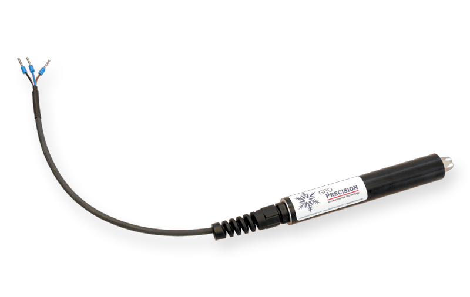
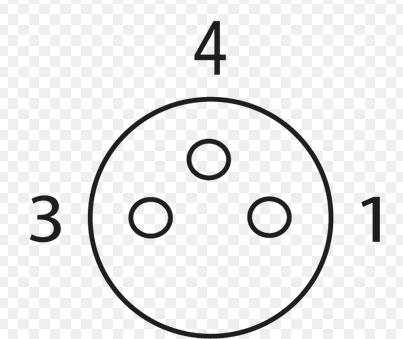
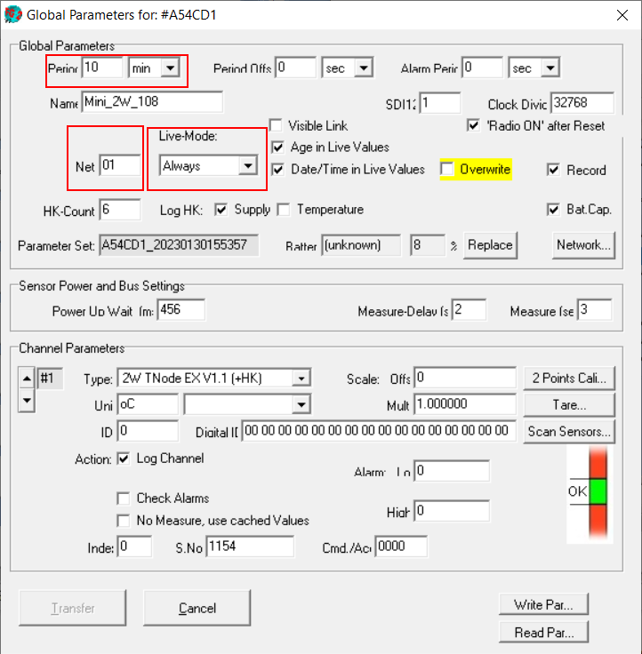
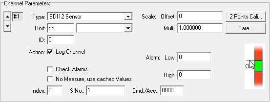
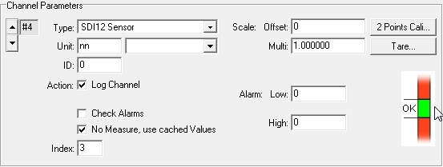
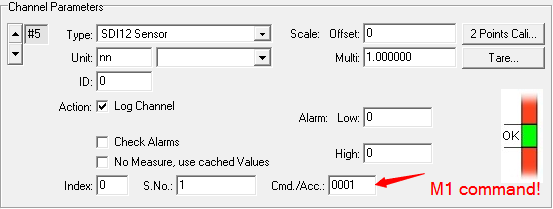
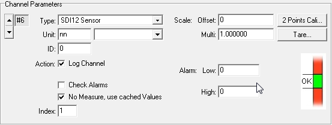

# Bedienungsanleitung: Wireless 433 MHz zu SDI-12 Konverter

Dokumentstand: 2026-07-24  
Grundlage: GeoPrecision GmbH, *Wireless 433 MHz to SDI12 Converter - Manual*, Erstfassung vom 2023-05-05

> [!IMPORTANT]
> Dieses Gerät ist ein Funk-zu-SDI-12-Konverter, kein eigenständiger Messsensor. Es empfängt die zuletzt per 433 MHz übertragenen Messwerte kompatibler GeoPrecision-Funkdatenlogger und stellt sie einem SDI-12-Datenlogger zur Verfügung. Die zugrunde liegende Herstellerunterlage beschreibt ausschließlich die 433-MHz-Ausführung. Für eine eventuell vorhandene 915-MHz-Ausführung enthält sie keine abweichenden technischen oder regulatorischen Angaben.

## 1. Zweck und Einsatzbereich

Der Konverter bindet GeoPrecision-Funkdatenlogger in einen SDI-12-Bus ein. Er kann unter anderem für folgende Aufgaben eingesetzt werden:

- Einbindung neuer GeoPrecision-Funkdatenlogger in ein bestehendes SDI-12-Messnetz
- Erweiterung eines Funkmessnetzes um einen SDI-12-Datenlogger, zum Beispiel für Internetübertragung oder zentrale Datensammlung
- Nachrüstung eines SDI-12-Datenloggers mit 433-MHz-Empfang
- Drahtlose Überbrückung der Strecke zwischen einer Messstelle und einem größeren Datenlogger

Unterstützt werden verschiedene GeoPrecision-433-MHz-Funkdatenlogger, beispielsweise:

- Temperaturdatenlogger
- Schnee-/Distanzdatenlogger
- Neigungs-/Winkeldatenlogger
- Thermistorketten



*Abbildung 1: Wireless 433 MHz zu SDI-12 Konverter in der Ausführung mit offenem Kabelende.*

Der Konverter kann bis zu 20 Werte eines einzelnen Funkdatenloggers und insgesamt höchstens 48 Werte mehrerer Funkdatenlogger bereitstellen.

## 2. Wichtige Hinweise

> [!WARNING]
> Verdrahtung nur im spannungsfreien Zustand durchführen. Versorgung, Masse und Datenleitung nicht vertauschen. Die zulässige Versorgungsspannung beträgt 3,6 bis 14 V DC.

> [!CAUTION]
> Der Konverter muss während einer vollständigen Konfiguration sowie zwischen Messstart (`M`) und Datenausgabe (`D`) ununterbrochen versorgt bleiben. Nach jedem Einschalten mindestens 800 ms warten, bevor der erste Befehl gesendet wird.

- Bei mehreren Geräten am selben SDI-12-Bus benötigt jedes Gerät eine eindeutige SDI-12-Adresse.
- Die nach SDI-12 zulässige gesamte Leitungslänge gilt für die Summe aller an denselben Bus angeschlossenen Leitungsabschnitte.
- Die herstellerspezifischen `X`-Befehle sind nicht Bestandteil des SDI-12-Standards. Manche PC-Adapter oder Terminalprogramme können damit empfindlicher reagieren als mit Standardbefehlen.
- Der Konverter liefert die zuletzt empfangenen Funkmesswerte. Deren Alter wird durch die Messperiode des Funkdatenloggers bestimmt.

## 3. Technische Daten

| Merkmal | Wert |
|---|---|
| Schnittstelle | SDI-12, Befehlssatz auf Basis SDI-12 V1.2 |
| Funkempfang | GeoPrecision 433-MHz-Funkdatenlogger |
| Versorgungsspannung | 3,6 bis 14 V DC |
| Stromaufnahme während der Messung | größer als 19 mA |
| Empfohlene Auslegung der Versorgung | größer als 20 mA dauerhaft |
| Stromaufnahme im Ruhezustand | 2 mA |
| Wartezeit nach dem Einschalten | mindestens 800 ms |
| Überspannungsschutz | TVS-Überspannungsableiter, 400 W |
| Werte je Funkdatenlogger | bis zu 20 |
| Werte insgesamt | bis zu 48 |
| Betriebstemperatur | -40 bis +85 °C |
| Optionales Zubehör | Kunststoffgehäuse für externen Einsatz |
| Werkseitige SDI-12-Adresse | `1` |

## 4. Anschluss

### 4.1 Offenes Kabelende

| Aderfarbe | Funktion | Anschlusswert |
|---|---|---|
| Braun | Versorgung | +3,6 bis +14 V DC, Versorgung für mehr als 20 mA auslegen |
| Schwarz | Masse | GND |
| Blau | SDI-12-Datenleitung | DATA |

### 4.2 M8-Steckverbinder, 3-polig

Die Belegung gilt für das in der Herstellerunterlage dargestellte Kabel mit weiblichem Gegenstück.


*Abbildung 2: Lieferbare Anschlussvarianten mit offenem Kabelende und M8-Steckverbinder.*

| Pin | Aderfarbe | Funktion |
|---:|---|---|
| 1 | Braun | Versorgung, +3,6 bis +14 V DC |
| 3 | Blau | SDI-12-Datenleitung |
| 4 | Schwarz | Masse, GND |



*Abbildung 3: Kontaktbild des M8-Anschlusses aus der Originalunterlage. Pin 1 führt die Versorgung, Pin 3 die SDI-12-Datenleitung und Pin 4 Masse.*

Schematische Ansicht der Kontaktseite:

```text
             Pin 4 (GND)
                  o

 Pin 3 (DATA) o       o Pin 1 (+V)
```

### 4.3 Anschluss an einen SDI-12-Bus

1. Versorgung des SDI-12-Busses ausschalten.
2. Braun mit der positiven Versorgung verbinden.
3. Schwarz mit der gemeinsamen Masse verbinden.
4. Blau mit der SDI-12-Datenleitung verbinden.
5. Prüfen, dass kein anderes Gerät am Bus dieselbe Adresse verwendet. Werkseitig lautet die Adresse `1`.
6. Bus einschalten und mindestens 800 ms warten.
7. Mit `1I!` die Kommunikation prüfen. Ist die Adresse unbekannt und nur ein Sensor angeschlossen, kann für unterstützte Befehle `?` als Platzhalteradresse verwendet werden.

## 5. Funkdatenlogger vorbereiten

### 5.1 Funktionsprinzip der Live-Messwerte

Kompatible 433-MHz-Funkdatenlogger übertragen fortlaufend den zuletzt aufgenommenen Messwertsatz. Beispiel: Bei einer Messperiode von einer Stunde wird derselbe Messwertsatz während dieser Stunde wiederholt ausgesendet und erst bei der nächsten Messung aktualisiert.

Ein Funkdatenlogger kann je nach Typ bis zu 48 Kanäle in einem Messzyklus erfassen. Die Werte sind nullbasiert indiziert:

- erster Wert: Index `0`
- zweiter Wert: Index `1`
- n-ter Wert: Index `n-1`
- optionaler Index `255`: Funk-Signalstärke

Innerhalb eines übertragenen Satzes heißt der erste Wert der **Messwert** (*measured value*). Die nachfolgenden Werte heißen **Cache-Werte** (*cached values*). Diese Unterscheidung ist für die Kanalzuordnung im Konverter wichtig.

### 5.2 Einstellungen in FG2-Shell

Der Funkdatenlogger muss bereits korrekt messen und aufzeichnen. In FG2-Shell das Parameterformular des Funkdatenloggers öffnen und Folgendes prüfen:

| Parameter | Einstellung |
|---|---|
| `Net` | Für Funkdatenlogger und Empfänger identisch; Werkseinstellung laut Vorlage `01` |
| `Live-Mode` | `Always` |
| `Period` | Vorhandene Messperiode notieren; sie bestimmt, wann neue Werte entstehen |



*Abbildung 4: Parameterformular des Funkdatenloggers in FG2-Shell. Rot markiert sind `Period`, `Net` und `Live-Mode`; `Live-Mode` steht auf `Always`.*

> [!NOTE]
> Die Herstellerunterlage zeigt die Einstellung am Funkdatenlogger, beschreibt aber keinen SDI-12-Befehl zum Ändern des Funknetzes im Konverter. Falls dessen `Net` nicht zur Logger-Einstellung passt, muss es mit der dafür vorgesehenen Herstellerkonfiguration oder durch den Lieferanten angepasst werden.

## 6. SDI-12-Kommunikation

### 6.1 Schreibweise

In den folgenden Befehlen gilt:

- `a`: aktuelle SDI-12-Adresse des Konverters, werkseitig `1`
- `n`: Kanal- oder Befehlsindex, abhängig vom Befehl
- `i`: Index eines Messwerts im Funkdatenlogger
- `s`: hexadezimale Seriennummer des Funkdatenloggers
- `c`: hexadezimaler Zugriffscode bzw. Geräte-PIN des Funkdatenloggers
- `<CR><LF>`: Abschluss einer Antwort mit Wagenrücklauf und Zeilenvorschub

Jeder an den Konverter gesendete Befehl endet mit `!`. Die Zeichenfolge `<CR><LF>` gehört bei den gezeigten Antworten zur Übertragung und wird nicht als Text eingegeben.

### 6.2 Benötigte Hilfsmittel

Für die Konfiguration werden benötigt:

- stabile Versorgung des Konverters
- SDI-12-PC-Interface mit Terminalsoftware, zum Beispiel SDI Win oder SDI Term, oder
- ein Datenlogger mit einer Kommandozeile zum direkten Senden von SDI-12-Befehlen

Während aller Konfigurationsschritte darf die Versorgung nicht unterbrochen werden. Die Konfiguration wird nichtflüchtig gespeichert und bleibt nach einem späteren Spannungsausfall erhalten.

## 7. Konfiguration

### 7.1 Empfohlene Reihenfolge

1. Funkdatenlogger gemäß Abschnitt 5 konfigurieren und seine hexadezimale Seriennummer sowie den Zugriffscode bereithalten.
2. Konverter anschließen, einschalten und mindestens 800 ms warten.
3. Kommunikation mit `aI!` prüfen.
4. Für jeden Funkdatenlogger zuerst dessen ersten gewünschten Wert mit `aXPn=5,i,s,c!` zuordnen.
5. Direkt danach weitere Werte desselben Funkdatenloggers mit `aXPn=3,i!` zuordnen.
6. Jede Kanalzuordnung mit `aXPn!` kontrollieren.
7. Optional Offset und Faktor setzen.
8. Kanalstatus prüfen und benötigte Kanäle aktivieren.
9. Eine vollständige Messung mit `M`-/`D`-Befehlen testen.
10. Versorgung erst nach Abschluss der Konfiguration trennen.

### 7.2 Ersten Wert eines Funkdatenloggers zuordnen

```text
aXPn=5,i,s,c!
```

| Feld | Bedeutung |
|---|---|
| `n` | Konverterkanal `0` bis `47`; der Kanal wird konfiguriert und aktiviert |
| `i` | Index des zu lesenden Werts im Funkdatenlogger |
| `s` | hexadezimale Seriennummer des Funkdatenloggers |
| `c` | hexadezimaler Zugriffscode bzw. Geräte-PIN |
| Antwort | nur die SDI-12-Adresse `a` |

Dieser Befehl wählt einen Funkdatenlogger aus und ordnet dessen Messwert dem Konverterkanal zu. Er muss auch verwendet werden, wenn anschließend Cache-Werte desselben Funkdatenloggers eingerichtet werden sollen.

Beispiel für Kanal 0, Wertindex 0, Seriennummer `A54CD1` und Zugriffscode `1154`:

```text
>> 1XP0=5,0,A54CD1,1154!
<< 1<CR><LF>
```

### 7.3 Weitere Werte desselben Funkdatenloggers zuordnen

```text
aXPn=3,i!
```

| Feld | Bedeutung |
|---|---|
| `n` | Konverterkanal `1` bis `47`; der Kanal wird konfiguriert und aktiviert |
| `i` | Index des Cache-Werts im zuvor ausgewählten Funkdatenlogger |
| Antwort | nur die SDI-12-Adresse `a` |

Der Befehl bezieht sich auf den zuletzt mit Typ `5` ausgewählten Funkdatenlogger. Deshalb die Cache-Werte eines Loggers unmittelbar nach dessen erstem Wert konfigurieren. Beim Wechsel zu einem anderen Funkdatenlogger wieder mit einem Typ-`5`-Befehl beginnen.

Beispiel für weitere Werte mit den Indizes 1 bis 3:

```text
>> 1XP1=3,1!
<< 1<CR><LF>
>> 1XP2=3,2!
<< 1<CR><LF>
>> 1XP3=3,3!
<< 1<CR><LF>
```

### 7.4 Kanalzuordnung lesen

```text
aXPn!
```

Beispiele:

```text
>> 1XP0!
<< 1XP0=5,0,A54CD1,1154<CR><LF>

>> 1XP2!
<< 1XP2=3,2,000000,0000<CR><LF>
```

Bei einem Cache-Kanal sind Seriennummer und Zugriffscode in der Antwort `000000` und `0000`, weil sie vom zuvor ausgewählten Funkdatenlogger übernommen werden.

### 7.5 Offset und Faktor

Offset und Faktor sind optional und bei Auslieferung für jeden Kanal deaktiviert.

Setzen für Kanal `n` von `0` bis `47`:

```text
aXKn=o,f!
```

- `o`: Offset
- `f`: Faktor
- beide Werte müssen immer gemeinsam und durch ein Komma getrennt übertragen werden
- als Dezimaltrennzeichen ist der Punkt zu verwenden

Beispiel:

```text
>> 1XK1=-0.25,2.54!
<< 1<CR><LF>
```

Auslesen:

```text
aXKn?!
```

Beispiel:

```text
>> 1XK1?!
<< 1=-0.25,+2.54<CR><LF>
```

> [!NOTE]
> Die Herstellerunterlage legt die mathematische Reihenfolge der Offset-/Faktorverrechnung nicht fest. Nach einer Skalierungsänderung deshalb mit einem bekannten Eingangswert prüfen, ob die Ausgabe der gewünschten Umrechnung entspricht.

### 7.6 Kanal aktivieren oder deaktivieren

Setzen:

```text
aXAn=s!
```

- `n`: Konverterkanal `0` bis `47`
- `s=0`: Kanal deaktivieren
- `s=1`: Kanal aktivieren

Beispiele:

```text
>> 1XA4=0!
<< 1<CR><LF>

>> 1XA4=1!
<< 1<CR><LF>
```

Status lesen:

```text
aXAn?!
```

Beispiel:

```text
>> 1XA4?!
<< 1=0<CR><LF>
```

> [!NOTE]
> In der englischen Ausgangsunterlage sind die Beispiele dieses Abschnitts typografisch inkonsistent (`k` und `n` werden vermischt). Die Befehle oben wurden entsprechend der beschriebenen Syntax als Kanalnummer `n` und Status `s` normalisiert. Bei einer abweichenden Firmwareantwort die gerätespezifische Firmwaredokumentation heranziehen.

### 7.7 SDI-12-Adresse ändern

```text
aAn!
```

- erstes `a`: bisherige Adresse
- `n`: neue Adresse

Beispiel, Adresse von `1` auf `2` ändern:

```text
>> 1A2!
<< 2<CR><LF>
```

Nach einer Adressänderung alle weiteren Befehle mit der neuen Adresse senden.

### 7.8 Gerät identifizieren

```text
aI!
```

Der Konverter antwortet mit seiner SDI-12-Identifikation. Der genaue Inhalt der Identifikationsantwort ist in der Ausgangsunterlage nicht festgelegt.

## 8. Messwerte auslesen

### 8.1 Ablauf

Eine vollständige Abfrage besteht aus Messstart, Wartezeit bzw. Service-Request und einem oder mehreren Datenbefehlen:

1. Ersten Werteblock mit `aM!` oder `aM0!` vorbereiten.
2. Antwort `atttn` auswerten.
3. Entweder den Service-Request des Konverters abwarten oder mindestens `ttt` Sekunden warten.
4. Daten mit `aD0!`, danach bei Bedarf `aD1!` bis `aD9!` auslesen.
5. Falls weitere Werteblöcke konfiguriert sind, `aM1!`, anschließend wieder die zugehörigen `D`-Befehle ausführen.
6. Für weitere Blöcke entsprechend mit `aM2!` bis maximal `aM9!` fortfahren.

Der Konverter muss während des gesamten Ablaufs eingeschaltet bleiben. Bei einem Spannungsausfall zwischen `M` und `D` die Messsequenz vollständig neu beginnen.

### 8.2 Ersten Messblock starten

```text
aM!
```

oder gleichbedeutend:

```text
aM0!
```

Der Befehl erfasst die konfigurierten Funkwerte und legt den ersten Werteblock im internen Zwischenspeicher ab. Er muss immer der erste `M`-Befehl einer neuen Messsequenz sein.

Antwortformat:

```text
atttn
```

| Feld | Bedeutung |
|---|---|
| `a` | SDI-12-Adresse |
| `ttt` | maximale Wartezeit in Sekunden |
| `n` | Anzahl der mit diesem Messblock angekündigten Werte, höchstens 9 |

Beispiel `10089`:

- Adresse `1`
- Wartezeit `008` Sekunden
- `9` angekündigte Werte

Der Konverter kann vor Ablauf der Wartezeit einen Service-Request senden. Dieser besteht aus seiner Adresse, im Beispiel `1<CR><LF>`.

### 8.3 Daten eines Messblocks lesen

```text
aDn!
```

`n` kann `0` bis `9` sein. Mit aufeinanderfolgenden `D`-Befehlen werden die in der vorherigen `M`-Antwort angekündigten Werte gelesen. Vor dem ersten `D`-Befehl muss der Service-Request eingegangen oder die angekündigte Wartezeit verstrichen sein.

### 8.4 Weitere Messblöcke vorbereiten

```text
aMn!
```

Für weitere Blöcke ist `n` zwischen `1` und `9` zu wählen. Jeder `M`-Befehl kündigt höchstens neun Werte an. Die tatsächlich erforderliche Zahl der `M`-Befehle hängt von der Anzahl der konfigurierten Kanäle ab.

### 8.5 Vollständiges Beispiel mit 13 Werten

Das folgende Beispiel verwendet Adresse `1` und einen Konverter mit 13 konfigurierten Werten. Platzhalter in eckigen Klammern stehen für die tatsächlich ausgegebenen, vorzeichenbehafteten Messwerte.

```text
>> 1M0!
<< 10089<CR><LF>       # 8 s Wartezeit, 9 Werte
<< 1<CR><LF>           # Service-Request

>> 1D0!
<< 1[Wert 0][Wert 1][Wert 2]<CR><LF>
>> 1D1!
<< 1[Wert 3][Wert 4][Wert 5]<CR><LF>
>> 1D2!
<< 1[Wert 6][Wert 7][Wert 8]<CR><LF>

>> 1M1!
<< 10014<CR><LF>       # 1 s Wartezeit, 4 Werte
<< 1<CR><LF>           # Service-Request

>> 1D0!
<< 1[Wert 9][Wert 10][Wert 11]<CR><LF>
>> 1D1!
<< 1[Wert 12]<CR><LF>
```

Die Aufteilung auf mehrere `D`-Antworten wird durch die zulässige SDI-12-Antwortlänge bestimmt. Ein Datenlogger darf nicht voraussetzen, dass alle angekündigten Werte in `D0` enthalten sind.

## 9. Fehlerwerte

| Wert | Bedeutung | Prüfung/Abhilfe |
|---:|---|---|
| `-98.00` | Kommunikationsfehler oder Funkwert nicht empfangen | Funkreichweite, `Net`, Live-Mode, Seriennummer, Zugriffscode und Messperiode prüfen |
| `-99.00` | Kanal nicht aktiviert | Kanalzuordnung und Aktivstatus mit `XP` bzw. `XA` prüfen |
| `-100` | Kein Wert vorhanden | Funkdatenlogger messen lassen, Live-Übertragung und Zuordnung prüfen; anschließend Messsequenz neu starten |

Fehlerwerte nicht als gültige physikalische Messwerte speichern. Der Datenlogger sollte sie erkennen, kennzeichnen und bei Bedarf eine erneute Abfrage auslösen.

## 10. Beispiel für die Datenlogger-Konfiguration

Bei einem GeoPrecision-SDI-12-Datenlogger mit FG2-Shell kann eine Abfrage von sechs Werten sinngemäß so eingerichtet werden:

- Kanäle 1 bis 4 verwenden den ersten Messblock `M0`.
- Beim ersten Kanal wird der normale SDI-12-Messvorgang eingerichtet.
- Die nachfolgenden Kanäle desselben Blocks verwenden die im Datenlogger zwischengespeicherten Werte und den jeweils passenden Wertindex.
- Für Kanal 5 wird im Feld `Cmd/Acc` der nächste Messbefehl `0001` bzw. `M1` ausgewählt.
- Kanal 6 verwendet den zweiten Wert aus diesem Block als Cache-Wert mit Index `1`.

#### Erster Wert aus `M0`



*Abbildung 5: Kanal 1 startet den normalen Messblock `M0`. `No Measure, use cached Values` ist ausgeschaltet; `Cmd/Acc` steht auf `0000`.*

#### Cache-Wert aus `M0`



*Abbildung 6: Kanal 4 verwendet einen bereits abgefragten Wert aus `M0`. Die Cache-Option ist eingeschaltet und der Wertindex ist `3`.*

#### Erster Wert aus `M1`



*Abbildung 7: Kanal 5 startet mit `Cmd/Acc = 0001` den zusätzlichen Messblock `M1`. Die Cache-Option ist ausgeschaltet.*

#### Cache-Wert aus `M1`



*Abbildung 8: Kanal 6 übernimmt mit eingeschalteter Cache-Option und Index `1` den zweiten Wert aus dem zuvor gestarteten `M1`-Block.*

Die genaue Bezeichnung der Felder hängt von der Datenlogger-Firmware ab. Entscheidend ist, dass der Logger nach den Werten aus `M0` einen neuen Block mit `M1` startet und dessen Werte wiederum über `D` abholt. Die Aussage der Vorlage, `M1`, `M2` usw. seien bei mehr als vier Werten erforderlich, bezieht sich auf diese dargestellte GeoPrecision-Datenloggerkonfiguration; auf Protokollebene kann ein `M`-Block bis zu neun Werte ankündigen.

## 11. Inbetriebnahme und Funktionsprüfung

### 11.1 Checkliste

- [ ] Versorgung 3,6 bis 14 V DC, dauerhaft für mehr als 20 mA ausgelegt
- [ ] Braun an +V, Schwarz an GND, Blau an DATA
- [ ] Eindeutige SDI-12-Adresse am gemeinsamen Bus
- [ ] Mindestens 800 ms Einschaltwartezeit eingehalten
- [ ] Funkdatenlogger zeichnet plausible Messwerte auf
- [ ] `Net` von Funkdatenlogger und Empfänger identisch
- [ ] `Live-Mode` auf `Always`
- [ ] Messperiode bekannt und für die Anwendung geeignet
- [ ] Hexadezimale Seriennummer und Zugriffscode korrekt eingetragen
- [ ] Erster Wert jedes Funkdatenloggers mit Typ `5` zugeordnet
- [ ] Folgewerte desselben Loggers mit Typ `3` zugeordnet
- [ ] Kanalzuordnungen mit `XP` kontrolliert
- [ ] Benötigte Kanäle aktiviert
- [ ] Optionaler Offset/Faktor mit Referenzwert geprüft
- [ ] Alle `M`-Blöcke und zugehörigen `D`-Antworten getestet
- [ ] Fehlerwerte werden im Datenlogger erkannt und nicht als Messwerte interpretiert

### 11.2 Plausibilitätsprüfung

1. Funkdatenlogger manuell eine neue Messung aufnehmen lassen oder mindestens seine Messperiode abwarten.
2. Am Konverter eine vollständige `M0`-/`D`-Sequenz durchführen.
3. Empfangene Werte mit den im Funkdatenlogger gespeicherten Werten vergleichen.
4. Bei mehreren Messblöcken jeden Block und jeden Kanalindex einzeln zuordnen und dokumentieren.
5. Optional die Signalstärke über Index `255` auf einen eigenen Konverterkanal legen und am endgültigen Montageort prüfen.

## 12. Störungsbehebung

### Keine Antwort über einen USB-Seriell-/SDI-12-Adapter

Mögliche Ursache ist eine zu große Verzögerung oder ein blockierter USB-Adapter.

1. PC herunterfahren.
2. USB-Adapter und Konverter trennen.
3. Versorgung des Konverters trennen.
4. PC neu starten.
5. Adapter, Konverter und Versorgung wieder korrekt verbinden.
6. Mindestens 800 ms nach dem Einschalten warten und die Identifikation erneut abfragen.

### `X`-Befehl schlägt fehl oder bleibt ohne Antwort

- Befehl erneut senden.
- Syntax, Kommata, hexadezimale Angaben und abschließendes `!` prüfen.
- Bei Dezimalzahlen den Punkt verwenden.
- Sicherstellen, dass der Konverter während der gesamten Befehlsfolge kontinuierlich versorgt bleibt.
- Einen anderen SDI-12-Adapter bzw. ein anderes Terminal testen, da die erweiterten `X`-Befehle nicht SDI-12-konform und vergleichsweise lang sind.

### `M` antwortet immer mit `1000`

`1000` bedeutet in diesem Zusammenhang: Adresse `1`, Wartezeit `000`, null Werte. Der Konverter ist nicht vollständig konfiguriert oder die vorgesehenen Kanäle sind deaktiviert.

- Kanalzuordnung mit `1XPn!` prüfen.
- Aktivstatus mit `1XAn?!` prüfen.
- Fehlende Zuordnungen und Aktivierungen nachholen.
- Messsequenz mit `1M0!` neu starten.

### Messwert `-98.00`

- Funkdatenlogger in Reichweite und eingeschaltet?
- `Live-Mode = Always`?
- Gleiches `Net` auf Sender und Empfänger?
- Seriennummer und Zugriffscode exakt und hexadezimal eingetragen?
- Bereits mindestens eine aktuelle Funkmessung übertragen?

### Alte, aber plausible Messwerte

Der Konverter gibt den zuletzt empfangenen Satz aus. Wenn sich die Werte nicht aktualisieren:

- Messperiode des Funkdatenloggers prüfen.
- Bis zur nächsten Messperiode warten oder eine Messung auslösen.
- Live-Mode und Funkempfang kontrollieren.
- Zeitstempel bzw. Alter der Daten im übergeordneten System überwachen.

## 13. Kurzreferenz der Befehle

| Befehl | Funktion |
|---|---|
| `aI!` | Gerät identifizieren |
| `aAn!` | SDI-12-Adresse von `a` auf `n` ändern |
| `aXPn=5,i,s,c!` | ersten Wert eines Funkdatenloggers einem Kanal zuordnen und Kanal aktivieren |
| `aXPn=3,i!` | weiteren Cache-Wert des zuletzt gewählten Funkdatenloggers zuordnen und Kanal aktivieren |
| `aXPn!` | Kanalzuordnung lesen |
| `aXKn=o,f!` | Offset und Faktor setzen |
| `aXKn?!` | Offset und Faktor lesen |
| `aXAn=s!` | Kanal aktivieren (`1`) oder deaktivieren (`0`) |
| `aXAn?!` | Kanalstatus lesen |
| `aM!` oder `aM0!` | ersten Messblock starten |
| `aM1!` bis `aM9!` | weiteren Messblock vorbereiten |
| `aD0!` bis `aD9!` | Werte des zuletzt vorbereiteten Messblocks lesen |

## 14. Wartung und Dokumentation der Anlage

Die Ausgangsunterlage nennt kein festes Wartungs- oder Kalibrierintervall für den Konverter. Eventuelle Vorgaben der eingesetzten Funkdatenlogger und Messsensoren gelten unabhängig davon. Für einen dauerhaft nachvollziehbaren Betrieb sollten mindestens folgende Daten an der Messstelle dokumentiert werden:

- SDI-12-Adresse des Konverters
- Funknetz (`Net`)
- Seriennummer und Zugriffscode jedes zugeordneten Funkdatenloggers
- Zuordnung Konverterkanal zu Funkdatenlogger und Wertindex
- Einheit und Bedeutung jedes Messwerts
- Messperiode jedes Funkdatenloggers
- verwendete `M`-Blöcke und Reihenfolge der Werte
- eingestellter Offset und Faktor je Kanal
- Installationsdatum, Versorgung und Kabellänge

Nach Änderungen an Funkdatenloggern, Kanalzuordnungen, Skalierung oder SDI-12-Adresse die vollständige Inbetriebnahmeprüfung wiederholen.

## 15. Herstellerangaben aus der Ausgangsunterlage

GeoPrecision GmbH  
Am Dickhäuterplatz 8  
D-76275 Ettlingen, Deutschland  
Telefon: +49 (0)7243 924112-0  
Fax: +49 (0)7243 924112-9  
E-Mail: info@geoprecision.de  
Web: [www.geoprecision.de](https://www.geoprecision.de), [www.geo-precision.com](https://www.geo-precision.com)

Weiterführende Informationen zum SDI-12-Standard: [www.sdi-12.org](https://www.sdi-12.org)

---

### Versionshinweise

| Datum | Änderung |
|---|---|
| 2023-05-05 | Erstfassung der englischen Herstellerunterlage |
| 2026-07-24 | Vollständige deutsche Markdown-Fassung, Syntax normalisiert und Inbetriebnahme-/Prüfablauf ergänzt |
