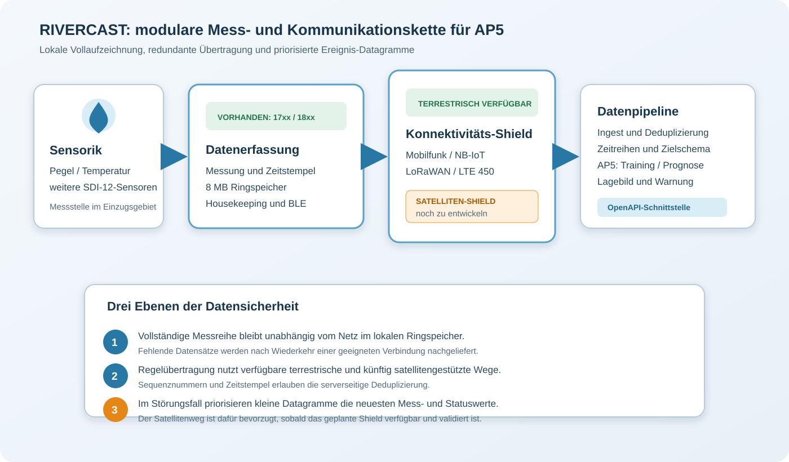
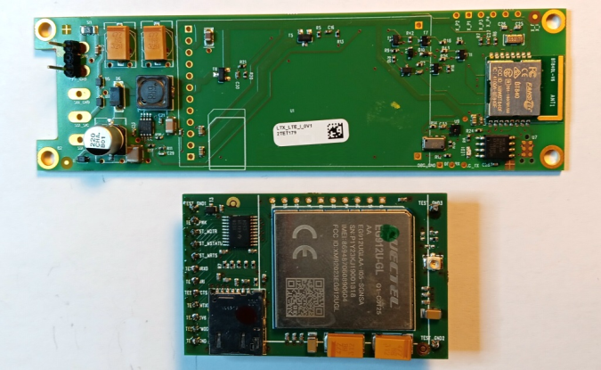
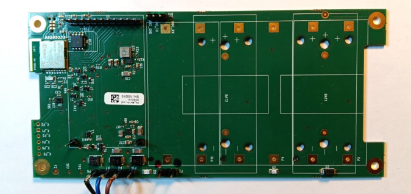
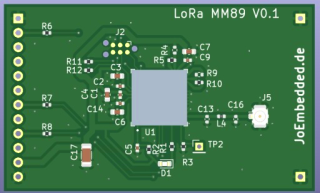
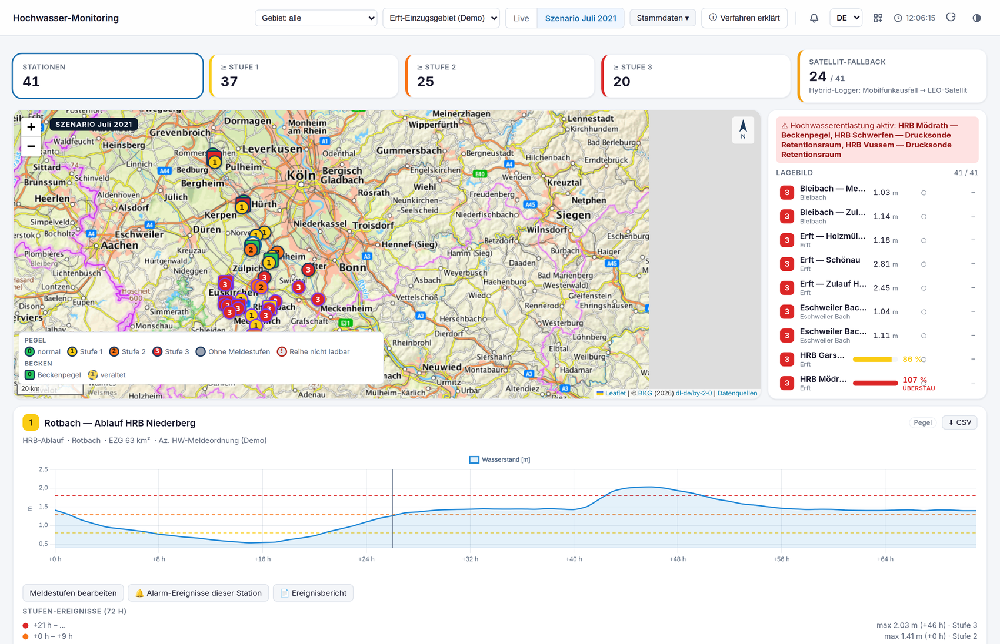

# RIVERCAST: modulare Loggerplattform als Datenbasis für AP5

**Stand:** 03.09.2026  
**Bezug:** AP5, Entwicklung eines KI-basierten hydrologischen Extremereignismodells, Laufzeit 05/2026 bis 06/2028

## Kurzüberblick

Für RIVERCAST wurde die bisherige Loggerplattform **LTX Intent 1500** zu einem modularen Hardwarebaukasten weiterentwickelt. Während beim Typ 1500 die Mobilfunktechnik fest auf der 2-Zoll-Platine integriert ist, trennen die Typfamilien **17xx** und **18xx** die Funktionen in zwei Baugruppen:

1. Die **Trägerplatine** übernimmt Datenerfassung, Zeitführung, lokale Speicherung, Energieüberwachung und die Anbindung der Sensorik.
2. Ein optional aufsteckbares **Konnektivitäts-Shield** trägt die zum Übertragungsweg passende Funktechnik.

Damit lässt sich die vollständige Loggerfunktion über unterschiedliche Funkwege erproben, ohne den Datenerfassungsteil für jeden Übertragungskanal neu zu entwickeln. Bestehende terrestrische Shields ermöglichen unter anderem Mobilfunk, NB-IoT, LoRaWAN und - als Variante für kritische Infrastruktur - LTE im 450-MHz-Band.

> [!IMPORTANT]
> **Entwicklungsstand:** Die Trägerplatinen der Familien 17xx und 18xx sowie terrestrische Konnektivitäts-Shields sind vorhanden. Das für die Satellitenkommunikation benötigte Shield muss erst noch entwickelt, aufgebaut und validiert werden. Darstellungen des Satellitenpfads in diesem Dokument beschreiben deshalb die Zielarchitektur und keinen bereits verfügbaren Hardwarestand.

*Zielarchitektur: Die Mess- und Speicherfunktion bleibt unabhängig vom gewählten Funkweg. Der Satellitenpfad ergänzt die vorhandenen terrestrischen Übertragungswege nach Entwicklung des entsprechenden Shields.*

## Entwicklung vom LTX Intent 1500 zu 17xx und 18xx

Der LTX Intent 1500 bildet den technischen Ausgangspunkt. Er vereint SDI-12-Datenerfassung, lokalen Speicher, Bluetooth Low Energy und ein fest integriertes LTE-M-/NB-IoT-/2G-Modem auf einer schmalen 2-Zoll-Platine. Die daraus abgeleiteten Plattformen führen die Mess- und Speicherfunktionen fort, lösen die Konnektivität aber mechanisch und funktional aus der Trägerplatine heraus.

| Plattform | Rolle im Baukasten | Abmessungen der Trägerplatine | Typischer Einsatz |
|---|---|---:|---|
| LTX Intent 1500 | Ausgangsplattform mit integriertem Mobilfunkmodem | 35 x 115 mm | kompakter, fest definierter Mobilfunklogger |
| LTX 17xx | schmale 2-Zoll-Trägerplatine mit aufsteckbarem Funk-Shield | 35 x 115 mm | kompakte Messstellen, Versorgung typischerweise über eine Lithium-D-Zelle |
| LTX 18xx | größere BoPla-Trägerplatine mit aufsteckbarem Funk-Shield | 70 x 147 mm | mehr Bauraum, flexible Batterie- und externe Versorgung, projektspezifische Ausbauten |

Die Trägerplatinen behalten die für RIVERCAST wesentlichen Funktionen:

- SDI-12 Version 1.3 einschließlich Low-Voltage-Betrieb,
- Bluetooth Low Energy für Inbetriebnahme und Service,
- standardmäßig 8 MB lokaler Ringspeicher für etwa 400.000 historische Messwerte,
- interne Zustandskanäle für Batteriespannung, Temperatur, Feuchte und Energieverbrauch,
- zeitgestempelte Aufzeichnung auch bei vollständigem Ausfall der Funkverbindung.

Das Shield enthält im Wesentlichen die Hardware für den jeweiligen Kommunikationskanal einschließlich Modem und Antennenanschluss. Dadurch kann ein schmalbandiger oder nicht-terrestrischer Übertragungsweg gegen bestehende terrestrische Varianten evaluiert werden, während Sensorik, Messablauf, lokales Datenformat und Speicherung unverändert bleiben.

*Beispiel der 17xx-Plattform: schmale Trägerplatine und separates, bereits vorhandenes terrestrisches LTE-Cat-1-Shield. Das Bild zeigt kein Satelliten-Shield.*

*Beispiel der 18xx-Plattform: größere BoPla-Trägerplatine als Datenerfassungsteil. Die freie Modulfläche ermöglicht unterschiedliche Konnektivitätsvarianten.*

*Vorhandenes Beispiel eines terrestrischen Shields für LoRaWAN EU868. Das geplante Satelliten-Shield ist noch zu entwickeln.*

## Beitrag der Loggerarchitektur zu AP5

AP5 entwickelt ein KI-basiertes Modell für hydrologische Extremereignisse. Dafür werden nicht nur möglichst viele Messwerte benötigt, sondern vor allem **zeitlich konsistente, nachvollziehbare und auch während einer Störung verfügbare Zeitreihen**. Die modulare Loggerarchitektur unterstützt AP5 an vier Stellen:

1. **Vollständige Trainings- und Validierungsdaten:** Der Ringspeicher zeichnet alle Messwerte lokal weiter auf, auch wenn kein Funknetz erreichbar ist. Nach Wiederherstellung einer Verbindung können fehlende Zeiträume nachgeliefert werden.
2. **Aktuelle Eingangsdaten für die Prognose:** Regelübertragungen stellen der Datenpipeline neue Wasserstands-, Temperatur- und Zustandswerte bereit. Die von TerraTransfer dokumentierte OpenAPI-Schnittstelle und das von BO-I-T entworfene Zielschema bilden den Übergang zur Modellschicht.
3. **Robustheit bei Extremereignissen:** Gerade bei Hochwasser können terrestrische Netze gestört oder überlastet sein. Ein zusätzlicher Satellitenpfad soll die Wahrscheinlichkeit erhöhen, dass wenigstens die für das aktuelle Lagebild entscheidenden Werte eintreffen.
4. **Vergleichbare Kommunikationsversuche:** Weil der Datenerfassungsteil gleich bleibt, lassen sich Latenz, Paketverlust, Energiebedarf und verfügbare Nutzdaten verschiedener Funkwege vergleichen, ohne zugleich die Messhardware oder die Datenentstehung zu verändern.

Die eigentliche Entwicklung und Erprobung des Hybridloggers ist im Sachbericht AP8 zugeordnet. Für AP5 ist sie eine technische Voraussetzung der Datenbereitstellung: Der Logger liefert die Eingangsdaten, die neu entwickelte Pipeline übernimmt Ingest, Prüfung und Bereitstellung, und das KI-Modell verarbeitet die daraus entstehenden Zeitreihen für Training, Validierung und operative Prognosen.

## Vorgesehenes Speicher- und Übertragungskonzept

Das Konzept unterscheidet bewusst zwischen **vollständiger Datenhaltung** und **zeitkritischer Ereigniskommunikation**.

### 1. Lokale Vollaufzeichnung

Jeder Messwert wird zunächst mit Zeitstempel im Logger gespeichert. Der Ringspeicher ist das unabhängige Sicherheitsnetz. Auch wenn Mobilfunk und Satellitenverbindung gleichzeitig ausfallen, geht die Messreihe nicht unmittelbar verloren. Noch nicht bestätigte Datensätze bleiben zur späteren Übertragung vorgemerkt.

### 2. Redundante Regelübertragung

Im Zielzustand sollen die Messdaten über Mobilfunk und - soweit Nutzdatenbudget, Energiebedarf und Netzbedingungen dies zulassen - zusätzlich über Satellit übertragen werden. Mobilfunk ist der bevorzugte Weg für vollständige Datenblöcke und das Nachladen größerer Rückstände. Der Satellitenweg schafft eine zweite, vom lokalen terrestrischen Netz unabhängige Zustellmöglichkeit.

Da ein schmalbandiger Satellitenkanal nur kleine Nutzdatenmengen und kurze Verbindungsfenster zulässt, muss die Übertragung paketiert und fortsetzbar sein. Je Datensatz werden mindestens Gerätekennung, Messzeit, Sequenznummer und Übertragungsgrund benötigt. Der Server kann dadurch doppelt übertragene Pakete erkennen und Lücken gezielt nachfordern oder später über Mobilfunk schließen.

### 3. Zusätzliche Datagramme im Störungsfall

Bei einem erkannten Störungs- oder Extremereignis soll der Logger neben der regulären Übertragung zusätzliche kompakte **Datagramme** versenden. Diese Datagramme enthalten vorzugsweise:

- den aktuellsten Wasserstand und weitere für die Prognose priorisierte Messwerte,
- Messzeit und fortlaufende Sequenznummer,
- Ereignis- oder Alarmkennzeichen,
- Batteriezustand und grundlegende Geräteinformation,
- optional einen kurzen Trend oder wenige unmittelbar vorausgehende Werte.

Der Satellitenweg soll für diese Ereignis-Datagramme bevorzugt werden, sobald das geplante Satelliten-Shield verfügbar ist. Falls der Satellitenpfad nicht nutzbar ist, kann derselbe kompakte Datensatz über einen verfügbaren terrestrischen Kanal gesendet werden. Ziel ist nicht, mit einem Datagramm die vollständige Historie zu ersetzen, sondern trotz eingeschränkter Verbindung mindestens den aktuellen hydrologischen Zustand sicher und mit geringer Latenz an die Datenpipeline zu übermitteln.

| Betriebssituation | Lokaler Speicher | Mobilfunk | Satellit nach Shield-Entwicklung |
|---|---|---|---|
| Normalbetrieb | vollständige Messreihe | vollständige Regelübertragung und Nachlieferung | redundante Übertragung im zulässigen Nutzdaten- und Energierahmen |
| Terrestrische Störung | vollständige Messreihe läuft weiter | Wiederholungsversuch, späteres Nachladen | priorisierte aktuelle Werte und Ereignis-Datagramme |
| Satellitenweg nicht verfügbar | vollständige Messreihe läuft weiter | Regelübertragung und gegebenenfalls kompaktes Datagramm | spätere Wiederholung |
| Beide Wege ausgefallen | vollständige Messreihe läuft weiter | spätere Nachlieferung | spätere Nachlieferung |

## Anschluss an Datenpipeline und KI-Modell

Im Juni 2026 wurde entschieden, die Datenpipeline aus INTENT nicht anzupassen, sondern wegen veränderter Datenquellen und Datensenken sowie der Erfahrungen aus heavyRAIN neu zu entwickeln. TerraTransfer stellte die Datenschnittstelle des Sensormanagers mit OpenAPI-Dokumentation bereit. BO-I-T begann daraufhin mit Datenexploration und Zielschema; am 28.08.2026 wurde ein durchgängiges Datenfluss- und Infrastrukturdiagramm im Konsortium abgestimmt.

Für die hybride Übertragung muss der Ingest unabhängig vom Empfangsweg dieselbe fachliche Messung erkennen. Sinnvoll ist deshalb ein gemeinsamer Datensatzschlüssel aus Gerätekennung, Messzeit und Sequenznummer. Vollständige Mobilfunkübertragungen, spätere Nachlieferungen aus dem Ringspeicher und kompakte Satelliten-Datagramme können so ohne Doppelzählung in eine konsistente Zeitreihe zusammengeführt werden. Diese konsolidierte Zeitreihe ist die gemeinsame Grundlage für:

- Datenexploration und Qualitätsprüfung,
- Training und Versionierung der Modelle,
- Validierung an historischen und neu aufgezeichneten Ereignissen,
- laufende Prognose und Aktualisierung des Lagebilds,
- Bewertung der Datenverfügbarkeit je Übertragungsweg.

*Demonstrator aus dem Sachbericht 2026: simuliertes Extremereignis mit Anzeige eines Satelliten-Fallbacks. Die Darstellung visualisiert die vorgesehene Systemfunktion; sie belegt kein bereits fertiggestelltes Satelliten-Shield.*

## Forschungs- und Validierungsbedarf

Vor dem Feldbetrieb des Satellitenpfads sind insbesondere folgende Punkte zu bearbeiten:

- Auswahl und Schaltungsentwicklung des Satellitenmodems sowie Konstruktion des zugehörigen Shields für 17xx und/oder 18xx,
- elektrische und mechanische Schnittstelle, Antennenanordnung, Gehäuseeinfluss und freie Sicht zum Satelliten,
- Umschalt- und Priorisierungslogik zwischen Mobilfunk, Satellit und lokalem Nachlieferbetrieb,
- maximales Nutzdatenvolumen, Datagrammformat, Bestätigung, Wiederholung und Deduplizierung,
- Latenz und Verfügbarkeit an topografisch abgeschatteten Messstellen,
- Energiebedarf je Satellitenübertragung einschließlich Einbuchzeit und Wiederholungen,
- erreichbare Batteriestandzeit bei Regelverkehr und bei erhöhter Ereignisfrequenz,
- praktische und wirtschaftliche Grenzen einer vollständigen redundanten Übertragung über Satellit,
- Laborprüfung, Feldtest und Ende-zu-Ende-Validierung vom Sensor bis zur AP5-Modellschicht.

Erst diese Messungen erlauben eine belastbare Festlegung, welche Daten im Normalbetrieb über beide Wege übertragen werden und welche kompakte Auswahl bei einem Störungsfall als zusätzliches Datagramm priorisiert wird.

## Projektstand und nächste Schritte

| Thema | Stand 03.09.2026 | Nächster Schritt |
|---|---|---|
| Trennung Datenerfassung / Konnektivität | mit den Plattformen 17xx und 18xx umgesetzt | gemeinsame Schnittstelle für weitere Shields absichern |
| Terrestrische Shields | vorhanden | Referenzmessungen zu Datenrate, Latenz und Energie durchführen |
| Satelliten-Shield | noch nicht entwickelt | Schaltung, Layout, Prototyp und Firmwareanbindung entwickeln |
| Lokale Speicherung | Ringspeicher vorhanden | Nachlieferung und Lückenbehandlung im Gesamtsystem testen |
| Schmalbandige Payloads | Vorarbeiten aus LoRaWAN vorhanden | Datagrammformat für Satellit festlegen und validieren |
| Serverseitige Kette | Satellitenpfad im LTX-Server vorbereitet; OpenAPI und Zielschema in Arbeit | Empfang, Deduplizierung und Übergabe an die AP5-Pipeline Ende zu Ende testen |
| KI-Modell | AP5-Entwicklungsumgebung und Modellauswahl im Sachbericht noch als offen geführt | Trainingsdaten, Modellstruktur und Qualitätskriterien konkretisieren |

## Quellen und weiterführende Dokumentation

- *RIVERCAST Sachbericht 2026, Entwurf vom 03.09.2026*, insbesondere Kapitel 3.4 (AP5), 3.5 (AP8) und 3.6 (AP9a).
- [LTX-Logger: Typen, Funkoptionen, Speicher und Energie](../../ltx_typen/logger_Zusammenfassung.md)
- [Kompaktes LTX-Payloadformat für schmalbandige Übertragungswege](../../lora/lora_payload.md)
- [LTX-Messdatenformat](../../ltx_datenfiles/ltx_fileformat_edt.md)
- [LTX-Parameterreferenz](../../ltx_parameter/ltx_parameter_referenz.md)

