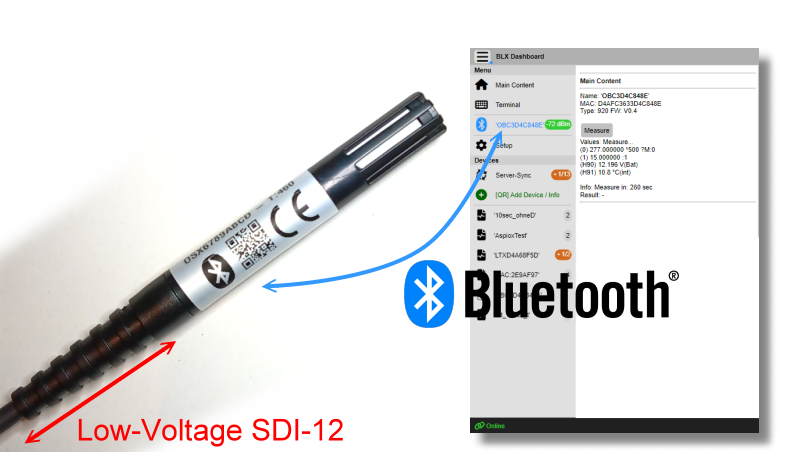
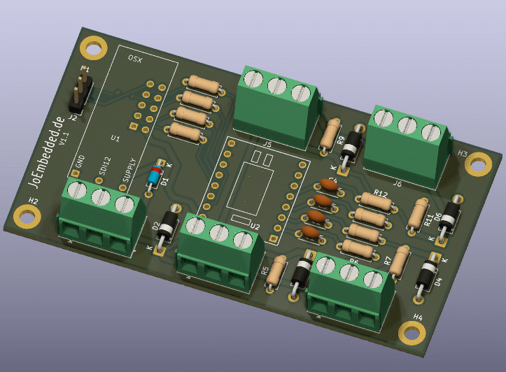

# Open-SDI12-Blue Sensoren und Interfaces

Stand: 2026-07-17

Diese Übersicht fasst die aktuell im Web-Archiv verfügbaren Open-SDI12-Blue-Typen zusammen. Der Ordner `Obsolete` ist bewusst nicht enthalten. Die Typen 210, 930 und 950 sind keine eigentlichen Messsensoren, sondern Konverter, Funkinterface beziehungsweise ein virtueller Server-Gerätetyp; sie sind am Ende separat aufgeführt.

**Zentrale Einstiegsseiten:**

- [Open-SDI12-Blue Datenblätter, Firmware und Zusatzdateien](https://joembedded.de/x3/ltx_firmware/index.php?dir=./Open-SDI12-Blue-Sensors)
- [Gesamtes LTX-Firmware- und Dokumentenarchiv](https://joembedded.de/x3/ltx_firmware/index.php)

## Gemeinsame Merkmale

Die OSX-Sensoren basieren auf der offenen [Open-SDI12-Blue-Plattform](https://github.com/joembedded/Open-SDI12-Blue). Soweit beim jeweiligen Typ nicht anders angegeben, gelten folgende gemeinsame Eigenschaften:

- Kommunikation über SDI-12 V1.3; Konfiguration und Diagnose zusätzlich über Bluetooth Low Energy
- Änderung der SDI-12-Adresse sowie Messung mit den Standardbefehlen `aM!`/`aMC!` und Auslesen mit `aD0!`
- lokale Bedienung mit BlueShell oder dem browserbasierten BLX Dashboard
- Low-Voltage-Auslegung für batteriebetriebene Messstellen; die tatsächliche Versorgungsspannung steht beim jeweiligen Typ
- optionale CRC-gesicherte SDI-12-Messbefehle für die Logger-Integration

## Sensoren

### Typ 310, 311 und 312 - Piezo-Druck- und Pegelsonde

Digitale Drucksonde für Wasserstandsmessungen und dauerndes Eintauchen bis zum zulässigen Überdruck. Der Messwert kann als Druck oder als Wasserstand in Metern ausgegeben werden.

- Standard-Messbereich: 0 bis 1 bar, entsprechend etwa 10 m Wassersäule
- Genauigkeit: maximal +/- 0,15 % FS; Langzeitstabilität typisch +/- 0,1 % FS
- Überdruckfestigkeit: vierfacher Messbereich
- Bauform: etwa 100 mm x 25 mm; standardmäßig 10 m belüftetes Kabel zur atmosphärischen Kompensation
- Typ 310: Standard-Temperatursensor, typisch +/- 2 °C
- Typ 311: Präzisionstemperatur, +/- 0,1 °C von -20 bis +50 °C
- Typ 312: wie Typ 311, zusätzlich 3-Achsen-Lagesensor
- Versorgung: 3,6 bis 16 V
- [Datenblatt Typ 31x (PDF)](https://joembedded.de/x3/ltx_firmware/Open-SDI12-Blue-Sensors/0310_0312_PiezoPressure/osx_PiezoPressure.pdf)
- Firmware: [Typ 310](https://joembedded.de/x3/ltx_firmware/Open-SDI12-Blue-Sensors/0310_0312_PiezoPressure/firmware_0310_KellerLD_1v2.sec), [Typ 311](https://joembedded.de/x3/ltx_firmware/Open-SDI12-Blue-Sensors/0310_0312_PiezoPressure/firmware_0311_KellerLD_1v2.sec), [Typ 312](https://joembedded.de/x3/ltx_firmware/Open-SDI12-Blue-Sensors/0310_0312_PiezoPressure/firmware_0312_KellerLD_1v2.sec)

### Typ 330 - Frequenz- und Impulszähler

Eingangsmodul für Impulsgeber, Regenmesser, Durchflussmesser und andere Zähler. Es liefert absoluten Zählerstand, Frequenz und einen skalierbaren Delta- beziehungsweise Durchflusswert.

- Frequenzbereich: 0 bis 1.000 Hz; Aktualisierung alle 8 s; Auflösung 0,1 Hz
- Zählerbereich: 0 bis 9.999.999, anschließend Überlauf auf 0
- Skalierung der Impulse in physikalische Einheiten und Delta-Bildung über ein konfigurierbares Zeitfenster
- interner Pull-up etwa 15 kOhm; bei geschlossenen Kontakten fließen etwa 220 µA
- für zuverlässigen Feldbetrieb sind Entprellung und bei langen Leitungen zusätzlicher EMV-Schutz empfohlen
- [Datenblatt (PDF)](https://joembedded.de/x3/ltx_firmware/Open-SDI12-Blue-Sensors/0330_Frequency_Pulse_Counter/osx_cntfrq.pdf)
- [Firmware Typ 330](https://joembedded.de/x3/ltx_firmware/Open-SDI12-Blue-Sensors/0330_Frequency_Pulse_Counter/firmware_0330_Counter_1v1.sec)

### Typ 340 - Temperatur und relative Feuchte, SHT2x

SDI-12-Schnittstelle für Sensirion-SHT2x-Sensoren. Geeignet für allgemeine Temperatur-/Feuchtemessungen mit optionaler Zweipunktkalibrierung.

- Messgrößen: relative Feuchte und Temperatur; optional Versorgungsspannung
- SHT25 typisch +/- 1,8 % rF und +/- 0,2 °C
- SHT21 typisch +/- 2 % rF und +/- 0,3 °C
- Leitung zwischen Interface und SHT2x maximal 1 m; PTFE-Schutzfilter empfohlen
- Versorgung: 3,6 bis 16 V
- [Datenblatt Typ 340 (PDF)](https://joembedded.de/x3/ltx_firmware/Open-SDI12-Blue-Sensors/034x_TempHumidity/osx_SHT2x.pdf)
- [Firmware Typ 340](https://joembedded.de/x3/ltx_firmware/Open-SDI12-Blue-Sensors/034x_TempHumidity/firmware_0340_SHT2x_1v0.sec)

### Typ 341 - Präzisions-Temperatur und relative Feuchte, SHT4x

Präzisionssensor mit Sensirion SHT4x, Low-Voltage-SDI-12 und Bluetooth. Die SHT45-Ausführung besitzt eine interne und eine äußere PTFE-Schutzmembran.

- Messgrößen: relative Feuchte und Temperatur; optional Versorgungsspannung
- SHT45: +/- 1,0 % rF im Bereich 20 bis 70 % rF und +/- 0,1 °C im Bereich 5 bis 60 °C
- schmale Sensorplatine: etwa 9,5 mm x 45 mm
- kundenspezifische Zweipunktkalibrierung möglich
- Versorgung: 3,6 bis 16 V mit SDI-12; 2,8 bis 3,6 V im reinen Bluetooth-Betrieb
- [Datenblatt Typ 341 (PDF)](https://joembedded.de/x3/ltx_firmware/Open-SDI12-Blue-Sensors/034x_TempHumidity/osx_SHT4x.pdf)
- [Firmware Typ 341](https://joembedded.de/x3/ltx_firmware/Open-SDI12-Blue-Sensors/034x_TempHumidity/firmware_0341_SHT4x_1v0.sec)

### Typ 350 - Universeller 24-Bit-Analogknoten

Universeller Analog-Datenerfassungsknoten mit Texas Instruments ADS1220. Die Hardware kann für verschiedene analoge Sensortypen bestückt und die Betriebsarten werden gerätespezifisch in der Firmware festgelegt.

- 24-Bit-Sigma-Delta-ADC; bis zu acht konfigurierte physikalische Messkanäle/Betriebsarten
- Anwendungen: 0/4-20 mA, PT100, Brücken- und Drucksensoren, Strahlungssensoren sowie differentielle und massebezogene Spannungen
- PT100-Ausführung: etwa -70 bis +120 °C, dokumentierte Genauigkeit besser als 0,05 °C
- Standard-Spannungsmessung: 0 bis 2.048 mV; Differenzmessung bei Verstärkung 128: +/- 16 mV
- automatische Offsetkalibrierung und 50/60-Hz-Unterdrückung je nach Kanalmodus
- [Benutzerhandbuch Typ 350, deutsch (PDF)](https://joembedded.de/x3/ltx_firmware/Open-SDI12-Blue-Sensors/035x_Analog/T350_handbuch.pdf) und [englisch (PDF)](https://joembedded.de/x3/ltx_firmware/Open-SDI12-Blue-Sensors/035x_Analog/T350_manual.pdf)
- Hardware-Unterlagen: [Bestückungsansicht (PDF)](https://joembedded.de/x3/ltx_firmware/Open-SDI12-Blue-Sensors/035x_Analog/osx_ad4to20mA_asstop.pdf), [Schaltplan (PDF)](https://joembedded.de/x3/ltx_firmware/Open-SDI12-Blue-Sensors/035x_Analog/osx_ad4to20mA_sch.pdf)
- [Firmware Typ 350, 0/4-20-mA-Ausführung](https://joembedded.de/x3/ltx_firmware/Open-SDI12-Blue-Sensors/035x_Analog/firmware_0350_2V_4to20mA_0v3.sec)

### Typ 380 - Interface für Rotronic HC2-xx

Low-Voltage-SDI-12- und Bluetooth-Interface für Rotronic-HC2-Präzisionsfühler. Das Datenblatt beschreibt das Interface; die genaue Sensorausführung und deren Bereich ergeben sich aus dem eingesetzten HC2-xx.

- Messgrößen: relative Feuchte und Temperatur; optional Versorgungsspannung
- Standardgenauigkeit HC2-ICxx-HH bei 10 bis 30 °C: +/- 0,8 % rF (erweitert +/- 1,2 % rF) und +/- 0,1 K
- Sensor-Warm-up nach dem Einschalten etwa 1.700 ms
- kundenspezifische Zweipunktkalibrierung möglich
- Versorgung: 3,6 bis 16 V
- [Datenblatt (PDF)](https://joembedded.de/x3/ltx_firmware/Open-SDI12-Blue-Sensors/0380_HC2_TempHum/osx_HC2.pdf)
- [Firmware Typ 380](https://joembedded.de/x3/ltx_firmware/Open-SDI12-Blue-Sensors/0380_HC2_TempHum/firmware_0380_HC2_0v4.sec)

### Typ 390 - Radar-Distanz mit Endress+Hauser FMR20

Vorkonfiguriertes Modbus-zu-SDI-12-Interface für den Radar-Distanzsensor Micropilot FMR20. Es schaltet und versorgt den Modbus-Sensor energiesparend und bereitet dessen Register als SDI-12-Messwerte auf.

- Messwerte: berechneter Pegel, Zieldistanz, Signalpegel, Temperatur, Signalqualität und optional Diagnose
- Ultra-Low-Power-Betrieb mit 15 s Aufwärmzeit
- Version A: externe Versorgung 5 bis 16 V
- Version B: zwei interne CR123A-Batterien; etwa sechs Jahre Standby oder rund 35.000 Messungen
- Version C: externe Versorgung 2,8 bis 16 V
- [Datenblatt (PDF)](https://joembedded.de/x3/ltx_firmware/Open-SDI12-Blue-Sensors/0390_FMR20_Radar_Modbus/osx_FMR20_Radar_Distance.pdf)
- [Firmware Typ 390](https://joembedded.de/x3/ltx_firmware/Open-SDI12-Blue-Sensors/0390_FMR20_Radar_Modbus/typ390_fmr20_15sec_warmup_r1hw_0v2.sec)

### Typ 400 - 2Wire-Light-Temperaturkette

Preisgünstige digitale Temperaturkette für nicht eingetauchte Anwendungen. Das Interface fragt mehrere Sensoren auf einer Zweidrahtleitung ab und stellt sie blockweise per SDI-12 bereit.

- bis zu 32 Temperaturstellen
- Genauigkeit +/- 0,5 °C von -10 bis +85 °C; Betriebsbereich -40 bis +85 °C; Auflösung 0,1 °C
- Schutzart IP64, ausdrücklich nicht wasserdicht
- Versorgung: 3,6 bis 16 V; Ruhestrom nur wenige µA, aber dauerhafte Versorgung erforderlich
- [Datenblatt (PDF)](https://joembedded.de/x3/ltx_firmware/Open-SDI12-Blue-Sensors/0400_W2_Wire_Light/osx_2wire_light.pdf)
- Zusatzinformation: [Hinweise zu DS18x20-Nachbauten (PDF)](https://joembedded.de/x3/ltx_firmware/Open-SDI12-Blue-Sensors/0400_W2_Wire_Light/info_ds18x20_fakes.pdf)
- [Firmware Typ 400](https://joembedded.de/x3/ltx_firmware/Open-SDI12-Blue-Sensors/0400_W2_Wire_Light/firmware_typ0400_w2_light_1v0.sec)

### Typ 410 - 2Wire-Präzisions-Temperatur- und Druckkette

Robuste digitale Sensorkette für viele hochpräzise Temperatur- und Druckmessstellen. Temperatur- und Drucksensoren können in Linien- oder Sterntopologie kombiniert werden.

- bis zu 50 Sensoren, optional bis zu 300
- Leitungslänge insgesamt bis 500 m ohne Genauigkeitsverlust durch die Leitung
- Standardsensoren bis 5 bar beziehungsweise 50 m Wassersäule; höhere Druckbereiche optional
- eingetauchte Sensoren IP68, Interface nur IP54
- Messzeit typischerweise 1 bis 3 s; Ergebnisse werden in Gruppen von bis zu neun Werten übertragen
- Versorgung: 3,6 bis 16 V, optional 2,8 bis 16 V
- [Datenblatt (PDF)](https://joembedded.de/x3/ltx_firmware/Open-SDI12-Blue-Sensors/0410_W2_Wire/osx_2wire.pdf)
- [Firmware Typ 410](https://joembedded.de/x3/ltx_firmware/Open-SDI12-Blue-Sensors/0410_W2_Wire/firmware_0410_W2_Wire_2v3.sec)

### Typ 420 - Keramische Druck- und Pegelsonde Huba 713

SDI-12-Interface für die digitale keramische Drucksonde Huba Control 713. Geeignet für Pegelmessungen mit belüftetem Kabel und dauernd eingetauchtem Sensorkopf.

- Standard-Messbereich 0 bis 1 bar, entsprechend etwa 10 m Wassersäule; Ausgabe optional in Metern
- Messgrößen: Druck und Temperatur; optional Versorgungsspannung
- standardmäßig 10 m belüftetes Kabel; Ultra-Low-Power-Betrieb
- Sensorkopf IP68, Konverter IP54
- Versorgung: 5 bis 16 V, optional 2,8 bis 16 V
- [Datenblatt (PDF)](https://joembedded.de/x3/ltx_firmware/Open-SDI12-Blue-Sensors/0420_Huba713_Ceramic/osx_Huba713_ceramic.pdf)
- [Firmware Typ 420](https://joembedded.de/x3/ltx_firmware/Open-SDI12-Blue-Sensors/0420_Huba713_Ceramic/firmware_0420_Huba713_Ceramic_1v0.sec)

### Typ 430 - Ultraschall-Distanz und Schneehöhe

Ultraschall-Distanzsensor in Ausführungen für allgemeine Abstände und Schneehöhe. Die Low-Power-Varianten eignen sich für Batteriebetrieb; die Präzisions-Schneeausführung besitzt eine beheizte, selbstreinigende Sensorfläche.

- Standardbereich 0,5 bis 5 m; Auflösung 1 mm; typische Genauigkeit +/- 2 mm
- Temperaturbereich -10 bis +65 °C; Sensor IP67
- MB-001: allgemeiner Low-Power-Distanzsensor, 3,6 bis 16 V
- MB-002: Low-Power-Schneehöhensensor mit größerem Schallwandler, 3,6 bis 16 V
- MB-003: Präzisions-Schneehöhe mit Vereisungs-/Kondensationsschutz, 7,5 bis 16 V und dauerhaft etwa 30 bis 50 mA
- [Datenblatt (PDF)](https://joembedded.de/x3/ltx_firmware/Open-SDI12-Blue-Sensors/0430_Distance_and_Snowdepth/osx_Distance_and_Snowdepth.pdf)

### Typ 450 - Induktive Leitfähigkeit

Induktiver Leitfähigkeitssensor für Langzeitmessungen in Flüssigkeiten. Da keine Messelektroden im direkten galvanischen Kontakt arbeiten, ist er weniger empfindlich gegenüber Passivierung, Biofilm und elektrolytischen Effekten.

- Bereiche: 0 bis 2.000 µS/cm, 0 bis 20 mS/cm oder 0 bis 60 mS/cm
- Auflösung 0,05 % FS; Genauigkeit maximal +/- 0,15 % FS
- Langzeitstabilität typisch +/- 0,1 % FS, maximal +/- 0,2 % FS
- Temperatur -40 bis +85 °C; Auflösung 0,25 °C; unkalibriert typisch etwa +/- 1 °C
- IP68; Bauform etwa 120 mm x 35 mm x 35 mm; einfache Kalibrierung
- Versorgung: 7,5 bis 14 V
- [Datenblatt (PDF)](https://joembedded.de/x3/ltx_firmware/Open-SDI12-Blue-Sensors/0450_Conductivity_Inductive/osx_CondInd.pdf)
- [Firmware Typ 450](https://joembedded.de/x3/ltx_firmware/Open-SDI12-Blue-Sensors/0450_Conductivity_Inductive/firmware_0450_Cond_Ind_0v5.sec)

### Typ 460 - Präzisionstemperatur

Hochgenauer digitaler Temperatursensor mit TMP119 und optionaler Zweipunktkalibrierung.

- Messgröße Temperatur; optional Versorgungsspannung und Rohwert für Service
- Sensorgenauigkeit je nach Ausführung bis +/- 0,08 °C
- Messzeit unter 1 s
- Versorgung: 3,6 bis 16 V
- [Datenblatt (PDF)](https://joembedded.de/x3/ltx_firmware/Open-SDI12-Blue-Sensors/0460_Temperature/osx_temperature.pdf)
- [Firmware Typ 460](https://joembedded.de/x3/ltx_firmware/Open-SDI12-Blue-Sensors/0460_Temperature/firmware_0460_Temp_0v2.sec)

### Typ 470 - 60-GHz-Radar-Distanz

Energieeffizienter 60-GHz-Radarsensor für hochpräzise Wasserstands- und Abstandsmessungen. Das Radar kann nichtleitende Materialien wie Kunststoff, Keramik, Glas oder dünnes trockenes Holz durchdringen und eignet sich dadurch auch für geschlossene Behälter.

- Messbereich 0,10 bis 12 m, optional bis 20 m
- typische Genauigkeit <= 2 mm; Auflösung 1 mm
- bis zu drei Distanzen gleichzeitig; zusätzlich jeweilige Signalstärke
- etwa 10° Öffnungswinkel mit Standardoptik; etwa 11 dBm EIRP
- grafischer Rohscan und Live-Plot zur Ausrichtung über BLX Dashboard
- Schutzart IP54, optional IP68; Versorgung 3,6 bis 16 V
- [Datenblatt deutsch (PDF)](https://joembedded.de/x3/ltx_firmware/Open-SDI12-Blue-Sensors/0470_RadarDistA/osx_radar_a121_de.pdf), [OEM-Ausführung deutsch (PDF)](https://joembedded.de/x3/ltx_firmware/Open-SDI12-Blue-Sensors/0470_RadarDistA/osx_radar_a121_oem_de.pdf), [englische Vorschau (PDF)](https://joembedded.de/x3/ltx_firmware/Open-SDI12-Blue-Sensors/0470_RadarDistA/osx_radar_a121_en_preview.pdf)
- [Firmware Typ 470](https://joembedded.de/x3/ltx_firmware/Open-SDI12-Blue-Sensors/0470_RadarDistA/firmware_0470_RadarDistA_1v3.sec)

## Konverter, Funkinterface und virtueller Typ

### Typ 210 - Modbus-zu-SDI-12-Konverter

Konverter zum Betrieb von Modbus-RTU-/RS485-Sensoren an einem SDI-12-Bus. Er schaltet die oft höhere Versorgung des Modbus-Segments nur für die Messung ein und bildet Modbus-Register auf SDI-12-Werte ab.

- bis zu zehn Modbus-Register pro Messung
- Registergruppen 3 und 4 sowie verschiedene 16-/32-Bit-Formate; Zahlenformat Big Endian
- typische Voreinstellung 9.600 Baud, 8N1; andere Baudraten projektspezifisch
- geschaltete Modbus-Versorgung; SDI-12-Seite 6 bis 16 V
- geeignet für lange RS485-Strecken; Modbus benötigt mindestens vier Adern
- [Datenblatt deutsch (PDF)](https://joembedded.de/x3/ltx_firmware/Open-SDI12-Blue-Sensors/0210_ModbusConverter/osx_modbus_de.pdf)
- [Firmware Typ 210](https://joembedded.de/x3/ltx_firmware/Open-SDI12-Blue-Sensors/0210_ModbusConverter/firmware_0210_Modbus_0v1.sec)

### Typ 930 - OSM LORA, SDI-12 zu LoRaWAN

Batteriebetriebenes Funkinterface, das Messwerte angeschlossener SDI-12-Sensoren nahezu in Echtzeit über LoRaWAN in eine Cloud überträgt. Anders als ein LTX-Logger besitzt ein OSM-Gerät keinen lokalen Messwertspeicher.

- bis zu 48 Fließkomma-Messkanäle
- LoRaWAN 1.0.4, Klasse A; bidirektional; kompatibel mit ChirpStack, The Things Stack und anderen Betreibern
- EU-Ausführung: EU868, maximal 15 dBm und längere Batterielaufzeit
- GLOBAL-Ausführung: weltweit einsetzbar, maximal 20 dBm und geringere Batterielaufzeit
- vier AA-Zellen; geschaltete SDI-12-Versorgung nominal 6 V und maximal 1 A
- lokale Konfiguration per BLE; offene Payload-Decoder-, Cloud- und App-Software
- [Datenblatt und Schnellstart, deutsch (PDF)](https://joembedded.de/x3/ltx_firmware/Open-SDI12-Blue-Sensors/0930_OSM_LORA/osm_LORA_DE.pdf)
- [Firmware Typ 930](https://joembedded.de/x3/ltx_firmware/Open-SDI12-Blue-Sensors/0930_OSM_LORA/firmware_0930_osm_lora_1v0.sec)

### Typ 950 - GET-/Wunderground-Upload in LTX

Typ 950 ist kein physischer Sensor, sondern die serverseitige Kennung für externe Wetterstationen und Gateways, die ihre Messwerte über eine HTTP-GET-URL im Wunderground-ähnlichen Format an LTX senden.

- integriert zum Beispiel EcoWitt-WS90-Wetterstationen in LTX Server oder LTX Legacy
- LTX dient als schnelles Eingangsportal; Messwerte können anschließend an Datenbank- und Zielsysteme weitergegeben werden
- automatische Erzeugung einer `iparam.lxp` beim ersten Upload
- fehlende oder ungültige Parameter werden als Fehlerwerte behandelt
- benötigt einen Webserver mit PHP; für LTX Server zusätzlich eine SQL-Datenbank
- [Beschreibung deutsch (PDF)](https://joembedded.de/x3/ltx_firmware/Open-SDI12-Blue-Sensors/0950_GetUpload/WUG_get_upload_DE.pdf) und [englisch (PDF)](https://joembedded.de/x3/ltx_firmware/Open-SDI12-Blue-Sensors/0950_GetUpload/WUG_get_upload_EN.pdf)

---

**Firmware- und Datenblatt-Archiv:** [https://joembedded.de/x3/ltx_firmware/index.php](https://joembedded.de/x3/ltx_firmware/index.php)
