Diese Anleitung beschreibt die Inbetriebnahme des **TerraTransfer Aquatos LoRa** auf Basis der LTX-Typ-1720-Plattform. Die lokale Bedienung erfolgt mit dem browserbasierten **BLX Dashboard** über Bluetooth Low Energy (BLE). Für LoRaWAN werden zwei Wege beschrieben:

- **Weg A:** The Things Network / The Things Stack (TTN)
- **Weg B:** ChirpStack V4

Der letzte Schritt ist die Weiterleitung der dekodierten Daten an den **TerraTransfer Sensormanager** oder ein anderes kompatibles Zielsystem.

```text
SDI-12-Sensor -> Aquatos LoRa -> LoRaWAN-Gateway
              -> TTN oder ChirpStack -> HTTPS/JSON -> Sensormanager
```

> **Wichtig:** Alle EUIs, Schlüssel, URLs, API-Schlüssel und Gerätenamen in Text und Abbildungen sind Beispiele. Verwenden Sie ausschließlich die Werte Ihres Geräts und Ihrer Serverumgebung. Root Keys und API-Schlüssel sind Geheimnisse.

> **Hinweis:** Die Screenshots zeigen exemplarische Softwarestände. Feldnamen oder Positionen können sich in neueren Versionen leicht ändern. Maßgeblich sind die beschriebenen Einstellungen und Werte.

# 1. Produkt und Einsatzbereich

Der Aquatos LoRa ist ein kompakter, batteriebetriebener Datenlogger für SDI-12-Sensoren. Er misst in einem frei einstellbaren Intervall, speichert Messwerte lokal und überträgt kompakte Telegramme per LoRaWAN im europäischen Frequenzbereich EU868. BLE ermöglicht Konfiguration, Diagnose, Firmware-Update und lokalen Datenzugriff direkt an der Messstelle.

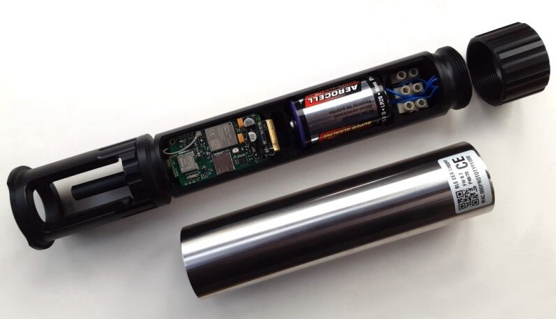{width=125mm}

*Beispiel des 2-Zoll-Rundgehäusekonzepts. Innenaufbau und Bestückung können je nach Aquatos-Ausführung abweichen.*

## Wesentliche Merkmale

- LoRaWAN 1.0.4, Klasse A, EU868
- bis zu 20 SDI-12-Messkanäle
- kompakte Float16-/Float32-Payloads mit bis zu 51 Byte Nutzdaten
- 8 MB lokaler Speicher in Ring- oder Linearbetrieb
- BLX Dashboard als PWA für BLE-Konfiguration, Diagnose und Datenzugriff
- energieoptimierter Betrieb mit einer Lithium-D-Zelle
- Housekeeping-Werte für Batterie, Energieverbrauch und interne Betriebswerte
- Betrieb mit TTN, ChirpStack V4 und kompatiblen LoRaWAN-Netzbetreibern

# 2. Sicherheit und Vorbereitung

Die Montage, Verdrahtung und Inbetriebnahme darf nur durch entsprechend qualifiziertes Personal erfolgen. Beachten Sie zusätzlich die Sicherheits-, Einbau- und Entsorgungshinweise von TerraTransfer sowie die Unterlagen des angeschlossenen Sensors.

## 2.1 Vor Beginn prüfen

- Gerät und Gehäuse sind unbeschädigt.
- Die 3,6-V-Lithium-D-Zelle ist polrichtig eingesetzt.
- Dichtungen und Kabelverschraubungen sind sauber und unbeschädigt.
- Der SDI-12-Sensor ist gemäß seiner Anschlussbelegung verdrahtet.
- Die 868-MHz-Antenne ist angeschlossen und mechanisch entlastet.
- Ein EU868-Gateway ist in Funkreichweite.
- Die passende Logger- und LoRa-Modem-Firmware ist installiert.
- Zugangsdaten für TTN oder ChirpStack sowie der Payload-Decoder liegen vor.
- Für den Sensormanager liegen Ziel-URL und gerätespezifischer API-Schlüssel vor.

> **Achtung:** Batterie niemals verpolen. Arbeiten an geöffneten Geräten nur mit geeignetem ESD-Schutz durchführen. Lithium-Batterien unterliegen Transport- und Entsorgungsvorschriften.

## 2.2 Einbauhinweise

1. Nehmen Sie die Erstinbetriebnahme möglichst am Schreibtisch vor.
2. Prüfen Sie Sensor und Funkstrecke vor dem endgültigen Einbau.
3. Positionieren Sie die Antenne so hoch und frei wie möglich. Metallische Abdeckungen, Schachtdeckel und Stahlbeton dämpfen das Signal.
4. Sichern Sie Logger und Sensorkabel gegen Zug, Absinken und Verdrehen.
5. Dokumentieren Sie Seriennummer, Device EUI, Sensoradresse, Einbautiefe, Messpunkthöhe und Bezugspunkt.

# 3. BLX Dashboard verwenden

BlueShell.exe ist für diese Anleitung nicht erforderlich. Das aktuelle Bedienwerkzeug ist das **BLX Dashboard**, eine Progressive Web App (PWA), die über Web Bluetooth direkt mit dem Logger kommuniziert.

## 3.1 Voraussetzungen und Start

- PC oder Android-Gerät mit Bluetooth Low Energy
- aktueller Chromium-basierter Browser, beispielsweise Google Chrome oder Microsoft Edge
- Zugriff auf das von TerraTransfer bereitgestellte BLX Dashboard oder das [öffentliche BLX-Dashboard-Demoprojekt](https://github.com/joembedded/ltx_ble_demo)
- Geräte-PIN beziehungsweise Geräteetikett mit den Zugangsdaten

Eine klassische Windows-Installation ist nicht notwendig. Öffnen Sie die HTTPS-Adresse im unterstützten Browser. Falls der Browser **App installieren** oder **Zum Startbildschirm hinzufügen** anbietet, ist das optional und erzeugt lediglich einen komfortablen Starter.

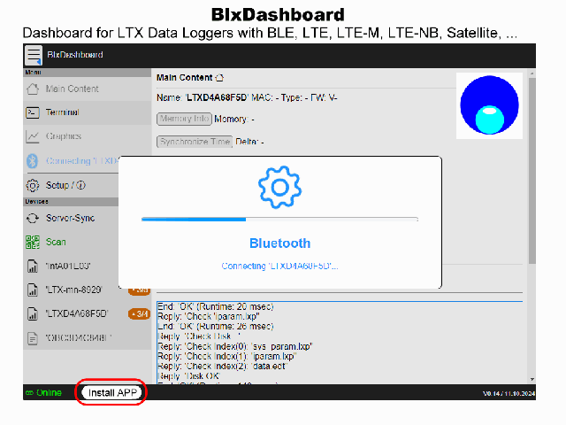{width=132mm}

*BLX Dashboard im Browser. Die optionale PWA-Installation ist markiert; für den Betrieb genügt das Öffnen der App.*

> **Hinweis:** Firefox unterstützt die für diesen Ablauf erforderliche Web-Bluetooth-Schnittstelle nicht. Auf iPhone und iPad ist ein Browser mit Web-Bluetooth-Unterstützung erforderlich.

## 3.2 Verbinden und freischalten

1. Aktivieren Sie Bluetooth am Bediengerät.
2. Öffnen Sie das BLX Dashboard.
3. Wählen Sie **Connect**, das Bluetooth-Symbol oder geben Sie im Terminal `.c` ein.
4. Wählen Sie den Aquatos LoRa anhand von Gerätename, MAC oder Seriennummer.
5. Erlauben Sie dem Browser den Bluetooth-Zugriff.
6. Falls **PIN required** erscheint, geben Sie die Geräte-PIN ein oder scannen Sie das Geräteetikett.
7. Warten Sie, bis Gerätetyp und Firmware angezeigt werden.

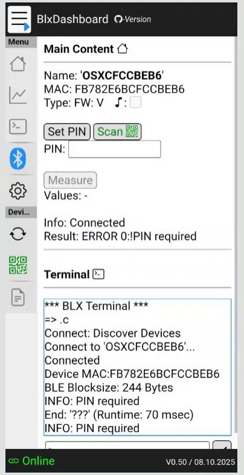{height=96mm}

*Eine bestehende BLE-Verbindung ist noch keine Freischaltung. Geschützte Befehle funktionieren erst nach erfolgreicher PIN-Prüfung.*

## 3.3 Terminal und wichtige Dashboard-Befehle

Das BLX-Terminal unterscheidet zwei Befehlsarten:

| Typ | Beispiel | Verarbeitung |
|---|---|---|
| Dashboard-Befehl | `.c`, `.firmware`, `.u` | beginnt mit Punkt und wird von der PWA verarbeitet |
| Logger-/Modembefehl | `xWrite`, `@$info`, `i` | wird über BLE direkt an das Gerät gesendet |

Nützliche Dashboard-Befehle:

| Befehl | Funktion |
|---|---|
| `.c` | BLE-Geräteauswahl öffnen und verbinden |
| `.d` | Verbindung trennen |
| `.r` | Verbindung zum zuletzt verwendeten Gerät wiederherstellen |
| `.i` | Gerät identifizieren |
| `.t set` | Loggeruhr auf die Browserzeit setzen |
| `.m` | Speicherbelegung und Aufzeichnungsmodus anzeigen |
| `.u` | Messdateien vom Logger in den lokalen Dashboard-Speicher laden |
| `.firmware` | passende gesicherte `.sec`-Firmwaredatei auswählen und übertragen |

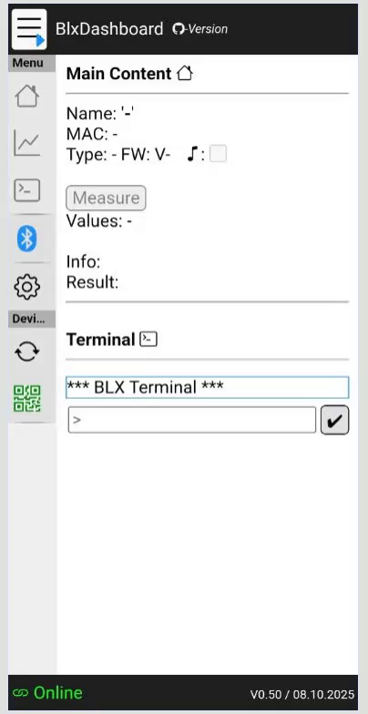{height=100mm}

*Die gleiche Terminaleingabe steht auf Desktop- und Mobilgeräten zur Verfügung.*

> **Achtung:** Vor einem Firmware-Update Gerätetyp, aktuellen Firmwarestand und Dateinamen prüfen. Typ 1720 und Typ 1820 benötigen unterschiedliche Firmwaredateien.

# 4. Logger und Messung konfigurieren

Das folgende Beispiel verwendet einen SDI-12-Drucksensor mit Wasserstand und Temperatur. Passen Sie Sensoradresse, Messkommando, Einheiten und Messbits an den tatsächlich eingesetzten Sensor an.

## 4.1 Messkanäle

| Parameter | Kanal `#0`: Wasserstand | Kanal `#1`: Temperatur |
|---|---:|---:|
| `Action` | `1` - messen und Cache füllen | `3` - Wert aus Cache verwenden |
| `Physkan` | `768` - SDI-12 | vom Sammelkanal vorgegeben |
| `Src_index` | `0` | `1` |
| `Unit` | `m` | `°C` |
| `Mem_format` | `2` - Float32, Anzeige mit 2 Stellen | `128` - Float16 |
| `Messbits` | gemäß Sensordatenblatt | wie vom Sammelkanal vorgegeben |
| `Xbytes` | beispielsweise `0M` | leer beziehungsweise gerätespezifisch |

Bei LoRaWAN entscheidet Bit 7 mit dem Wert `128` in `Mem_format` über Float16. Ohne dieses Bit wird Float32 übertragen. Float16 reduziert die Payloadgröße, hat aber eine geringere Auflösung.

## 4.2 Allgemeine Parameter

| Parameter | Beispielwert | Bedeutung |
|---|---:|---|
| `Period` | `600` | alle 600 Sekunden messen |
| `Period_Internet_sec` | `0` | jeden neuen Messwert übertragen |
| `HK_reload` | `6` | bei jeder sechsten Messung Housekeeping ergänzen |
| `MinTemp_oC` | `-40` | minimale Betriebstemperatur der Konfiguration |
| `Service Parameter -> Sysparam -> p Port` | anwendungsabhängig | LoRaWAN-Uplink-`fPort` |

Das Messintervall ist zwischen 120 und 86.400 Sekunden konfigurierbar. Kurze Messintervalle bedeuten nicht automatisch, dass gleich häufig gesendet werden sollte. Funkqualität, Airtime, Netzregeln und Batterielaufzeit müssen gemeinsam betrachtet werden.

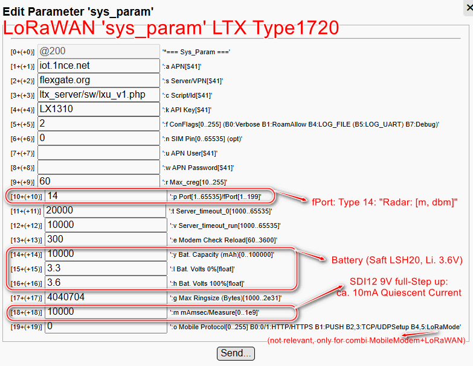{width=132mm}

*Beispielansicht der Systemparameter. Vor dem Speichern müssen die Werte zur konkreten Messstelle passen.*

## 4.3 fPort und Einheiten

Der Uplink-`fPort` steuert zugleich das Einheitenschema des LTX-Payload-Decoders:

| fPort | Einheitengruppe |
|---:|---|
| `1` bis `9` | frei beziehungsweise kundenspezifisch, ohne Standardeinheiten |
| `10` | Temperatur, `°C` |
| `11` | Feuchte/Temperatur, `%rH`, `°C` |
| `12` | Druck/Temperatur, `Bar`, `°C` |
| `13` | Pegel/Temperatur, `m`, `°C` |
| `14` | Radar, `m`, `dBm` |
| `15` | Leitfähigkeit, `°C`, `uS/cm` |

Für Wasserstand und Temperatur ist beispielsweise `fPort 13` passend:

```text
xsp13
xWrite
```

`xWrite` speichert die Parameteränderung dauerhaft.

## 4.4 Batterie- und Energieparameter

Für eine typische Lithium-D-Zelle können folgende Werte als vorsichtiger Ausgangspunkt dienen:

| Feld in `sys_param` | Beispielwert | Bedeutung |
|---|---:|---|
| `y Bat. Capacity` | `10000` | angesetzte Batteriekapazität in mAh |
| `l Bat. Volts 0%` | `3.3` | Spannung für 0 Prozent |
| `h Bat. Volts 100%` | `3.6` | Spannung für 100 Prozent |
| `m mAmsec/Measure` | `10000` | Basisenergie einer Messung in mA·ms |

```text
xsy10000
xsl3.3
xsh3.6
xsm10000
xWrite
```

> **Wichtig:** Kapazität, Spannungsschwellen und Messenergie müssen zur Batterie und zum angeschlossenen Sensor passen. Die Beispielwerte sind keine garantierte Laufzeitberechnung.

# 5. LoRaWAN-Modem vorbereiten

Dieser Abschnitt gilt für TTN und ChirpStack gleichermaßen.

## 5.1 Status prüfen und EU868 initialisieren

Öffnen Sie das Terminal im BLX Dashboard. Der folgende optionale Befehl setzt das Modem zurück und zeigt Modemtyp, Firmware, Device EUI sowie ADR-/Datenrateneinstellungen:

```text
@$res
```

Fehlen Presets oder stimmt die Device EUI nicht mit der Logger-MAC überein, initialisieren Sie EU868:

```text
@$initeu868
```

> **Achtung:** `@$res` unterbricht eine bestehende LoRaWAN-Verbindung. Verwenden Sie den Befehl nur bei der Einrichtung oder gezielt zur Diagnose.

## 5.2 OTAA-Daten auslesen

```text
@$info
```

Notieren Sie die drei Werte exakt:

| LTX-Ausgabe | Bedeutung | Feld im Netzwerkserver |
|---|---|---|
| `DEUI` | Device EUI, normalerweise Logger-MAC | `DevEUI` / `Device EUI` |
| `APPEUI` | Application EUI / Join EUI | `JoinEUI` / `Join EUI` |
| `NWKKEY` | Root Key für LoRaWAN 1.0.x | `AppKey` / `Application key` |

Beispiel, bewusst verkürzt:

```text
DEUI:   C4:C9:...:39:72
APPEUI: 4A:0D:...:68:C7
NWKKEY: EE:1B:...:C2:BA
DataRate DR:0
Autom. DR Reduction ADR:1
No active Join
No Network!
```

`No active Join` und `No Network!` sind vor der Registrierung normal.

## 5.3 Reset und Nonces

`@AT+RFS` löscht Modemkonfiguration, Join-Kontext und Nonces. Verwenden Sie diesen Befehl nur bewusst:

```text
@AT+RFS
@$initeu868
@$info
```

Danach müssen die OTAA-Daten erneut gesetzt und die bereits verwendeten DevNonces auch am Netzwerkserver zurückgesetzt werden. Andernfalls kann der nächste Join als Replay abgewiesen werden.

Manuell geänderte Modemparameter werden gespeichert mit:

```text
@AT+SAVECFG
```

## 5.4 ADR, Datenrate und Wiederholungen

| Betriebsziel | Geräteeinstellung | Auswirkung |
|---|---|---|
| stationäre, stabile Funkstrecke | meist `ADR=1` | Server darf Datenrate, Sendeleistung und `NbTrans` optimieren |
| vorhersehbares Energiebudget | `ADR=0`, erprobte feste Datenrate | Firmware verwendet `NbTrans=1`; Server optimiert nicht |
| mobile oder stark wechselnde Funkstrecke | häufig `ADR=0` | robuste feste Parameter müssen projektspezifisch bestimmt werden |

`DR0` hat eine große Link-Budget-Reserve, benötigt aber mehr Airtime und Energie als höhere Datenraten. Wählen Sie bei fester Konfiguration die höchste am Einsatzort zuverlässig funktionierende Datenrate.

Beispiel für eine bewusst feste Konfiguration:

```text
@AT+ADR=0
@AT+DR=3
@AT+SAVECFG
```

`AT+NBTRANS=X` ist nur ein flüchtiger Testbefehl. Nach einem Reset steht der Wert wieder auf `1`; `AT+SAVECFG` macht ihn nicht persistent.

# 6. Netzwerkserver auswählen

| Kriterium | The Things Network / The Things Stack | ChirpStack V4 |
|---|---|---|
| Infrastruktur | Community- oder betreiberspezifischer Stack; vorhandene Gateways können je Tarif/Netz nutzbar sein | eigene oder beauftragte ChirpStack-Instanz und angebundenes Gateway |
| Einrichtung | schneller Einstieg bei vorhandener Abdeckung | mehr Betriebsverantwortung und volle Kontrolle |
| Funkverkehr | Nutzungs- und Tarifregeln des Betreibers beachten | gesetzliche Funkvorgaben und eigene Netzkapazität beachten |
| Typischer Einsatz | Tests, kleine Installationen, vorhandene Abdeckung | eigene Gateways, kommerzielle Netze, größere Flotten |

Für beide Wege benötigen Sie ein erreichbares EU868-Gateway, die Werte aus `@$info`, den [LTX Payload Decoder](https://github.com/joembedded/payload-decoder) und eine Ziel-URL für die Datenweiterleitung.

\clearpage

# Weg A: The Things Network / The Things Stack

## A1. Anwendung anlegen

1. Melden Sie sich bei Ihrem The-Things-Stack-Konto an.
2. Wählen Sie den europäischen Cluster.
3. Öffnen Sie **Applications** und wählen Sie **Add application**.
4. Vergeben Sie eine eindeutige Application ID und einen sprechenden Namen.

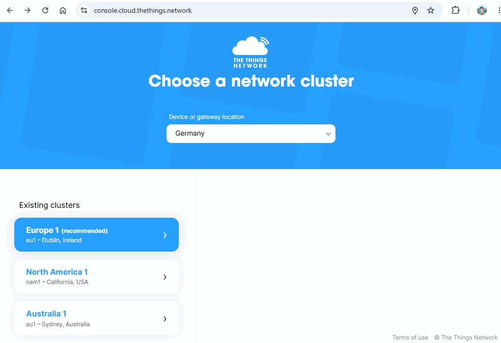{width=132mm}

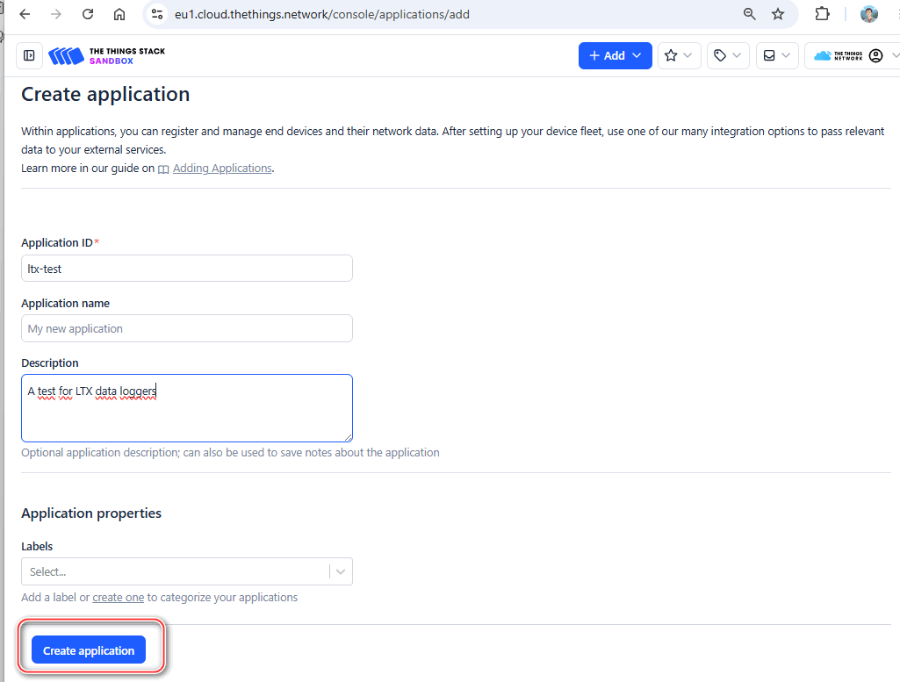{width=132mm}

## A2. Endgerät manuell registrieren

1. Öffnen Sie **Add end device**.
2. Wählen Sie **Enter end device specifics manually**.
3. Stellen Sie ein:
   - Frequency plan: `Europe 863-870 MHz (SF9 for RX2 - recommended)`
   - LoRaWAN version: `LoRaWAN Specification 1.0.4`
   - Regional Parameters: passend zur Gerätefirmware, im getesteten Setup `RP002-1.0.3`
4. Aktivieren Sie OTAA.
5. Übernehmen Sie `APPEUI`, `DEUI` und `NWKKEY` aus `@$info` in Join EUI, Device EUI und AppKey.
6. Vergeben Sie eine eindeutige End device ID und registrieren Sie das Gerät.

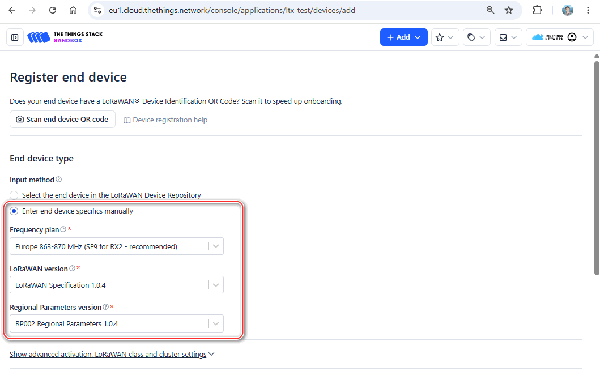{width=132mm}

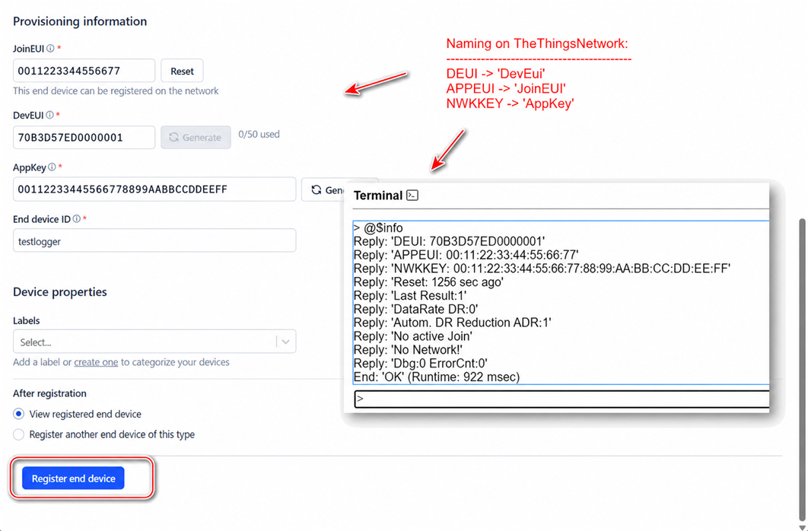{width=132mm}

## A3. Uplink-Decoder und Downlink-Encoder

1. Öffnen Sie **Payload formatters -> Uplink**.
2. Wählen Sie **Custom Javascript formatter**.
3. Kopieren Sie den vollständigen Inhalt von `payload_ltx_clean.js` aus dem [LTX Payload Decoder](https://github.com/joembedded/payload-decoder) in das Codefeld.
4. Speichern und testen Sie den Decoder.

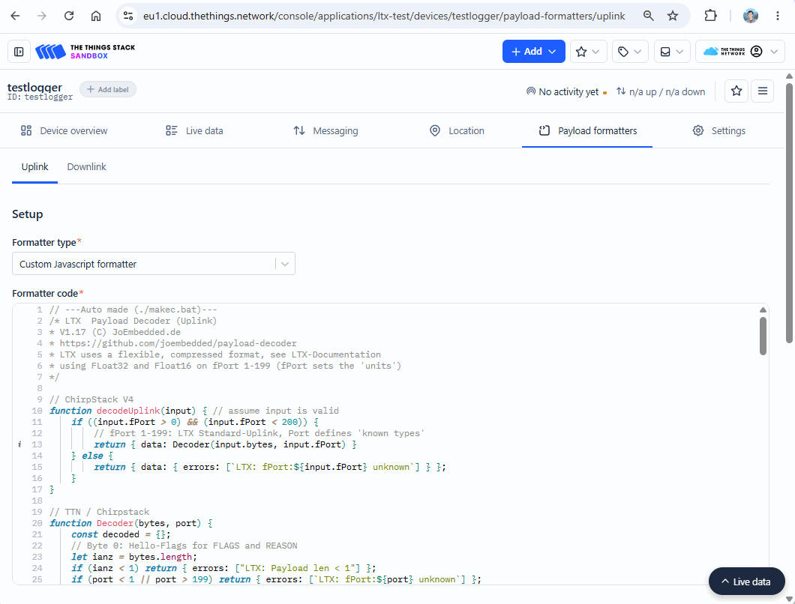{width=132mm}

Für die optionale Remote-Parametrierung öffnen Sie **Payload formatters -> Downlink**, wählen ebenfalls JavaScript und fügen `paydown_ltx.js` ein. Loggerbefehle werden auf `fPort 10` übertragen. Downlinks sparsam einsetzen.

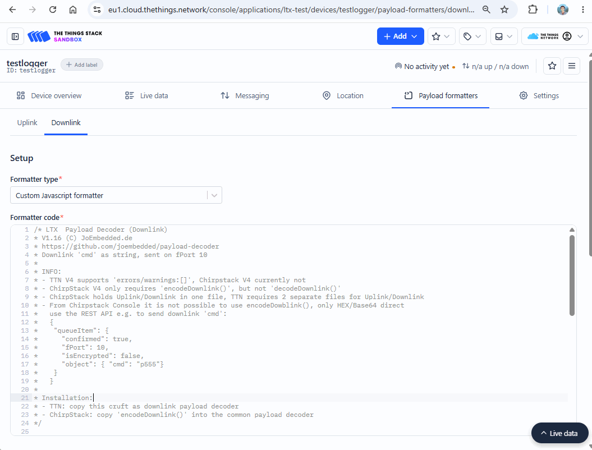{width=132mm}

## A4. Webhook zum Sensormanager

1. Öffnen Sie **Integrations -> Webhooks**.
2. Fügen Sie einen **Custom webhook** hinzu.
3. Wählen Sie JSON.
4. Tragen Sie die von TerraTransfer bereitgestellte HTTPS-Adresse einschließlich Geräte-API-Key als Base URL ein.
5. Lassen Sie Ereignispfade leer, wenn TerraTransfer nichts anderes vorgibt.
6. Aktivieren Sie mindestens **Uplink message**. **Join accept** kann die Diagnose erleichtern.
7. Speichern Sie die Integration.

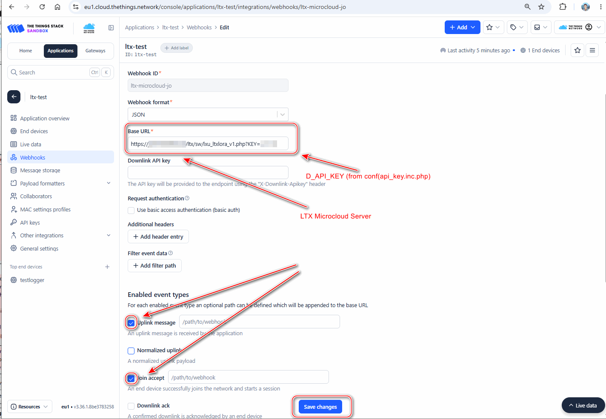{width=132mm}

> **Wichtig:** Verwenden Sie ausschließlich HTTPS. Ziel-URL und API-Schlüssel erhalten Sie von TerraTransfer. Beim ersten Test keine erforderlichen JSON-Felder herausfiltern.

## A5. Testübertragung und Live Data

Im Diagnosemodus werden Übertragungsdetails im BLX-Terminal sichtbar:

```text
@$dbg 1
i
```

Kontrollieren Sie in **Live data**:

- Join-Ereignis und anschließenden Uplink
- dekodierte Kanäle unter `decoded_payload.chans`
- erwarteten `f_port`
- keine wiederholten Webhook-Fehler

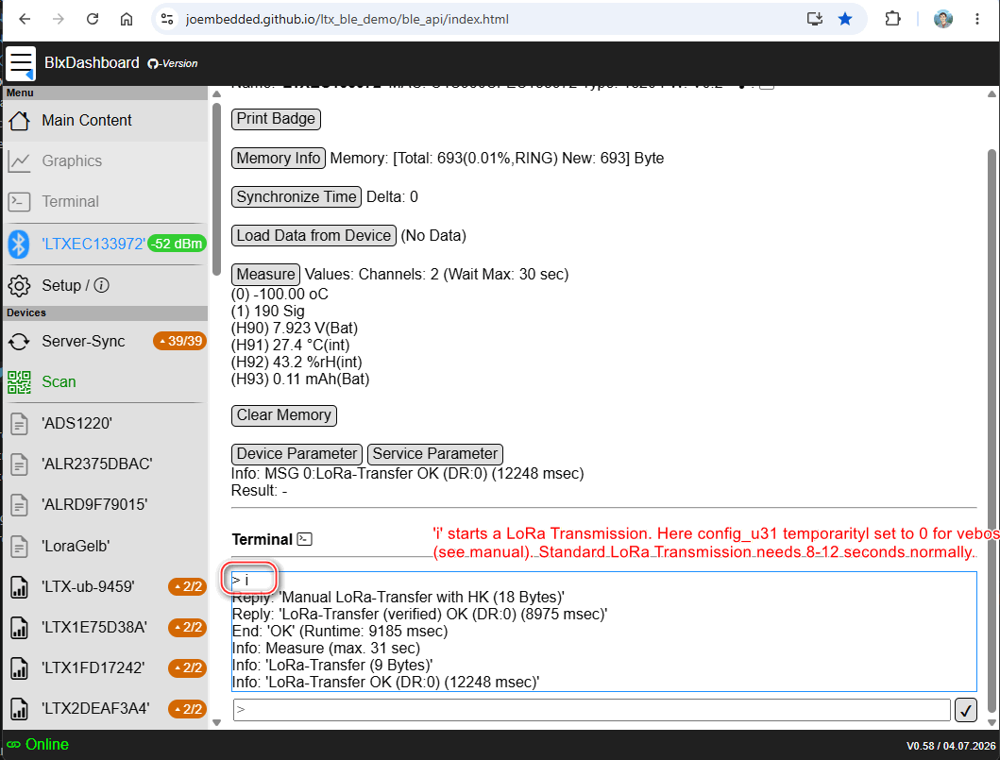{width=132mm}

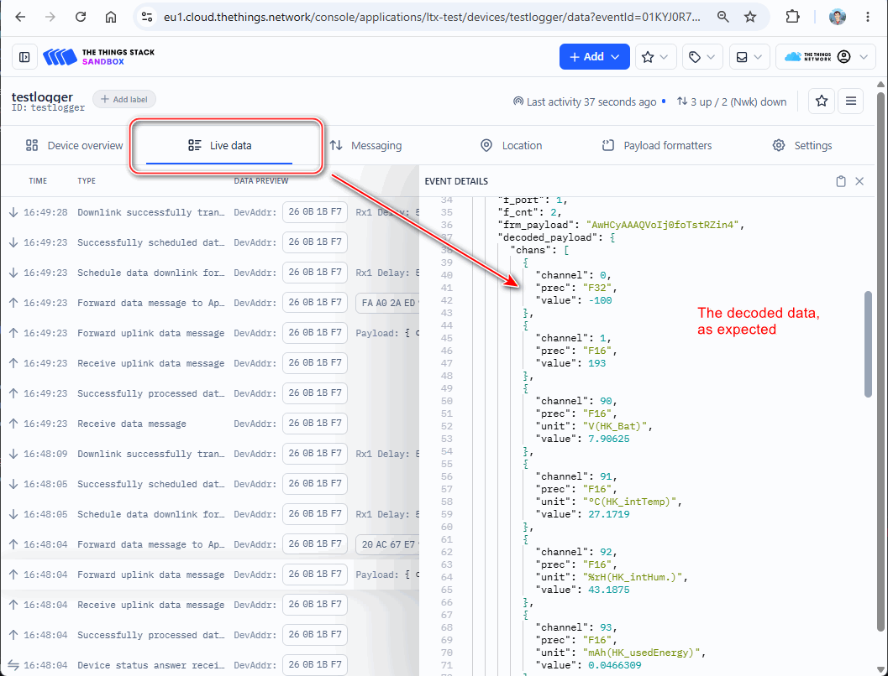{width=132mm}

Danach Diagnosemodus wieder ausschalten:

```text
@$dbg 0
```

Wurde `@AT+RFS` ausgeführt, setzen Sie in den erweiterten Geräteeinstellungen einmalig **Reset used DevNonces** zurück. Tun Sie dies nur passend zum physischen Modem-Reset.

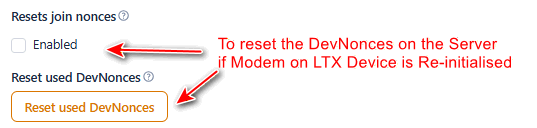{width=132mm}

\clearpage

# Weg B: ChirpStack V4

## B1. Anwendung und Geräteprofil

1. Melden Sie sich an Ihrer ChirpStack-V4-Instanz an und wählen Sie den richtigen Tenant.
2. Öffnen Sie **Applications -> Add application** und legen Sie die Anwendung an.
3. Öffnen Sie **Device Profiles -> Add device profile**.
4. Verwenden Sie:

| Feld | Einstellung |
|---|---|
| Region | `EU868` |
| MAC version | `LoRaWAN 1.0.4` |
| Regional parameters revision | im getesteten Setup `RP002-1.0.5` |
| ADR algorithm | beispielsweise `Default ADR algorithm (LoRa only)` |
| Join | OTAA, Klasse A; Class B und C nicht aktivieren |
| Expected uplink interval | tatsächliches Sendeintervall in Sekunden |

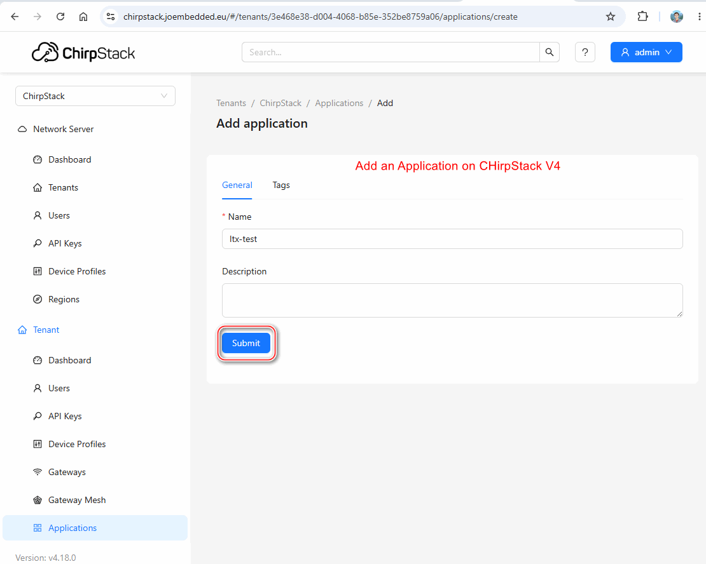{width=132mm}

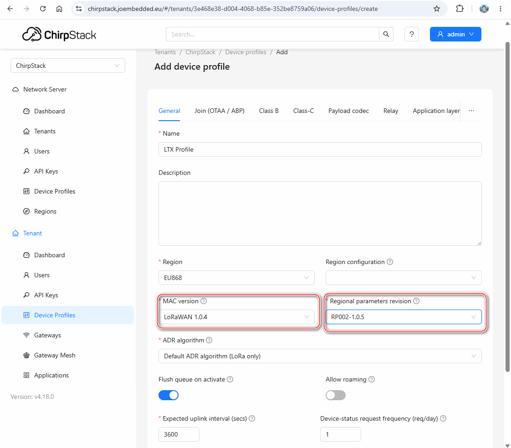{width=132mm}

## B2. Gemeinsamen Payload-Codec einrichten

Wählen Sie im Geräteprofil unter **Payload codec** die JavaScript-Funktionen. Fügen Sie in dieser Reihenfolge ein:

1. vollständiger Inhalt von `payload_ltx_clean.js`
2. eine Leerzeile
3. vollständiger Inhalt von `paydown_ltx.js`

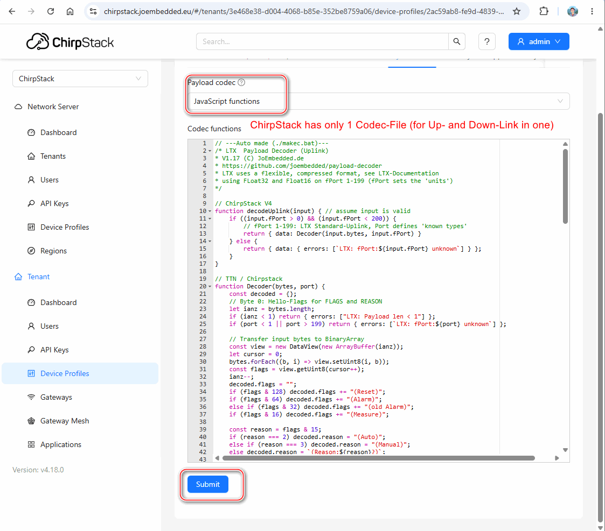{width=132mm}

## B3. Gerät registrieren

1. Öffnen Sie die Anwendung und wählen Sie **Add device**.
2. Tragen Sie die Werte ohne Doppelpunkte und Leerzeichen ein:

| Loggerwert | ChirpStack-Feld | Länge |
|---|---|---:|
| `DEUI` | Device EUI | 16 Hex-Zeichen |
| `APPEUI` | Join EUI | 16 Hex-Zeichen |
| `NWKKEY` | Application key unter OTAA keys | 32 Hex-Zeichen |

3. Ordnen Sie das Geräteprofil zu.
4. Lassen Sie **Device is disabled** ausgeschaltet.
5. Lassen Sie **Disable frame-counter validation** ausgeschaltet.

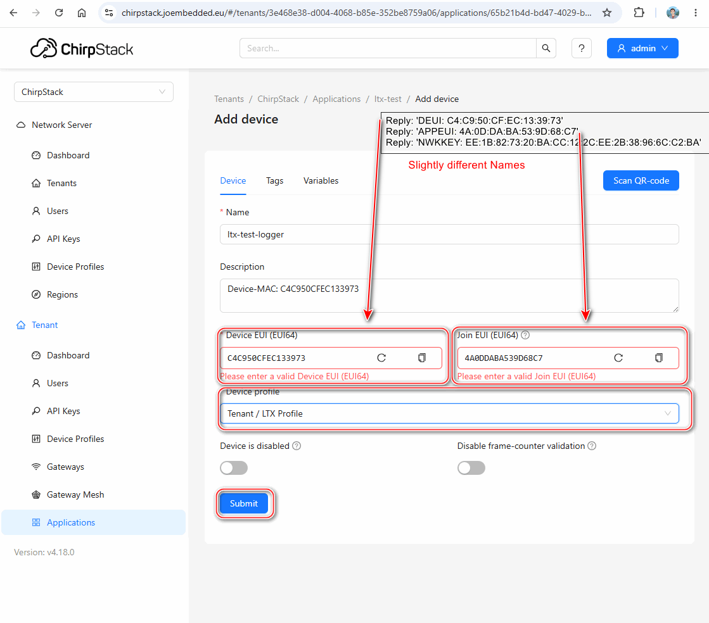{width=132mm}

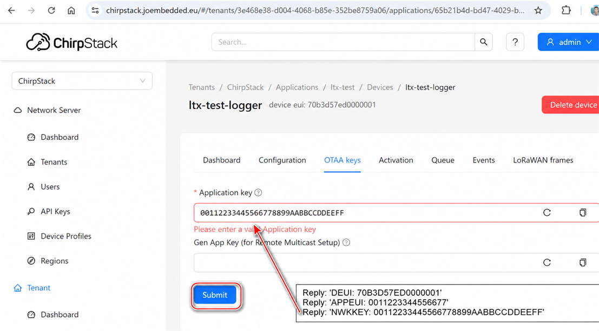{width=132mm}

## B4. HTTP-Integration zum Sensormanager

1. Öffnen Sie **Applications -> Ihre Anwendung -> Integrations**.
2. Fügen Sie eine HTTP-Integration hinzu.
3. Wählen Sie JSON als Payload encoding.
4. Tragen Sie die von TerraTransfer bereitgestellte HTTPS-Endpunkt-URL einschließlich Geräte-API-Key ein.
5. Speichern Sie mit **Submit**.

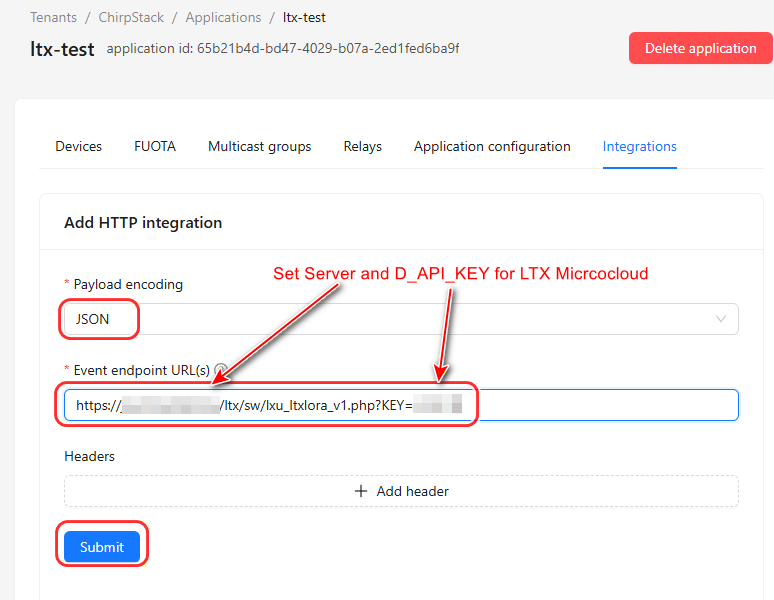{width=132mm}

## B5. Join und Uplink prüfen

```text
@$dbg 1
i
```

Kontrollieren Sie unter **LoRaWAN frames**, ob `JoinRequest` und `JoinAccept` sichtbar sind. Sind beide vorhanden, der Logger meldet aber `JOIN_FAILED`, liegt die Ursache wahrscheinlich im Downlink-Pfad vom Gateway zum Logger. Warten Sie kurz und testen Sie einmal erneut.

{width=132mm}

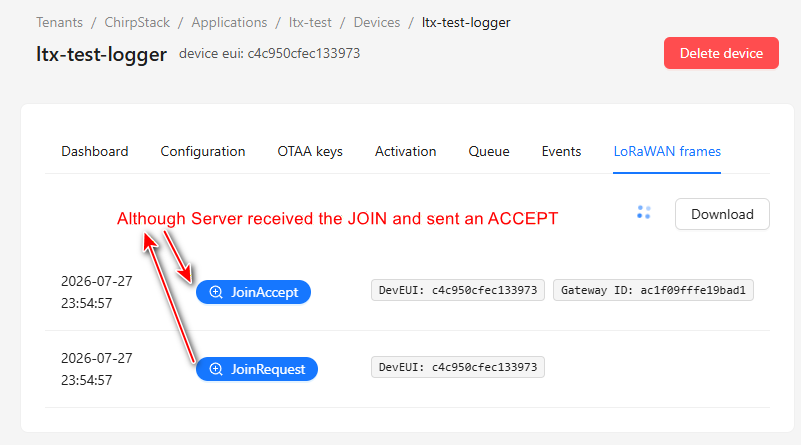{width=132mm}

Ein erfolgreicher zweiter Transfer bestätigt den Empfang des JoinAccept im Logger:

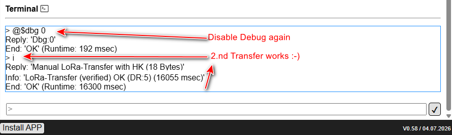{width=132mm}

Öffnen Sie anschließend **Events** und prüfen Sie:

- steigenden Frame Counter `FCnt`
- erwarteten `FPort`
- Mess- und Housekeeping-Payloads
- dekodierte Kanäle unter `object`
- eine zur Funkplanung passende Datenrate

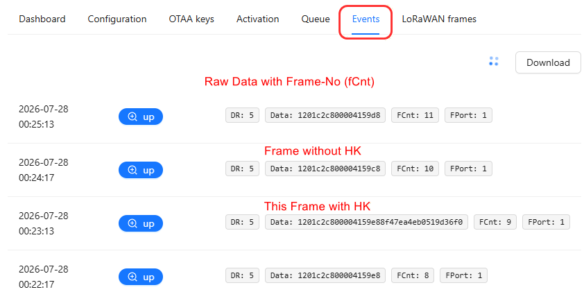{width=132mm}

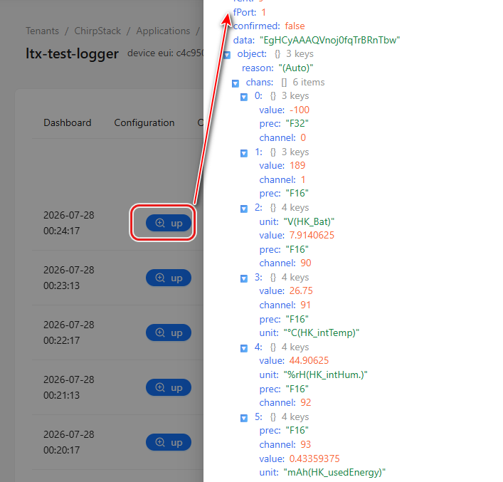{width=132mm}

Danach Diagnosemodus ausschalten:

```text
@$dbg 0
```

Wurde `@AT+RFS` ausgeführt und ChirpStack meldet `DevNonce has already been used`, verwenden Sie beim Gerät unter **OTAA keys** einmalig **Flush OTAA device nonces**. Deaktivieren Sie nicht die Frame-Counter-Prüfung.

# 7. Sensormanager und Messstelle

Nach dem ersten erfolgreichen Uplink sollte der Aquatos LoRa im TerraTransfer Sensormanager erscheinen. Die konkrete Portaloberfläche und Freischaltung werden von TerraTransfer bereitgestellt.

Prüfen Sie:

1. Gerätekennung und Zeitstempel stimmen.
2. Kanäle, Werte und Einheiten sind plausibel.
3. Messstelle, Standort und Bezugspunkt sind hinterlegt.
4. Eine Referenzmessung wurde dokumentiert und die Tarierung geprüft.
5. Grenzwerte, Batteriewarnung und Überwachung auf ausbleibende Daten sind eingerichtet.

Wenn die Daten im Netzwerkserver dekodiert sind, im Sensormanager aber fehlen, prüfen Sie zuerst HTTPS-Adresse, API-Schlüssel, aktivierte Uplink-Ereignisse und Integrationsfehler.

# 8. Abschluss und Dauerbetrieb

## 8.1 Erfolgskriterien

| Ebene | Prüfung | Erwartetes Ergebnis |
|---|---|---|
| Logger | Terminal nach `i` | `LoRa-Transfer OK` oder `LoRa-Transfer (verified) OK` |
| LoRaWAN | Live Data / Frames | Join und Uplink, Frame Counter steigt |
| Funkparameter | `AT+NBTRANS=?` oder `N:` in `AT+XSTATE=?` | entspricht der geplanten Energiestrategie |
| Decoder | `decoded_payload` / `object` | plausible Werte und Einheiten |
| Integration | Webhook-/HTTP-Ereignis | erfolgreiche HTTP-Antwort |
| Portal | Sensormanager | aktuelle Messwerte sichtbar |

## 8.2 CE-konformer Dauerbetrieb

Im regulären Betrieb werden BLE und LoRaWAN nicht gleichzeitig betrieben. Die BLE-Verbindung wird während eines LoRaWAN-Transfers kurz getrennt und danach wieder aufgebaut.

Für den CE-konformen Dauerbetrieb müssen im Parameter `Config0_U31` das Bit mit dem Wert `16` gesetzt und der Diagnosemodus mit `@$dbg 0` deaktiviert sein. `Config0_U31` ist eine Bitmaske; weitere gesetzte, projektspezifische Bits bleiben zulässig.

## 8.3 Wartung

- Gehäuse, Dichtungen, Kabel, Antenne und Befestigung regelmäßig prüfen.
- Batteriestand und verbrauchte Kapazität im Sensormanager beobachten.
- RSSI, SNR, Datenrate und wirksames `NbTrans` überwachen.
- Lokalen Speicher bei Bedarf mit dem BLX Dashboard auslesen.
- Firmware nur mit der für Typ 1720 vorgesehenen `.sec`-Datei aktualisieren.
- Sensoren nach Herstellervorgabe kalibrieren.
- Änderungen an Gerät, Sensor, Firmware, Funkprofil und Messstelle dokumentieren.

# 9. Fehlersuche

| Symptom | Wahrscheinliche Ursache | Prüfung und Maßnahme |
|---|---|---|
| Aquatos erscheint nicht in der Bluetooth-Auswahl | Bluetooth aus, Browser ohne Web Bluetooth, Gerät nicht versorgt | Bluetooth und Batterie prüfen; Chrome/Edge verwenden; App neu öffnen |
| `PIN required` bleibt sichtbar | Verbindung besteht, Freischaltung fehlt | korrekte PIN eingeben oder Geräteetikett vollständig scannen |
| Kein `JoinRequest` | falsche Region, Gateway offline, Funk- oder Antennenproblem | EU868 an Gerät, Profil und Gateway prüfen; Gateway-Livedaten und Antenne kontrollieren |
| `JoinRequest`, aber kein `JoinAccept` | EUI/Key oder OTAA-Profil falsch | `DEUI`, `APPEUI`, `NWKKEY`, LoRaWAN 1.0.4 und Regional Parameters vergleichen |
| `JoinAccept` am Server, aber `JOIN_FAILED` | Downlink erreicht den Logger nicht | Gateway-Downlink, RX2, Duty Cycle und Funkqualität prüfen; nach kurzer Pause einmal erneut testen |
| `DevNonce has already been used` | Modem wurde mit `@AT+RFS` zurückgesetzt | DevNonces am verwendeten Server passend zum physischen Reset zurücksetzen |
| Rohpayload, aber keine Werte | Codec fehlt oder enthält einen Fehler | richtige JavaScript-Datei einsetzen und integrierten Test ausführen |
| falsche oder fehlende Einheit | falscher Uplink-`fPort` | `p Port` passend zur Einheitengruppe setzen und mit `xWrite` speichern |
| Server dekodiert, Portal bleibt leer | URL, API-Key oder Ereignisart falsch | HTTPS-Endpunkt und Key prüfen; Uplink-Ereignis aktivieren; Integrationsfehler öffnen |
| `NbTrans` ändert sich bei `ADR=1` | Netzwerkserver regelt den Wert | ADR-Strategie und Paketverluste prüfen; wirksamen Wert überwachen |
| `NbTrans` steht nach Reset auf `1` | Testwert ist nicht persistent | erwartetes Verhalten; bei `ADR=0` gilt immer der Default `1` |
| Batterie wird beim Test stark belastet | Debug, DR0, häufige Joins oder viele bestätigte Uplinks | `@$dbg 0`; Funkproblem beheben; Intervall und Datenrate optimieren |
| Sensorwert fehlt oder ist unplausibel | Verdrahtung, SDI-12-Adresse oder Kanalparameter falsch | Sensoranschluss, Adresse, `Xbytes`, `Src_index` und Einzelmessung im BLX Dashboard prüfen |

# 10. Technische Daten

| Eigenschaft | Wert |
|---|---|
| Produktbezeichnung | TerraTransfer Aquatos LoRa |
| Plattform | LTX Typ 1720 |
| Anwendung | autonomer Datenlogger für SDI-12-Sensoren |
| Sensorschnittstelle | SDI-12 Version 1.3, auch für Low-Voltage-Sensoren |
| Messkanäle | bis zu 20 |
| Messintervall | 120 bis 86.400 Sekunden |
| LoRaWAN | Version 1.0.4, Klasse A, OTAA, bidirektional, ADR |
| Frequenzbereich | EU868, 863 bis 870 MHz |
| Sendeleistung | maximal 14 dBm |
| Nutzdaten je Uplink | bis zu 51 Byte, abhängig von Datenrate und Netzparametern |
| Lokale Kommunikation | Bluetooth Low Energy ab BLE 4.2 |
| Bedienung | BLX Dashboard als browserbasierte PWA |
| Lokaler Speicher | 8 MB Standard, bis zu 16 MB bestückbar |
| Speicherbetrieb | Ring- oder Linearspeicher |
| Speicherkapazität | typisch etwa 400.000 historische Messwerte bei 8 MB, abhängig von Datensatzgröße |
| Versorgung | 3,4 bis 3,6 V |
| Batterie | 1 x Lithium-D-Zelle, typisch 12 Ah |
| Sensorversorgung | intern geschaltet, etwa 9 V; optional 12 V |
| Leiterplattenformat | ca. 35 mm x 115 mm |
| Gehäuse | schlankes 2-Zoll-Rundgehäuse |

Die tatsächliche Batterielaufzeit hängt von Sensorstrom, Mess- und Übertragungsintervall, Datenrate, Empfangsqualität, Wiederholungen, Batteriechemie und Temperatur ab. Eine belastbare Laufzeitangabe ist nur für die konkrete Projektkonfiguration möglich.

# 11. Checkliste

## Gerät und Logger

- [ ] Batterie polrichtig eingesetzt und Aquatos per BLE erreichbar
- [ ] BLX Dashboard in Chrome/Edge geöffnet, PIN akzeptiert
- [ ] Sensor angeschlossen und Einzelmessung plausibel
- [ ] Messkanäle, Housekeeping und `fPort` konfiguriert
- [ ] Batterieparameter geprüft und mit `xWrite` gespeichert
- [ ] Antenne montiert und Einbau dokumentiert

## LoRaWAN

- [ ] EU868 eingestellt
- [ ] `DEUI`, `APPEUI` und `NWKKEY` sicher notiert
- [ ] ADR-/Datenratenstrategie festgelegt
- [ ] TTN oder ChirpStack mit LoRaWAN 1.0.4 konfiguriert
- [ ] Payload-Codec gespeichert und getestet
- [ ] Join und dekodierter Uplink sichtbar
- [ ] HTTP-/Webhook-Integration erfolgreich

## Nach dem Test

- [ ] Messwerte im Sensormanager sichtbar und plausibel
- [ ] Referenzmessung, Messpunkthöhe und Bezugspunkt dokumentiert
- [ ] Alarmierung und Überwachung auf ausbleibende Daten eingerichtet
- [ ] `@$dbg 0` ausgeführt
- [ ] CE-Bit `16` in `Config0_U31` gesetzt
- [ ] Sendeintervall, Airtime und Batterieverbrauch geprüft
- [ ] Root Key und API-Schlüssel getrennt und sicher gespeichert

# 12. Weiterführende Dokumentation

- [LTX Typ 1720 - Hardware und gerätespezifische Parameter](https://github.com/joembedded/ltx_docu/blob/master/editiert/ltx_typen/LTX_T1720_LoRaWAN.MD)
- [LoRaWAN-Inbetriebnahme mit TTN und ChirpStack](https://github.com/joembedded/ltx_docu/blob/master/editiert/ltx_lorawan_howto/ltx_lorawan_howto.md)
- [BLX Dashboard - Kommando-Referenz](https://github.com/joembedded/ltx_docu/blob/master/editiert/blx_dashboard/blx_commands.md)
- [LTX LoRaWAN AT-Kommandos](https://github.com/joembedded/ltx_docu/blob/master/editiert/lora/ltx_lora_at_kommandos.md)
- [LTX LoRa-Payload, fPort und Einheiten](https://github.com/joembedded/ltx_docu/blob/master/editiert/lora/lora_payload.md)
- [Energie-Vergleich LoRa-Module EU868](https://github.com/joembedded/ltx_docu/blob/master/editiert/lora/energie_vergleich.md)
- [LTX Payload Decoder](https://github.com/joembedded/payload-decoder)
- [Firmware- und Datenblatt-Archiv](https://joembedded.de/x3/ltx_firmware/index.php)

---

*Alternative technische Anleitung für TerraTransfer Aquatos LoRa auf Basis LTX Typ 1720. Vor dem produktiven Rollout Firmwarestand, regionale Funkvorgaben, Stack-Version und kundenspezifische Sensormanager-Konfiguration prüfen.*
