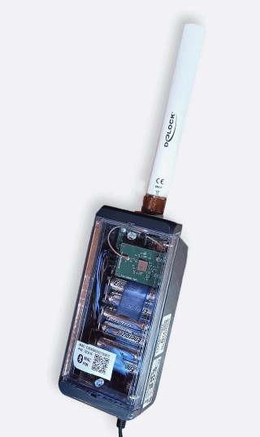

\noindent{\headingfont\fontsize{22}{25}\selectfont\color{GPInk}Produktprofil}\par
\vspace{4mm}

Der **LTX Typ 1820** ist ein batteriebetriebener Datenlogger für SDI-12-Sensoren. Er kombiniert LoRaWAN EU868, lokalen Messwertspeicher und Bluetooth Low Energy (BLE). Das größere Polycarbonatgehäuse bietet Raum für verschiedene Batterieoptionen und unterstützt zusätzlich eine externe Versorgung. Damit eignet sich der Logger für Messstellen mit flexiblem Energie- und Backup-Konzept.

{height=105mm}

# Vorteile auf einen Blick

- Bis zu **20 SDI-12-Messkanäle** nach SDI-12 Version 1.3
- LoRaWAN 1.0.4, Klasse A, im EU868-Band
- Lokaler Speicher mit 8 MB Standardkapazität
- Ring- oder Linearspeicher für unabhängige Datensicherung
- BLE-Zugriff für Konfiguration, Diagnose und lokalen Datenabruf
- Interne AA- oder optionale Lithium-D-Zellen
- Externe Versorgung von 4 bis 14 V mit möglicher Batterie-Backup-Funktion
- Geräumiges Polycarbonatgehäuse für flexible Feldinstallationen

\newpage

# Technische Daten

| Eigenschaft | Wert |
|---|---|
| Anwendung | Autonomer Datenlogger für SDI-12-Sensoren |
| Sensorschnittstelle | SDI-12 Version 1.3, auch für Low-Voltage-Sensoren |
| Anzahl Messkanäle | Bis zu 20 |
| Messintervall | 10 bis 86.400 Sekunden, konfigurierbar |
| LoRaWAN | Version 1.0.4, Klasse A |
| Frequenzbereich | EU868, 863 bis 870 MHz |
| Sendeleistung | Maximal 14 dBm |
| Nutzdaten pro Uplink | Bis zu 51 Byte, abhängig von Datenrate und Netzparametern |
| Lokale Kommunikation | Bluetooth Low Energy ab BLE 4.2 |
| Lokaler Speicher | 8 MB Standard, bis zu 16 MB bestückbar |
| Speicherkapazität | Typisch etwa 400.000 historische Messwerte bei 8 MB; abhängig von Kanalzahl und Datensatzgröße |
| Interne Versorgung | 6 × 1,5-V-AA-Zelle; optional 2 × 3,6-V-Lithium-D-Zelle |
| Externe Versorgung | 4 bis 14 V; die höhere anliegende Spannung wird verwendet |
| Sensorversorgung | Höchste Versorgungsspannung wird durchgeschaltet, bis ca. 1 A |
| Gehäuseformat (B × L × H) | Ca. 75 mm × 180 mm × 60 mm |
| Antennenanschluss | N-Buchse, ausführungsabhängig |
| Gehäuse | Polycarbonat mit transparentem Deckel; je nach Ausführung bis IP68 |

# Energieversorgung, Verbrauch und Laufzeit

Der Typ 1820 kann mit sechs AA-Zellen, optional zwei Lithium-D-Zellen oder einer externen Quelle von 4 bis 14 V betrieben werden. Bei paralleler Versorgung verwendet die Hardware die höhere Spannung; interne Batterien können als Backup dienen. Die Eingangsspannung wird energieoptimiert auf die Betriebsspannung des LoRaWAN-Modems umgesetzt. Für SDI-12-Sensoren steht die jeweils anliegende Versorgungsspannung durchgeschaltet zur Verfügung. Bei weniger als 9 V müssen deshalb geeignete Low-Voltage-Sensoren eingesetzt werden.

Das Ultra-Low-Power-Design benötigt im Schlafmodus bei aktivem Bluetooth Low Energy weniger als **20 µA**. Eine BLE-Verbindung verursacht nur einen geringen zusätzlichen Energiebedarf. SDI-12-Sensoren werden ausschließlich für die Messung versorgt; die durchgeschaltete Versorgung benötigt dabei etwa 1 mA zuzüglich des Sensorstroms und kann Sensoren mit bis zu etwa 1 A versorgen. Beim Senden verursacht das LoRaWAN-Modem kurzzeitig Stromspitzen von etwa 20 bis 50 mA.

Alle LTX-Logger verfügen über ein internes Energiemanagement. Es summiert den tatsächlich verbrauchten Energieanteil dynamisch in mAh und führt den daraus abgeleiteten prozentualen Kapazitätsverbrauch als Housekeeping-Wert mit. Zusammen mit der Batteriespannung in mV ermöglicht dies eine belastbare Wechselprognose auch bei wechselnden Betriebsbedingungen, sodass Batterien nicht rein vorsorglich zu früh getauscht werden müssen. Die Spannung eignet sich besonders für Systeme mit gut auswertbarem Spannungsverlauf, etwa Blei-Gel-, Alkali- oder LiPo-Akkus. Bei Lithium-Primärbatterien ist dagegen überwiegend die verbrauchte Kapazität aussagekräftig, weil deren Spannung über lange Zeit nur wenig abfällt.

Sechs interne AA-Zellen stellen je nach Chemie typischerweise etwa 2.000 bis 3.500 mAh bereit. Bei angemessener Sensorlast sowie Mess- und Übertragungsintervall ist damit ein mehrjähriger Betrieb möglich. Die tatsächliche Laufzeit hängt besonders von Sensorverbrauch, Funkintervall, LoRaWAN-Datenrate, Empfangsqualität, Batteriechemie und Temperatur ab. Eine überschlägige Betrachtung für Messung und Sensorversorgung enthält das [TensioMark-Beispiel in der Logger-Hardwareübersicht](https://github.com/joembedded/ltx_docu/blob/master/editiert/ltx_typen/logger_Zusammenfassung.md#4-energiebetrachtung--beispiel-tensiomark-3-sensoren). Detaillierte Messwerte zum LoRaWAN-Energiebedarf bei verschiedenen Datenraten und Nutzlasten enthält der [Energie-Vergleich der LoRa-Module](https://github.com/joembedded/ltx_docu/blob/master/editiert/lora/energie_vergleich.md).

# Daten, Funk und Service

Der Logger speichert Messwerte unabhängig von der Funkübertragung lokal im Ring- oder Linearspeicher. Das **BLX Dashboard** unterstützt per BLE Konfiguration, Diagnose und Datenzugriff. LoRaWAN stellt kompakte Uplinks und bidirektionale Kommunikation bereit; Housekeeping-Werte ergänzen die Ferndiagnose.

# Typische Einsatzbereiche

- Hydrologische, geotechnische und meteorologische Messstellen
- SDI-12-Sensorik mit höherem Energie- oder Platzbedarf
- Standorte mit externer Akku- oder Solarversorgung
- Langzeitmonitoring mit lokaler Datensicherung, Fernübertragung und Versorgungsreserve

# Hinweise zur Projektierung

Schutzart, Antenne, Batterie, Sensorlast, Funkabdeckung und Gehäuse sind projektspezifisch abzustimmen. Details zu LoRaWAN-Inbetriebnahme, Payload, Firmware und Parametrierung: [joembedded/ltx_docu](https://github.com/joembedded/ltx_docu).
