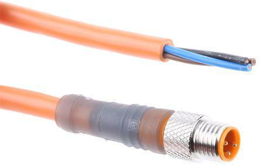

\noindent{\headingfont\fontsize{22}{25}\selectfont\color{GPInk}Produktprofil}\par
\vspace{4mm}

Der **Wireless 433 MHz zu SDI-12 Konverter** bindet kompatible GeoPrecision-Funkdatenlogger in einen SDI-12-Bus ein. Er empfängt die zuletzt per 433 MHz übertragenen Messwerte und stellt sie einem übergeordneten SDI-12-Datenlogger zur Verfügung. So lassen sich bestehende Funkmessstellen um zentrale Datensammlung, Internetanbindung oder zusätzliche lokale Speicherung erweitern.

Der Konverter ist kein eigenständiger Messsensor. Die Aktualität seiner Ausgabewerte wird durch Messperiode und Funkübertragung der zugeordneten Funkdatenlogger bestimmt.

# Vorteile auf einen Blick

- Integration von GeoPrecision-433-MHz-Funkdatenloggern in SDI-12-Systeme
- Bis zu **20 Werte je Funkdatenlogger** und **48 Werte insgesamt**
- Geeignet für Temperatur-, Schnee-/Distanz-, Neigungs- und Thermistorketten-Logger
- Konfigurierbare Zuordnung von Funkwerten zu SDI-12-Kanälen
- Optionaler Offset und Faktor je Kanal
- Versorgung von 3,6 bis 14 V DC
- Varianten mit offenem Kabelende oder 3-poligem M8-Anschluss
- Optionales Kunststoffgehäuse für externe Installation

\newpage

# Technische Daten

| Merkmal | Wert |
|---|---|
| Schnittstelle | SDI-12, Befehlssatz auf Basis SDI-12 V1.2 |
| Funkempfang | GeoPrecision-433-MHz-Funkdatenlogger |
| Versorgungsspannung | 3,6 bis 14 V DC |
| Stromaufnahme während der Messung | Größer als 19 mA |
| Empfohlene Versorgungsauslegung | Mehr als 20 mA dauerhaft |
| Stromaufnahme im Ruhezustand | 2 mA |
| Einschaltwartezeit | Mindestens 800 ms |
| Typische Dauer des ersten Messblocks | Etwa 8 s; der Konverter meldet die Wartezeit per SDI-12 |
| Überspannungsschutz | TVS-Überspannungsableiter, 400 W |
| Werte je Funkdatenlogger | Bis zu 20 |
| Werte insgesamt | Bis zu 48 |
| Betriebstemperatur | -40 bis +85 °C |
| Werkseitige SDI-12-Adresse | `1` |
| Optionales Zubehör | Kunststoffgehäuse für externen Einsatz |

# Anschluss

## Offenes Kabelende

| Aderfarbe | Funktion | Anschlusswert |
|---|---|---|
| Braun | Versorgung | +3,6 bis +14 V DC |
| Schwarz | Masse | GND |
| Blau | Daten | SDI-12 DATA |

## M8-Steckverbinder, 3-polig

| Pin | Aderfarbe | Funktion |
|---:|---|---|
| 1 | Braun | Versorgung, +3,6 bis +14 V DC |
| 3 | Blau | SDI-12-Datenleitung |
| 4 | Schwarz | Masse, GND |

{width=90mm}

# Funktionsprinzip

1. Kompatible Funkdatenlogger senden ihre aktuellen Werte im 433-MHz-Netz.
2. Der Konverter übernimmt die zuletzt empfangenen Werte in seinen Cache.
3. Die Konfiguration verbindet Funklogger, Wertindex und SDI-12-Ausgabekanal.
4. Ein SDI-12-Logger liest bis zu 48 Werte über die angekündigten Messblöcke aus.

Damit eignet sich der Konverter für neue Messnetze und zur Nachrüstung vorhandener SDI-12-Logger.

# Projektierung und Betrieb

- Während Konfiguration, Messstart und Datenausgabe muss die Versorgung bestehen bleiben.
- Nach dem Einschalten sind mindestens 800 ms bis zum ersten Befehl einzuhalten.
- Jedes Gerät am gemeinsamen SDI-12-Bus benötigt eine eindeutige Adresse.
- Funknetz, Zugangsdaten und Live-Modus der Funkdatenlogger müssen korrekt sein.
- Fehlerwerte dürfen nicht als Messwerte gespeichert werden; die Aktualität folgt der Messperiode des Funkloggers.

# Typische Einsatzbereiche

- Nachrüstung bestehender SDI-12-Logger mit drahtlosem 433-MHz-Empfang
- Zusammenführung verteilter Funkmesspunkte an einem zentralen Datenlogger
- Drahtlose Überbrückung zwischen Messstelle und SDI-12-Infrastruktur
- Zentrale Archivierung von Temperatur-, Schnee-, Distanz-, Neigungs- oder Thermistorketten-Daten

# Weiterführende Dokumentation

Die Bedienungsanleitung im Repo beschreibt Kanalzuordnung, Kommandos, Messblöcke, Fehlercodes, LTX-Energieparameter, Inbetriebnahme und Störungsbehebung. Zusätzlich gelten die Vorgaben der eingesetzten Datenlogger.
