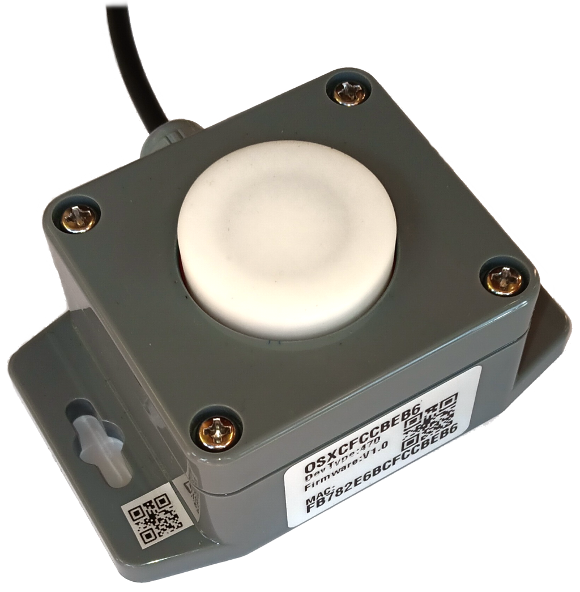
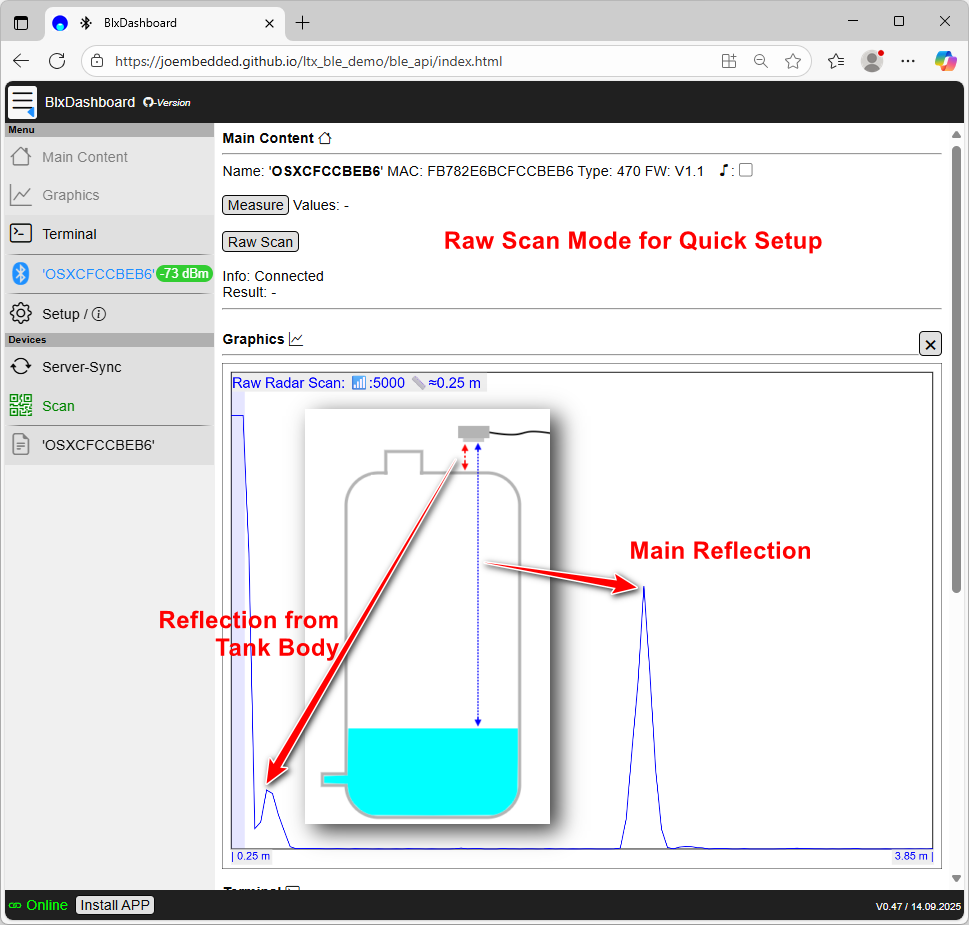

\noindent{\headingfont\fontsize{22}{25}\selectfont\color{GPInk}Produktprofil}\par
\vspace{4mm}

Der **OSX Radar-Distanzsensor Typ 470** misst Abstände berührungslos mit einem 60-GHz-Radarsignal. Die gekapselte Ausführung ist besonders für Wasserstands- und Füllstandsmessungen vorgesehen. Messwerte werden über SDI-12 Version 1.3 ausgegeben; Einrichtung, Diagnose und grafische Ausrichtung sind zusätzlich per Bluetooth mit dem BLX Dashboard möglich.

{height=100mm}

# Vorteile auf einen Blick

- Typischer Messbereich von **0,10 m bis 12 m**
- Optional konfigurierbarer Messbereich bis **20 m**
- Typische Genauigkeit **≤ 2 mm**, Auflösung **1 mm**
- Bis zu drei Distanzen mit zugehöriger Signalstärke erfassbar
- SDI-12 Version 1.3 und Bluetooth Low Energy
- Raw-Scan und Live-Plot zur Inbetriebnahme und Ausrichtung
- Niedriger Ruhestrom für energieeffiziente Messstellen
- Gehäuse in IP54, optional IP68 laut Quelldokument

\newpage

# Technische Daten

| Eigenschaft | Wert |
|---|---|
| Messprinzip | Pulsed Coherent Radar (PCR) |
| Radarfrequenz | 60 GHz |
| Typischer Messbereich | 0,10 m bis 12 m |
| Erweiterter Messbereich | Optional bis 20 m, abhängig von Parametrierung und Anwendung |
| Typische Genauigkeit | ≤ 2 mm |
| Auflösung | 1 mm |
| Erfasste Ziele | Bis zu 3 Distanzen gleichzeitig |
| Messwertausgabe | Distanz in m und Signalstärke in dB |
| Öffnungswinkel | Standard-Radaroptik ca. 10°; interner Radarstrahler ohne Fokussierung 60° bis 90° |
| Sendeleistung | Ca. 11 dBm EIRP |
| Sensorschnittstelle | SDI-12 Version 1.3 |
| Lokale Kommunikation | Bluetooth Low Energy; SDI-12 über Bluetooth möglich |
| Versorgungsspannung | 3,6 bis 16 V |
| Verpolschutz | Nicht vorhanden |
| Strom während Messung | Kurzzeitig bis 100 mA |
| Ruhestrom | Durchschnittlich < 30 µA bei 4 V im Deep Sleep |
| BLE-Verbindung | Durchschnittlich < 60 µA bei 4 V bei aktiver Verbindung |
| Bereitschaft nach Einschalten | Ca. 250 ms |
| Betriebstemperatur | -40 °C bis +85 °C |
| Schutzart | IP54; optional IP68 |
| Konformität | CE und RoHS gemäß Quelldokument |

# Anschluss

| Aderfarbe | Funktion |
|---|---|
| Schwarz | GND |
| Braun | Versorgung 3,6 bis 16 V |
| Weiß oder Blau | SDI-12-Signal |

**Achtung:** Die Versorgung ist nicht verpolungssicher. Vor dem Einschalten müssen Polarität und Versorgungsspannung geprüft werden.

Für Distanzen unter 0,15 m nennt die Quelle die zusätzliche Funktion **LeakCancellation**. Sie ist standardmäßig deaktiviert und kann die Messgeschwindigkeit reduzieren. Objekte unter 0,05 m werden technisch nicht erfasst.

\clearpage

# Messprinzip und Einrichtung

Leitfähige oder feuchte Grenzflächen reflektieren das Radarsignal unterschiedlich stark. Metall reflektiert nahezu vollständig, Wasser sehr stark; auch feuchte Erde oder Vegetation kann klare Signale liefern. Kunststoff, Keramik, Glas oder dünnes trockenes Holz dämpfen das Signal nur gering, sodass Messungen je nach Aufbau auch durch solche Materialien möglich sind.

{width=90mm}

Der Raw-Scan unterstützt die Ausrichtung am Einbauort und macht Haupt- sowie Nebenreflexionen sichtbar. Der Live-Plot zeigt die erkannten Distanzen und Signalstärken während der Inbetriebnahme.

# Typische Einsatzbereiche

- Wasserstands- und Pegelmessung
- Füllstandsmessung in Behältern
- Berührungslose Abstandserfassung im Außenbereich
- Batteriebetriebene SDI-12-Messstellen
- Anwendungen mit mehreren reflektierenden Grenzflächen

# Hinweise zur Projektierung

Messbereich, Reflektorfläche, Empfindlichkeit, Ergebnis-Sortierung und Optik sind an den Einbau anzupassen. Größere Messbereiche erhöhen laut Quelle Messzeit und Energiebedarf und können Mehrfachreflexionen begünstigen. Die Standardausführung IP54 ist vor direktem Regen, Schnee und starkem Wasserstrahl zu schützen; IP68 ist optional.

Befehle, Parametrierung und Kalibrierhinweise: [Originaldokumentation für Typ 470](https://joembedded.de/x3/ltx_firmware/Open-SDI12-Blue-Sensors/0470_RadarDistA/osx_radar_a121_de.pdf). Sensorplattform: [joembedded/Open-SDI12-Blue](https://github.com/joembedded/Open-SDI12-Blue).
