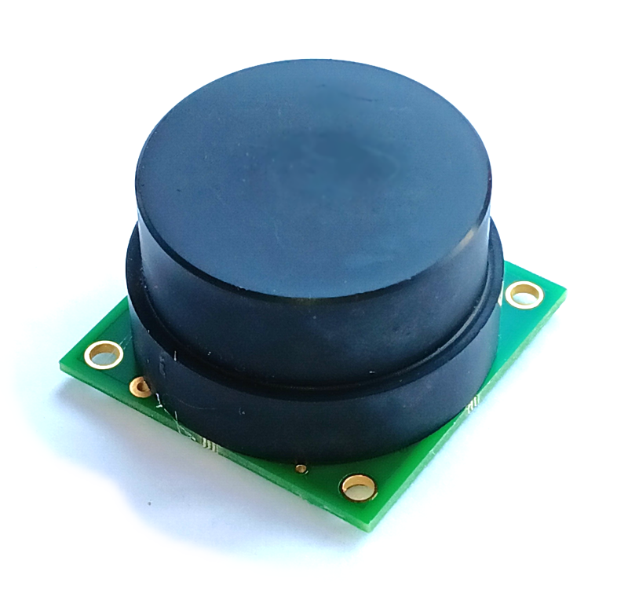
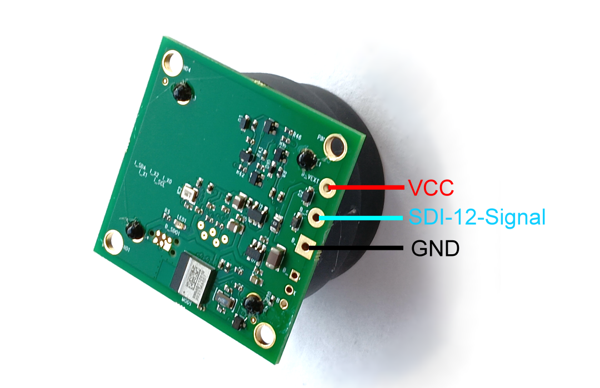

\noindent{\headingfont\fontsize{22}{25}\selectfont\color{GPInk}Produktprofil}\par
\vspace{4mm}

Der **OSX Radar-Distanzsensor Typ 471** ist die OEM-Ausführung des 60-GHz-Radarsensors. Das kompakte Modul ist für die Integration in kundenspezifische Gehäuse und Messsysteme vorgesehen. Es misst Distanzen berührungslos, kommuniziert über SDI-12 Version 1.3 und lässt sich per Bluetooth mit dem BLX Dashboard einrichten und diagnostizieren.

{height=100mm}

# Vorteile auf einen Blick

- OEM-Modul mit Abmessungen von **40 mm × 40 mm × 25 mm**
- Typischer Messbereich von **0,15 m bis 12 m**
- Optional konfigurierbarer Messbereich bis **20 m**
- Typische Genauigkeit **≤ 2 mm**, Auflösung **1 mm**
- Bis zu drei Distanzen mit zugehöriger Signalstärke erfassbar
- SDI-12 Version 1.3 und Bluetooth Low Energy
- Kabel- und PCB-Anschlussvariante dokumentiert
- Integration hinter dünnen, radartransparenten Gehäusewänden möglich

\newpage

# Technische Daten

| Eigenschaft | Wert |
|---|---|
| Messprinzip | Pulsed Coherent Radar (PCR) |
| Radarfrequenz | 60 GHz |
| Typischer Messbereich | 0,15 m bis 12 m |
| Erweiterter Messbereich | Optional bis 20 m, abhängig von Parametrierung und Anwendung |
| Typische Genauigkeit | ≤ 2 mm |
| Auflösung | 1 mm |
| Erfasste Ziele | Bis zu 3 Distanzen gleichzeitig |
| Messwertausgabe | Distanz in m und Signalstärke in dB |
| Öffnungswinkel | Standardlinse ca. 10°; Radarstrahler ohne Fokussierung 60° bis 90° |
| Sendeleistung | Ca. 11 dBm EIRP |
| Sensorschnittstelle | SDI-12 Version 1.3 |
| Lokale Kommunikation | Bluetooth Low Energy; SDI-12 über Bluetooth möglich |
| Versorgungsspannung | 3,6 bis 16 V |
| Verpolschutz | Nicht vorhanden |
| Strom während Messung | Kurzzeitig bis 100 mA |
| Ruhestrom | Durchschnittlich < 30 µA bei 4 V im Deep Sleep |
| BLE-Verbindung | Durchschnittlich < 60 µA bei 4 V bei aktiver Verbindung |
| Bereitschaft nach Einschalten | Ca. 250 ms |
| Betriebstemperatur | -40 °C bis +85 °C |
| Abmessungen | 40 mm × 40 mm × 25 mm |
| Radar-Dom | ABS; optional POM |
| Schutzart | Für das OEM-Modul in der Quelle nicht angegeben |
| Konformität | CE und RoHS gemäß Quelldokument |

# Elektrischer Anschluss

Die Kabelvariante verwendet Schwarz für GND, Braun für die Versorgung und Weiß oder Blau für das SDI-12-Signal. Bei der PCB-Variante stehen separate Anschlusspunkte für VCC, SDI-12-Signal und GND zur Verfügung.

**Achtung:** Die Versorgung ist nicht verpolungssicher. Eine externe Schutzdiode kann vorgesehen werden, erhöht laut Quelle jedoch die minimale Versorgungsspannung geringfügig.

# Typische Einsatzbereiche

- Integration in Pegel- und Füllstandsmessgeräte
- Kundenspezifische SDI-12-Sensorik
- Messung hinter gekapselten, radartransparenten Gehäuseflächen
- Energieeffiziente IoT- und Datenlogger-Anwendungen

\clearpage
\thispagestyle{fancy}
\vspace*{1pt}

# OEM-Integration

{width=105mm}

Der Radar-Dom besteht standardmäßig aus ABS und optional aus POM. ABS kann auf ebenen Flächen verklebt werden, beispielsweise auf der Innenseite eines Gehäuses. Dünne Gehäusewände aus geeigneten radartransparenten Materialien können das Signal nur gering abschwächen; die Quelle nennt als typische Wandstärke 2 bis 3 mm.

# Integrationshinweise

- Schutzart und Umweltschutz legt das kundenseitige Gehäuse fest.
- Messbereich, Reflektorfläche, Empfindlichkeit und Sortierung sind anzupassen.
- Die Radaroptik möglichst nahe an einer geeigneten Gehäusewand montieren.
- Metall und enge Einbauräume können Nebenreflexionen verursachen.
- Größere Messbereiche erhöhen laut Quelle Messzeit und Energieverbrauch.

# Hinweise zur Ausführung

Die ODT-Quelle bezeichnet diese OEM-Ausführung durchgängig als **Typ 471**. Für das ungekapselte Modul ist keine Schutzart angegeben. Abdichtung, Kondensationsschutz, Zugentlastung und mechanischer Schutz sind im Zielgerät festzulegen und zu prüfen.

Befehle, Parametrierung und Kalibrierhinweise: [Originaldokumentation für Typ 471 OEM](https://joembedded.de/x3/ltx_firmware/Open-SDI12-Blue-Sensors/0470_RadarDistA/osx_radar_a121_oem_de.pdf). Sensorplattform: [joembedded/Open-SDI12-Blue](https://github.com/joembedded/Open-SDI12-Blue).
