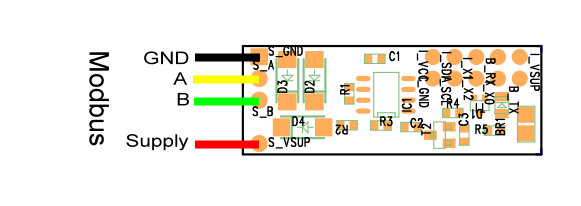

\noindent{\headingfont\fontsize{22}{25}\selectfont\color{GPInk}Produktprofil}\par
\vspace{4mm}

Der **Typ 210 Modbus-zu-SDI-12-Konverter** ermöglicht den Betrieb fremder Modbus-RTU-/RS485-Sensoren an einem vorhandenen SDI-12-Bus. Modbus bietet eine große Auswahl an Sensoren und lange RS485-Strecken, benötigt für einfache Umweltsensorik jedoch mehr Verdrahtung, Versorgung und Protokollkonfiguration als SDI-12. Die Typ-210-Leiterplatte übersetzt deshalb ausgewählte Modbus-Register in SDI-12-Messwerte und integriert sie in die einheitliche Logger-Umgebung.

{width=145mm}

# Vorteile auf einen Blick

- Flexible Leiterplatte statt festgelegtem Fertiggerät
- Betrieb fremder Modbus-RTU-/RS485-Sensoren an einem SDI-12-Datenlogger
- Bis zu zehn auslesbare Modbus-Register je Messung
- Unterstützung der Modbus-Registergruppen 3 und 4
- 16- und 32-Bit-Zahlenformate mit Big-Endian-Interpretation
- Geschaltete Versorgung des Modbus-Segments zur Energieeinsparung
- Konfiguration und Diagnose per Bluetooth Low Energy oder über SDI-12
- Projektspezifische Anpassung an Sensor, Registerliste, Versorgung, Anschluss und Gehäuse

\newpage

# Technische Daten

| Eigenschaft | Wert |
|---|---|
| Anwendung | Einbindung eines Modbus-RTU-/RS485-Sensors in SDI-12-Loggerumgebungen |
| Bauform | Open-SDI12-Blue-Leiterplatte, projektspezifisch anzupassen |
| Modbus-Schnittstelle | RS485, Modbus RTU |
| SDI-12-Schnittstelle | SDI-12 Version 1.3 |
| Register je Messung | Bis zu zehn Ergebnisregister |
| Unterstützte Modbus-Gruppen | Gruppe 3 und 4, 16-Bit-Register |
| Datenformate | 16-Bit-Integer und 32-Bit-Fließkommawerte; Big Endian |
| Typische Modbus-Kommunikation | 9.600 Baud, 8N1; weitere Baudraten projektspezifisch |
| Versorgung SDI-12-Seite | 5 bis 16 V DC |
| Modbus-Versorgung | Geschaltet; für die Messung bis 100 mA über den Konverter |
| Empfohlene Modbus-Versorgung | Typisch 8 bis 16 V; abhängig vom angeschlossenen Sensor |
| Mindestversorgung Modbus-Sensor | Rein technisch ab 3,6 V möglich, sensorspezifisch prüfen |
| Einschaltbereitschaft Konverter | Etwa 250 ms, ohne Aufwärmzeit des Modbus-Sensors |
| Betriebstemperatur | -40 bis +85 °C |
| BLE-Advertising | Im Mittel unter 15 µA bei 4 V |
| Aktive BLE-Verbindung | Im Mittel unter 50 µA bei 4 V |

# Warum Modbus auf SDI-12 abbilden?

Modbus-Sensoren sind für viele Messgrößen verfügbar und RS485 eignet sich für lange Leitungswege. Ein Modbus-Segment benötigt jedoch mindestens vier Adern sowie eine sensorabhängig oft höhere Versorgungsspannung. Außerdem müssen Sensoradresse, Registergruppe, Registerindex, Datenformat und gegebenenfalls Aufwärmzeit projektspezifisch festgelegt werden.

LTX-Datenlogger verfügen dagegen über einen SDI-12-Bus, der für einfache Umweltsensorik einheitlich und mit geringem Integrationsaufwand genutzt werden kann. Der Typ 210 übernimmt die Modbus-spezifische Kommunikation und stellt die ausgewählten Werte als SDI-12-Messwerte bereit. So bleibt die Loggerkonfiguration auf der SDI-12-Seite konsistent, während fremde Modbus-Sensoren gezielt eingebunden werden können.

| Merkmal | Modbus RTU / RS485 | SDI-12 mit Typ 210 |
|---|---|---|
| Ziel | Breite Sensorverfügbarkeit und lange Leitungen | Einheitliche Einbindung in LTX-Logger |
| Verdrahtung | Mindestens vier Adern | SDI-12-Bus zum Logger; Modbus nur im Sensorteil |
| Versorgung | Häufig höher und sensorspezifisch | Modbus-Versorgung bei Bedarf geschaltet |
| Konfiguration | Adresse, Register, Format und Baudrate | Ergebniswerte als SDI-12-Kanäle |

# Registermapping und Werteaufbereitung

Ein Modbus-Sensor stellt Werte typischerweise in den Registergruppen 3 oder 4 bereit. Der Typ 210 liest diese mit einem konfigurierbaren Messkommando aus und fasst mehrere aufeinanderfolgende 16-Bit-Register bei Bedarf zu einem 32-Bit-Fließkommawert zusammen. Die Interpretation erfolgt im Big-Endian-Format. Nicht benötigte Registerteile können übersprungen werden.

Für jedes Ergebnisregister lassen sich Multiplikator und Offset hinterlegen. Dadurch können Rohwerte direkt in die gewünschte physikalische Einheit überführt werden. Einheiten stehen für die BLE-Messansicht zur Verfügung. Die genaue Registerbelegung, Skalierung, Aufwärmzeit und Modbus-Sensoradresse werden aus der Dokumentation des jeweils anzuschließenden Fremdsensors abgeleitet und projektspezifisch eingerichtet.

\newpage

# Konfiguration per Bluetooth oder SDI-12

Der Typ 210 kann über Bluetooth Low Energy mit **BlueShell** oder dem browserbasierten **BLX Dashboard** konfiguriert und diagnostiziert werden. Für bekannte Sensoren können vorbereitete Konfigurationen als Textdatei oder QR-Code eingespielt werden. Ein Debug-Modus zeigt vorübergehend die gesendeten und empfangenen Modbus-Telegramme und unterstützt die Prüfung des passenden Registerkommandos.

Die Konfiguration ist auch über SDI-12 möglich: SDI-12-Kommandos werden dazu über die BLE-Schnittstelle vorangestellt beziehungsweise als erweiterte Geräteparameter verwendet. Nach dem Einstellen von Registerkommando, Einheiten, Skalierung oder Aufwärmzeit werden die Werte dauerhaft gespeichert. Damit kann die gleiche Leiterplatte an verschiedene Modbus-Sensoren und Messaufgaben angepasst werden.

| Parameter | Funktion |
|---|---|
| Messkommando C | Registergruppe, Startadresse und Datenformat festlegen |
| K0 bis K15 | Multiplikator und Offset für bis zu acht Ergebniswerte |
| U | Einheiten für die BLE-Messansicht festlegen |
| P | Vorlaufzeit der geschalteten Modbus-Versorgung einstellen; `0` für Dauerbetrieb |
| pdebug | Temporäre Ausgabe der Modbus-Telegramme ein- oder ausschalten |
| XWrite | Geänderte Konfiguration dauerhaft speichern |

# SDI-12-Integration und Energieversorgung

Mit `aM!` oder CRC-gesichert mit `aMC!` startet der Konverter die Modbus-Messung und legt die konfigurierten Ergebniswerte im internen Cache ab. `aD0!` bis `aD9!` geben bis zu zehn Ergebnisregister aus. `aM1!` beziehungsweise `aMC1!` ergänzt die Ausgabe um die Versorgungsspannung. Bei Modbus-Fehlern werden die Fehlerwerte `-700` bis `-755` ausgegeben; `-1000` kennzeichnet eine fehlende Antwort oder interne Verbindungsstörung.

| Ader | Funktion |
|---|---|
| SDI-12 Schwarz | GND |
| SDI-12 Braun | Versorgung, 5 bis 16 V DC |
| SDI-12 Weiß | SDI-12-Signal |
| Modbus GND | Bezugspotenzial des RS485-Segments |
| Modbus A / B | RS485-Datenleitung |
| Modbus Supply | Geschaltete Versorgung des angeschlossenen Sensors |

Die geschaltete Modbus-Versorgung reduziert die Energieaufnahme zwischen Messungen, sofern der Fremdsensor nach einer geeigneten Aufwärmzeit zuverlässig startet. Für Sensoren mit dauerhaftem Betrieb oder langer Stabilisierung kann die Versorgung über den Parameter P dauerhaft aktiv bleiben. Die maximal schaltbare Last von 100 mA sowie Spannung, Einschaltstrom und Aufwärmzeit des Fremdsensors sind zwingend projektspezifisch zu prüfen.

\newpage

# Typische Einsatzbereiche

- Einbindung von Modbus-RTU-Sensoren, für die keine gleichwertige SDI-12-Ausführung verfügbar ist
- Umweltsensorik mit bestehenden LTX-Loggern und SDI-12-Infrastruktur
- RS485-Sensoren mit langen Anschlusswegen und eigener Registerdokumentation
- Projektspezifische OEM- und Sonderlösungen mit angepasster Versorgung und Gehäuseintegration
- Messstellen mit lokaler BLE-Konfiguration und Modbus-Diagnose

# Konformität und weiterführende Informationen

Die Modbus-Konverter-Ausführung des Typ 210 entspricht laut Originalunterlage den grundlegenden Anforderungen der Funkanlagenrichtlinie RED 2014/53/EU sowie der Richtlinien 2011/65/EU (RoHS 2) und (EU) 2015/863 (RoHS 3). Das vollständige Originaldatenblatt und die Firmware sind im [LTX-Firmware- und Dokumentenarchiv](https://joembedded.de/x3/ltx_firmware/index.php) verfügbar. Weiterführende technische Informationen zur LTX-Integration: [joembedded/ltx_docu](https://github.com/joembedded/ltx_docu).