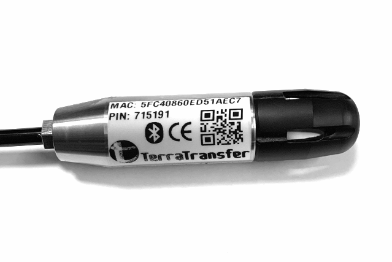
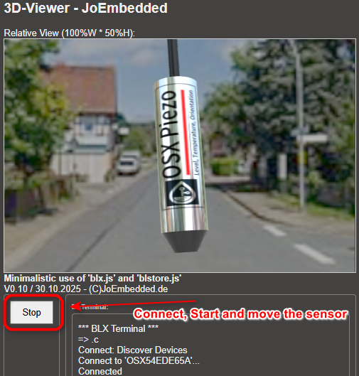

\noindent{\headingfont\fontsize{22}{25}\selectfont\color{GPInk}Produktprofil}\par
\vspace{4mm}

Die **Typen 310, 311 und 312** sind eng verwandte digitale Piezo-Druck- und Pegelsonden für Wasserstandsmessungen und dauerndes Eintauchen bis zum zulässigen Überdruck. Der Standardbereich von 0 bis 1 bar entspricht etwa 10 m Wassersäule. Neben dem Druck erfassen alle Varianten die Temperatur; Typ 311 ergänzt die Druckmessung um eine hochpräzise Temperaturmessung und Typ 312 zusätzlich um einen empfindlichen 3-Achsen-Lagesensor.

{height=102mm}

# Vorteile auf einen Blick

- Digitale Piezo-Drucksonde für Wasserstand und hydrostatische Pegelmessung
- Standardbereich 0 bis 1 bar, entsprechend etwa 10 m Wassersäule
- Druckgenauigkeit maximal +/- 0,15 % FS und typische Langzeitstabilität +/- 0,1 % FS
- Vierfache Überdruckfestigkeit bezogen auf den Messbereich
- Messwertausgabe als Druck oder als Wasserstand in Metern konfigurierbar
- Standardmäßig 10 m belüftetes Kabel für atmosphärische Kompensation
- Low-Voltage SDI-12 Version 1.3 und Bluetooth Low Energy für Service und Parametrierung
- Typ 311 und 312 mit Präzisionstemperatur; Typ 312 zusätzlich mit 3-Achsen-Lagesensor

\newpage

# Technische Daten

| Eigenschaft | Wert |
|---|---|
| Anwendung | Wasserstand, hydrostatischer Pegel und Druckmessung |
| Messprinzip | Digitaler Piezo-Druckaufnehmer |
| Standarddruckbereich | 0 bis 1 bar, entsprechend etwa 10 m Wassersäule |
| Druckgenauigkeit | Maximal +/- 0,15 % FS; Linearität, Hysterese und Wiederholbarkeit bei Raumtemperatur |
| Langzeitstabilität | Typisch +/- 0,1 % FS, maximal +/- 0,2 % FS; bei Bereichen unter 1,5 bar maximal +/- 3 mbar |
| Überdruckfestigkeit | Vierfacher Messbereich |
| Druckausgabe | Standardmäßig bar; konfigurierbar als mWS oder mH2O |
| Sensorgeometrie | Ca. 100 mm x 25 mm |
| Standardkabel | 10 m, belüftet zur atmosphärischen Kompensation |
| Kommunikationsschnittstellen | SDI-12 Version 1.3 und Bluetooth Low Energy |
| Versorgung | 3,6 bis 16 V DC |
| Messstrom | Unter 4 mA für etwa 300 ms bei Standard-Aufwärmzeit |
| Einschaltbereitschaft | Etwa 250 ms |
| Betriebstemperatur | -40 bis +85 °C |
| Empfohlene Mediumtemperatur | -10 bis +80 °C für beste Leistung |

# Varianten 310, 311 und 312

| Typ | Druck und Pegel | Temperatur | Lageerfassung |
|---|---|---|---|
| 310 | Piezo-Druckmessung, konfigurierbar als Wasserstand | Standardtemperatursensor, typisch +/- 2 °C | Keine |
| 311 | Wie Typ 310 | Präzisionstemperatur, +/- 0,1 °C von -20 bis +50 °C | Keine |
| 312 | Wie Typ 311 | Präzisionstemperatur, +/- 0,1 °C von -20 bis +50 °C | 3-Achsen-Lagesensor X, Y, Z |

Der Typ 312 ist die umfangreichste Ausführung der Baureihe. Neben Druck und Präzisionstemperatur liefert er die Schwerkraftkomponenten auf drei Achsen. Damit wird aus der Pegelsonde zugleich ein Sensor für die Überwachung von Einbaulage und Messstellensituation.

# Wasserpegel aus Druck ableiten

Die Sonden liefern den Druck intern in bar. Für Süß- oder Trinkwasser mit einer Salinität unter 0,1 % kann die Ausgabe auf Wasserstand umgerechnet werden; unter mitteleuropäischen Bedingungen entsprechen 1 bar etwa 10,197 m Wassersäule. Die Umrechnung ist abhängig von Wasserdichte, Salinität und geografischer Fallbeschleunigung und muss bei besonderen Medien oder hohen Genauigkeitsanforderungen projektspezifisch bewertet werden.

Relativ messende Ausführungen nutzen das belüftete Kapillarrohr im Kabel als atmosphärische Referenz. Der Druckwert entspricht damit unmittelbar dem Wasserdruck über Atmosphärendruck. Absolut messende Ausführungen benötigen für die Wasserstandsumrechnung eine barometrische Kompensation durch den Datenlogger oder ein geeignetes Referenzsystem.

\newpage

# Typ 312: Einbaulage und Manipulation erkennen

Der 3-Achsen-Lagesensor des Typ 312 misst die Schwerkraftkomponenten in X-, Y- und Z-Richtung in mg. In Ruhelage liegt die Vektorsumme der drei Komponenten typischerweise bei etwa $1{,}000\,\mathrm{mg}$; Änderungen der Komponenten zeigen eine Drehung oder Lageänderung der Sonde an. Z weist dabei in Richtung Boden.

{height=92mm}

Die Orientierungswerte unterstützen die Diagnose der Messstelle. Sie können beispielsweise anzeigen, dass die Sonde am Grund aufliegt, sich die Einbaulage verändert hat oder an der Messstelle eine Manipulation beziehungsweise mechanische Veränderung stattgefunden hat. Für eine belastbare Bewertung wird bei der Inbetriebnahme eine Referenzlage erfasst und spätere Messwerte werden damit verglichen; Erschütterungen, Kabelzug und wechselnde Einbaubedingungen sind dabei zu berücksichtigen.

# SDI-12-Messwerte und Integration

Mit `aM!` oder für Datenlogger CRC-gesichert mit `aMC!` startet der Sensor eine Basis-Messung von Druck und Temperatur. Der erweiterte Befehl `aM9!` beziehungsweise `aMC9!` stellt zusätzlich die Versorgungsspannung bereit und liefert bei Typ 312 auch die Lagewerte X, Y und Z. Die Werte werden anschließend mit `aD0!` bis `aD9!` aus dem internen Cache ausgelesen.

| Messwert | Standardausgabe |
|---|---|
| Index 0 | Druck, standardmäßig bar; optional mWS oder mH2O |
| Index 1 | Temperatur in °C |
| Index 2 bis 4 | Lage X, Y und Z in mg, nur Typ 312 |
| Index 5 | Versorgungsspannung in mV |

Bei internen Sensor- oder Kommunikationsfehlern geben die Sonden Fehlerwerte von `-1101` bis `-1106` aus. `-2000` kennzeichnet einen Fehler des Präzisionstemperatursensors bei Typ 311 oder Typ 312.

# Bluetooth, Kalibrierung und Projektierung

Die lokale Konfiguration und Diagnose erfolgen per BLE mit **BlueShell** oder dem browserbasierten **BLX Dashboard**. Die Bluetooth-Reichweite ist bei dieser Anwendung begrenzt und wird durch Wasser stark gedämpft; der Zugriff ist daher außerhalb des Wassers oder nahe der Wasseroberfläche vorzusehen.

Über Koeffizienten können Druck und Temperatur skaliert oder mit einem Offset versehen werden. Der Befehl `XZeroP` setzt den Drucknullpunkt und speichert die Einstellung direkt. Die Aufwärmzeit der Typen 310 und 311 ist konfigurierbar; ein Wert von `0` aktiviert den Dauerbetrieb mit höherem Energiebedarf. Bei Typ 312 kann zusätzlich die Übertragungsrate der Lagewerte eingestellt werden.

| Kabelader | Funktion |
|---|---|
| Gelb | GND |
| Weiß | Versorgung, 3,6 bis 16 V DC |
| Grün | SDI-12-Signal |

# Typische Einsatzbereiche

- Wasserstands- und Pegelmessung in Brunnen, Schächten, Gewässern und Behältern
- Langzeitmonitoring mit dauerhaft eingetauchten Drucksonden
- Pegelmessungen mit zusätzlicher Präzisionstemperatur über Typ 311 oder Typ 312
- Messstellen, bei denen die Einbaulage oder mögliche Lageänderungen überwacht werden sollen
- Diagnose von Aufliegen am Grund, verändertem Sondenwinkel oder möglichen Manipulationen mit Typ 312

# Konformität und weiterführende Informationen

Die PiezoPressure-Ausführung der Typen 310, 311 und 312 entspricht laut Originalunterlage den grundlegenden Anforderungen der Funkanlagenrichtlinie RED 2014/53/EU sowie der Richtlinien 2011/65/EU (RoHS 2) und (EU) 2015/863 (RoHS 3). Das vollständige Originaldatenblatt und die Firmware sind im [LTX-Firmware- und Dokumentenarchiv](https://joembedded.de/x3/ltx_firmware/index.php) verfügbar. Weiterführende technische Informationen zur LTX-Integration: [joembedded/ltx_docu](https://github.com/joembedded/ltx_docu).