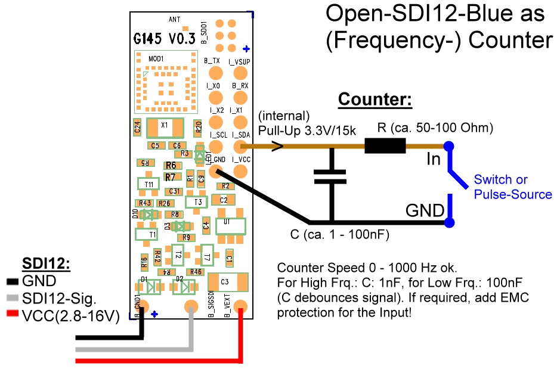

\noindent{\headingfont\fontsize{22}{25}\selectfont\color{GPInk}Produktprofil}\par
\vspace{4mm}

Der **Typ 330 Counter** ist kein Fertiggerät, sondern eine anpassbare Leiterplatte der Open-SDI12-Blue-Plattform. Sie erfasst langsame Impulse von Schaltern und Impulsgebern, etwa an Regenmessern oder Durchflusszählern, sowie Frequenzen bis 1.000 Hz. Der Zählerstand, die Frequenz und ein konfigurierbarer Delta-Wert werden über Low-Voltage SDI-12 bereitgestellt; Bluetooth Low Energy (BLE) unterstützt die Parametrierung, Inbetriebnahme und Diagnose.

{width=145mm}

# Vorteile auf einen Blick

- Universell anpassbare Leiterplatte statt festgelegtem Fertiggerät
- Impulszählung für Regenmesser, Durchflussmesser und weitere Kontakt- oder Pulssignale
- Frequenzmessung von 0 bis 1.000 Hz mit 0,1-Hz-Auflösung
- Absoluter Zählerstand bis 9.999.999, anschließend Überlauf auf 0
- Skalierung von Impulsen in physikalische Einheiten, beispielsweise Liter, Millimeter oder Kubikmeter
- Konfigurierbarer Delta-Wert für Durchfluss, Niederschlag oder Verbrauch je Zeitfenster
- Low-Voltage SDI-12 Version 1.3 und BLE für Integration und lokalen Service
- Schutzbeschaltung für Schaltkontakte und lange Leitungen projektierbar

\newpage

# Technische Daten

| Eigenschaft | Wert |
|---|---|
| Anwendung | Projektierbare Impulszählung und Frequenzmessung |
| Bauform | Open-SDI12-Blue-Leiterplatte, keine fertige Gehäuseeinheit |
| Messgrößen | Absoluter Zählerstand, Frequenz, Delta-Wert; optional Versorgungsspannung |
| Frequenzbereich | 0 bis 1.000 Hz |
| Frequenzauflösung | 0,1 Hz |
| Aktualisierung der Frequenz | Alle 8 s |
| Zählerbereich | 0 bis 9.999.999, danach Überlauf auf 0 |
| Kommunikationsschnittstellen | SDI-12 Version 1.3 und Bluetooth Low Energy |
| Versorgung | 2,8 bis 16 V DC |
| Dauerbetrieb | Erforderlich für Zähler- und Frequenzfunktion |
| Ruhestrom bei offenem Eingang | Wenige µA; BLE-Advertising im Mittel unter 15 µA bei 4 V |
| Strom bei geschlossenem Eingang | Etwa 220 µA durch internen Pull-up von ca. 15 kOhm |
| SDI-12-Kommunikation | Unter 5 mA für etwa 200 ms |
| Einschaltbereitschaft | Etwa 250 ms; Frequenzwert nach mindestens 8 s verfügbar |
| Betriebstemperatur | -40 bis +85 °C |

# Projektierbare Eingangs- und Schutzbeschaltung

Der Zähleingang besitzt einen internen Pull-up von etwa 15 kOhm nach 3,3 V. Bei geschlossenem Kontakt fließen dadurch etwa 220 µA. Für Schaltkontakte empfiehlt die Originalunterlage einen Serienwiderstand von etwa 50 bis 100 Ohm und einen externen Kondensator zur Entprellung. Für langsame Impulse ist ein größerer Kondensator geeignet; bei höheren Frequenzen wird eine kleinere Kapazität verwendet. Das Anschlussbild zeigt als Orientierungswerte etwa 1 nF für hohe Frequenzen und etwa 100 nF für niedrige Frequenzen.

Bei externen oder langen Leitungen ist eine zusätzliche EMV-Schutzbeschaltung, beispielsweise mit einer TVS-Diode, dringend zu prüfen. Die konkrete Beschaltung richtet sich nach Signalquelle, Impulsdauer, Leitungslänge, Umgebung und erforderlicher Frequenzbandbreite. So kann die Platine an robuste Feldanwendungen ebenso angepasst werden wie an schnelle Frequenzsignale.

# Zählen, Frequenz und Delta-Wert

Der Typ 330 berechnet die Frequenz fest im Acht-Sekunden-Rhythmus. Nach dem Einschalten muss daher mindestens acht Sekunden gewartet werden, bevor ein Frequenzwert verfügbar ist. Der absolute Zählerstand wird unabhängig davon fortlaufend erfasst und kann über Skalierungskoeffizienten in eine physikalische Einheit umgesetzt werden.

Der Delta-Wert bildet die skalierte Zählerdifferenz über ein frei konfigurierbares Zeitfenster. Bei einem Regenmesser mit zehn Impulsen pro Millimeter kann der Zähler beispielsweise mit dem Faktor 0,1 direkt Millimeter ausgeben. Ist das Delta-Zeitfenster auf 60 s eingestellt, liefert der Delta-Wert den Niederschlag der vergangenen Minute. Entsprechend lässt sich die Funktion für Durchfluss-, Mengen- oder Verbrauchswerte nutzen.

| Konfigurationswert | Funktion |
|---|---|
| K0 / K1 | Multiplikator und Offset für den Zählerstand |
| K2 / K3 | Multiplikator und Offset für die Frequenz |
| K4 | Zeitfenster des Delta-Werts in Sekunden; mindestens 8 s empfohlen |

\newpage

# SDI-12-Integration

Mit `aM!` oder CRC-gesichert mit `aMC!` startet der Datenlogger eine Messung und liest anschließend mit `aD0!` bis zu drei Werte aus: absoluten Zählerstand, Frequenz in Hertz und Delta-Wert. `aM1!` beziehungsweise `aMC1!` ergänzt die Messung um die Versorgungsspannung. Die Daten stehen nach Abschluss der SDI-12-Messung im internen Cache bereit.

| Befehl | Funktion |
|---|---|
| `aM!` / `aMC!` | Zählerstand, Frequenz und Delta-Wert erfassen |
| `aM1!` / `aMC1!` | Messwerte einschließlich Versorgungsspannung erfassen |
| `aD0!` | Werte der vorangehenden Messung auslesen |
| `aI!` | Leiterplatte identifizieren |
| `aAn!` | SDI-12-Adresse ändern |

Bei zu frühem Abruf eines Frequenzwerts meldet der Typ 330 den Fehlerwert `-101.0`; bei einem zu kurzen Delta-Zeitfenster den Fehlerwert `-102.0`. Die Wartezeit ergibt sich aus dem festen Frequenzintervall beziehungsweise dem eingestellten Delta-Zeitfenster.

# Bluetooth und Parametrierung

Über BLE lassen sich Zähler- und Frequenzskalierung, Offset sowie Delta-Zeitfenster mit **BlueShell** oder dem browserbasierten **BLX Dashboard** einstellen und dauerhaft speichern. Dies erlaubt eine projektspezifische Zuordnung der Rohimpulse zu Einheiten wie Millimeter Niederschlag, Liter, Kubikmeter oder einer anwendungsspezifischen Durchflussgröße.

Die Platine wird für die jeweilige Anwendung mit geeigneter Eingangs- und EMV-Beschaltung, Versorgung, Gehäuse und Anschlusskonzept kombiniert. Dadurch eignet sie sich sowohl als Baustein in einem kompakten Zählergehäuse als auch als Bestandteil kundenspezifischer Messsysteme.

# Typische Einsatzbereiche

- Kippwaagen-Regenmesser und Niederschlagsmessung
- Durchfluss- und Verbrauchszähler mit Impulsausgang
- Kontaktgeber, Schalter und langsame Ereigniszähler
- Drehzahl- und Frequenzmessung bis 1.000 Hz
- Angepasste OEM- und Sonderlösungen auf Basis der Open-SDI12-Blue-Platine

# Konformität und weiterführende Informationen

Die Frequency-/Pulse-Counter-Ausführung des Typ 330 entspricht laut Originalunterlage den grundlegenden Anforderungen der Funkanlagenrichtlinie RED 2014/53/EU sowie der Richtlinie 2011/65/EU (RoHS 2). Das vollständige Originaldatenblatt und die Firmware sind im [LTX-Firmware- und Dokumentenarchiv](https://joembedded.de/x3/ltx_firmware/index.php) verfügbar. Weiterführende technische Informationen zur LTX-Integration: [joembedded/ltx_docu](https://github.com/joembedded/ltx_docu).