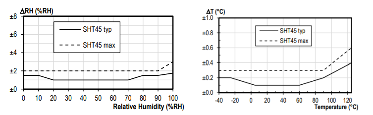
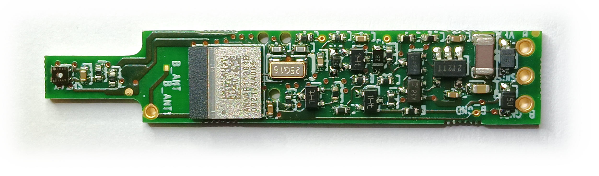

\noindent{\headingfont\fontsize{22}{25}\selectfont\color{GPInk}Produktprofil}\par
\vspace{4mm}

Der **Typ 341 SHT4x** ist ein Präzisionssensor für relative Feuchte und Temperatur auf Basis der SHT4x-Familie von Sensirion. Er kombiniert die Low-Voltage-Ausführung des SDI-12-Busses nach Version 1.3 mit Bluetooth Low Energy (BLE) für Inbetriebnahme, Diagnose und Parametrierung. Die Ausführung mit **SHT45** besitzt eine interne sowie eine äußere PTFE-Schutzmembran für das Sensorelement.

{width=125mm}

# Vorteile auf einen Blick

- Präzise Messung von relativer Feuchte und Temperatur mit SHT4x-Sensorelement
- SHT45: typisch +/- 1,0 % rF von 20 bis 70 % rF und +/- 0,1 °C von 5 bis 60 °C
- Low-Voltage SDI-12 Version 1.3 ab 3,6 V Versorgungsspannung
- Bluetooth Low Energy für lokale Konfiguration, Diagnose und Messwertabfrage
- Zusätzliche Ausgabe der Versorgungsspannung mit dem SDI-12-Befehl `aM1!`
- Kundenspezifische Zweipunktkalibrierung über anwenderseitige Koeffizienten möglich
- Schlanke Sensorplatine mit etwa 9,5 mm x 45 mm
- Energieeffizienter Betrieb für batteriebetriebene Messstellen

\newpage

# Technische Daten

| Eigenschaft | Wert |
|---|---|
| Anwendung | Präzisionsmessung von relativer Feuchte und Temperatur |
| Sensorelement | SHT4x; Ausführung SHT45 mit interner und äußerer PTFE-Schutzmembran |
| Messgrößen | Relative Feuchte, Temperatur; optional Versorgungsspannung |
| Genauigkeit SHT45, relative Feuchte | Typisch +/- 1,0 % rF bei 20 bis 70 % rF |
| Genauigkeit SHT45, Temperatur | Typisch +/- 0,1 °C bei 5 bis 60 °C |
| Kommunikationsschnittstellen | SDI-12 Version 1.3 und Bluetooth Low Energy |
| Versorgung mit SDI-12 | 3,6 bis 16 V DC |
| Versorgung nur mit BLE | 2,8 bis 3,6 V DC |
| Messdauer | Unter 1 s |
| Messstrom | Unter 5 mA für etwa 500 ms |
| Bereitschaft mit BLE-Advertising | Im Mittel unter 15 µA bei 4 V |
| Aktive BLE-Verbindung | Im Mittel unter 50 µA bei 4 V |
| Einschaltbereitschaft | Etwa 250 ms |
| Betriebstemperatur | -40 bis +85 °C |
| Sensorplatine | Ca. 9,5 mm x 45 mm |
| Sensorbauform | Ca. 12 mm x 70 mm, ABS, mit ca. 45 mm Kabelknickschutz |

Die nachstehende Kennlinie aus der Originalunterlage zeigt die typische sowie die maximale Abweichung der SHT45-Ausführung in Abhängigkeit von relativer Feuchte und Temperatur.

{width=145mm}

# Sensor und Schnittstellen

Der Typ 341 stellt die Messwerte über die Standardbefehle des SDI-12-Protokolls bereit. Nach `aM!` oder `aMC!` stehen relative Feuchte und Temperatur im internen Cache zur Abfrage mit `aD0!` bereit. `aM1!` beziehungsweise `aMC1!` ergänzt die Ausgabe um die Versorgungsspannung. Die Messung ist in weniger als einer Sekunde abgeschlossen.

Die Konfiguration der SDI-12-Schnittstelle sowie Diagnose und lokale Messwertabfrage erfolgen über BLE mit **BlueShell** oder dem browserbasierten **BLX Dashboard**. Die werkseitig kalibrierten SHT4x-Sensoren können bei Bedarf zusätzlich über getrennte Multiplikations- und Offsetkoeffizienten für Feuchte und Temperatur zweipunktkalibriert werden.

| Kabelader | Funktion |
|---|---|
| Schwarz | GND |
| Braun | Versorgung: 3,6 bis 16 V mit SDI-12; 2,8 bis 3,6 V nur mit BLE |
| Weiß | SDI-12-Signal |

# Kompakte Elektronik

Die für den Typ 341 angepasste Open-SDI12-Blue-Platine verbindet das SHT4x-Sensorelement, die Low-Voltage-SDI-12-Schnittstelle und BLE auf engem Bauraum. Der Sensor ist gegen übliche Transienten und Spannungsspitzen geschützt. Falschpolung oder fehlerhafte Anschlüsse können das Gerät jedoch beschädigen.

{width=150mm}

# Typische Einsatzbereiche

- Meteorologische und klimatische Messstellen
- Umweltmonitoring mit batteriebetriebenen SDI-12-Datenloggern
- Feuchte- und Temperaturüberwachung in Schutzgehäusen, Schächten und Anlagen
- Präzisionsmessungen mit lokaler BLE-Inbetriebnahme und -Diagnose

# Konformität und Hinweise

Die SHT4x-Ausführung des Typ 341 entspricht laut Originalunterlage den grundlegenden Anforderungen der Funkanlagenrichtlinie RED 2014/53/EU sowie der Richtlinien 2011/65/EU (RoHS 2) und (EU) 2015/863 (RoHS 3). Die vollständige Auswahl an Open-SDI12-Blue-Sensoren, Firmware und Zusatzdateien ist im [LTX-Firmware- und Dokumentenarchiv](https://joembedded.de/x3/ltx_firmware/index.php) verfügbar. Weiterführende technische Informationen zur LTX-Integration: [joembedded/ltx_docu](https://github.com/joembedded/ltx_docu).