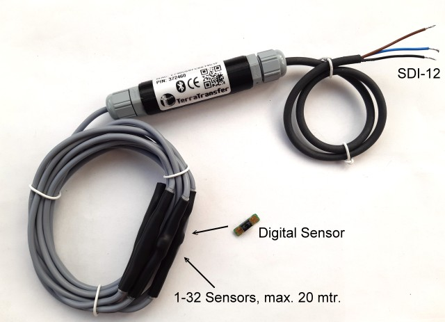

\noindent{\headingfont\fontsize{22}{25}\selectfont\color{GPInk}Produktprofil}\par
\vspace{4mm}

Der **Typ 400 2Wire-Light** ist eine preisgünstige, digitale Temperaturmesskette für nicht eingetauchte Anwendungen. Das SDI-12- und Bluetooth-LE-Interface erfasst bis zu 32 Temperaturstellen über eine gemeinsame Zweidrahtleitung und stellt sie blockweise für einen Datenlogger bereit. Die Light-Version eignet sich für Anwendungen mit moderaten Genauigkeitsanforderungen, begrenzter Kettenlänge und kompakter Sensoranzahl.

{width=125mm}

# Vorteile auf einen Blick

- Bis zu **32** digitale Temperaturstellen an einer Zweidrahtleitung
- Kettenlänge bis **20 m**
- Digitale Temperaturwerte mit 0,1 °C Auflösung
- Low-Voltage SDI-12 Version 1.3 und Bluetooth Low Energy für Service und Parametrierung
- Messung typischerweise in 1 bis 3 s; Ausgabe in Gruppen von bis zu neun Werten
- Preisgünstige Lösung für nicht eingetauchte Temperaturmessstellen
- Geringer Ruhestrom, jedoch dauerhafte Versorgung für die Messkette erforderlich
- Lokale Diagnose, Sensor-Scan und Positionszuordnung mit BlueShell oder BLX Dashboard

\newpage

# Technische Daten

| Eigenschaft | Wert |
|---|---|
| Anwendung | Digitale Temperaturmesskette für nicht eingetauchte Anwendungen |
| Anzahl Temperaturstellen | Bis zu 32 |
| Kettenlänge | Maximal 20 m |
| Sensorgenauigkeit | +/- 0,5 °C von -10 bis +85 °C |
| Sensor-Betriebsbereich | -40 bis +85 °C |
| Auflösung | 0,1 °C |
| Messwertausgabe | -55,000 bis +125,000 °C als SDI-12-Wert |
| Kommunikationsschnittstellen | SDI-12 Version 1.3 und Bluetooth Low Energy |
| Messzeit | Typisch 1 bis 3 s |
| SDI-12-Ausgabe | Bis zu neun Werte je Messgruppe; mehrere `M`-/`D`-Befehle für längere Ketten |
| Versorgung, empfohlen | 3,6 bis 16 V DC |
| Mindestversorgung | 3,3 V DC |
| Einschaltbereitschaft | Etwa 250 ms |
| Bereitschaft mit BLE-Advertising | Im Mittel unter 15 µA bei 4 V |
| Aktive BLE-Verbindung | Im Mittel unter 50 µA bei 4 V |
| Schutz gegen Wasser | Nicht wasserdicht; nicht für eingetauchte Anwendungen vorgesehen |

# Light-Version im Vergleich zur Präzisionskette Typ 410

Der Typ 400 ist bewusst als wirtschaftliche **Light-Version** einer digitalen Temperaturmesskette ausgelegt. Der verwendete Temperatursensor erreicht im spezifizierten Bereich eine Genauigkeit von +/- 0,5 °C und ist damit weniger genau als die T-Nodes der Präzisionsmesskette Typ 410. Ebenso sind Sensoranzahl und Leitungslänge deutlich begrenzt: Der Typ 400 unterstützt bis zu 32 Sensoren auf bis zu 20 m, während Typ 410 standardmäßig bis zu 50 und optional bis zu 300 Sensoren sowie insgesamt bis zu 500 m Leitung unterstützt.

| Kriterium | Typ 400 2Wire-Light | Typ 410 2Wire-Präzisionskette |
|---|---|---|
| Einsatzschwerpunkt | Preisgünstige, nicht eingetauchte Temperaturmessung | Hochpräzise Temperatur- und Druckmessketten |
| Sensoranzahl | Bis zu 32 | Bis zu 50, optional bis zu 300 |
| Gesamtkabellänge | Bis zu 20 m | Bis zu 500 m |
| Sensorgenauigkeit | +/- 0,5 °C von -10 bis +85 °C | Abhängig von eingesetztem T-Node und Ausführung |
| Eintauchen | Nicht vorgesehen | Eingetauchte Sensoren bis zum zulässigen Überdruck |

Die Light-Version ist damit besonders sinnvoll, wenn eine kompakte, kostensensitive Messkette in einer trockenen oder gegen Feuchtigkeit geschützten Umgebung benötigt wird. Für lange Ketten, höhere Kanalzahlen, eingetauchte Sensoren oder Präzisionsanforderungen ist Typ 410 die geeignete Produktfamilie.

# SDI-12-Datenmodell und Integration

Eine Messung wird mit `aM!` oder CRC-gesichert mit `aMC!` gestartet. Der Konverter stellt je Messgruppe bis zu neun Temperaturwerte bereit. Bei mehr als neun Sensoren werden die folgenden Gruppen mit `aM1!` bis `aM3!` beziehungsweise `aMC1!` bis `aMC3!` abgerufen; die zugehörigen Datenantworten erfolgen mit `aD0!` bis `aD9!`. `aM9!` beziehungsweise `aMC9!` liefert die Versorgungsspannung.

| Befehl | Funktion |
|---|---|
| `aM!` / `aMC!` | Messung der ersten Temperaturgruppe starten |
| `aM1!` bis `aM3!` | Weitere Temperaturgruppen bereitstellen |
| `aD0!` bis `aD9!` | Werte der zuvor gewählten Messgruppe auslesen |
| `aM9!` / `aMC9!` | Versorgungsspannung auslesen |
| `aI!` | Interface identifizieren |
| `aAn!` | SDI-12-Adresse ändern |

Die erste ausgegebene Temperatur gehört zum Sensor am Ende der Kette. Die Sensorpositionen können bei der Inbetriebnahme per BLE gescannt, sortiert und dauerhaft gespeichert werden. Damit lässt sich die Reihenfolge der SDI-12-Werte der realen Einbausituation zuordnen.

# Bluetooth, Inbetriebnahme und Diagnose

Bluetooth Low Energy ermöglicht den lokalen Zugriff mit **BlueShell** oder dem browserbasierten **BLX Dashboard**. Damit lassen sich angeschlossene Sensoren scannen, Positionen prüfen, Messwerte kontrollieren und die SDI-12-Parameter konfigurieren. Die Messkette wird betriebsbereit ausgeliefert; ein erneuter Scan ist vor allem nach Umbauten oder nach einem Werksreset erforderlich.

Bei Sensor- oder Leitungsfehlern liefert der Typ 400 eindeutige SDI-12-Fehlerwerte: `-98.000` für einen internen Sensorfehler, `-99.000` bei Kommunikationsfehlern, `-101.000` bei fehlendem Sensor beziehungsweise Kabelunterbrechung und `-102.000` bei einem Kurzschluss der Sensorleitung.

# Anschluss und Projektierung

| Kabelader | Funktion |
|---|---|
| Schwarz | GND |
| Braun | Versorgung, 3,6 bis 16 V DC empfohlen |
| Blau oder Weiß | SDI-12-Signal |

Für die digitalen Sensoren wird bei Standard-M8-Anschluss Braun für das Signal sowie Schwarz und optional Blau für GND verwendet. Die Kette benötigt eine dauerhafte Versorgung, damit die Sensoren fortlaufend abgefragt werden können. Sensoranzahl, Leitungslänge, Anschlussqualität, Feuchteschutz und Messintervall sind bei der Projektierung zu prüfen. Die Sensoren und das Interface sind nicht für den dauerhaften Kontakt mit Wasser vorgesehen.

# Typische Einsatzbereiche

- Temperaturüberwachung in Gebäuden, technischen Anlagen und Schutzgehäusen
- Mehrpunktmessungen an kurzen Rohrleitungen, Behältern und Maschinen
- Kostensensitive Temperaturmessketten mit bis zu 32 Messstellen
- Messstellen mit lokaler BLE-Inbetriebnahme und Diagnose
- Nicht eingetauchte Anwendungen mit SDI-12-Datenloggern

# Konformität und weiterführende Informationen

Die 2Wire-Light-Ausführung des Typ 400 entspricht laut Originalunterlage den grundlegenden Anforderungen der Funkanlagenrichtlinie RED 2014/53/EU sowie der Richtlinien 2011/65/EU (RoHS 2) und (EU) 2015/863 (RoHS 3). Das vollständige Originaldatenblatt und die Firmware sind im [LTX-Firmware- und Dokumentenarchiv](https://joembedded.de/x3/ltx_firmware/index.php) verfügbar. Weiterführende technische Informationen zur LTX-Integration: [joembedded/ltx_docu](https://github.com/joembedded/ltx_docu).