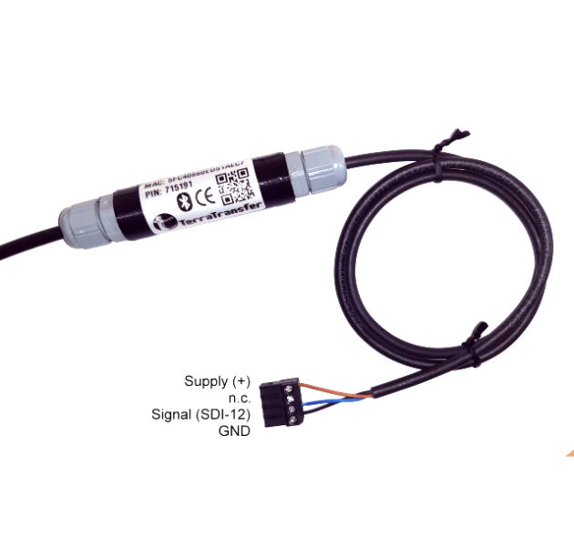
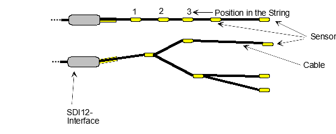

\noindent{\headingfont\fontsize{22}{25}\selectfont\color{GPInk}Produktprofil}\par
\vspace{4mm}

Der **Typ 410 2Wire** ist ein digitaler Konverter für hochpräzise Temperatur- und Druckmessketten. Er bindet bis zu 50 Sensoren standardmäßig, optional bis zu 300 Sensoren, über eine gemeinsame Zweidrahtleitung an einen SDI-12-Datenlogger an. Die Open-SDI12-Blue-Plattform ergänzt die Low-Voltage-SDI-12-Schnittstelle nach Version 1.3 um Bluetooth Low Energy (BLE) für Inbetriebnahme, Diagnose und Konfiguration vor Ort.

{height=103mm}

# Vorteile auf einen Blick

- Bis zu **50** digitale Sensoren pro Kette, optional bis zu **300** Sensoren
- Kombinierbar mit Präzisionstemperatursensoren, Drucksensoren und gemischten Ketten
- Linien- oder Sterntopologie mit einer Gesamtkabellänge bis 500 m
- Keine Genauigkeitseinbuße durch die Leitung innerhalb der vorgesehenen Topologie und Länge
- Eingetauchte Sensoren für dauerhaften Betrieb bis zum zulässigen Überdruck, Interface in Schutzart IP54
- Low-Voltage SDI-12 Version 1.3 und Bluetooth Low Energy für Service und Parametrierung
- Messung typischerweise in 1 bis 3 s; Ausgabe in Gruppen von bis zu neun Werten
- Energieeffizienter Betrieb für batteriebetriebene Langzeitmessstellen

\newpage

# Technische Daten

| Eigenschaft | Wert |
|---|---|
| Anwendung | Digitale Präzisions-Temperatur- und Druckmessketten |
| Sensortypen | TxNODE und Varianten, LevelLD-Drucksensoren oder Kombinationen |
| Anzahl Sensoren | Bis zu 50, optional bis zu 300 |
| Topologie | Linie oder Stern; Kombinationen entsprechend der Projektierung |
| Gesamtkabellänge | Bis zu 500 m |
| Kommunikationsschnittstellen | SDI-12 Version 1.3 und Bluetooth Low Energy |
| Messzeit | Typisch 1 bis 3 s |
| SDI-12-Ausgabe | Bis zu neun Werte je Messgruppe; mehrere `M`-/`D`-Befehle für längere Ketten |
| Messwertbereich Temperatur | -55,000 bis +125,000 °C als SDI-12-Ausgabe |
| Versorgung, empfohlen | 3,6 bis 16 V DC |
| Versorgung, optional | 2,8 bis 16 V DC, ausführungsspezifisch |
| Einschaltbereitschaft | Etwa 250 ms |
| Betriebstemperatur | -40 bis +85 °C |
| Schutzart Sensoren | IP68 für dauerndes Eintauchen bis zum zulässigen Überdruck |
| Schutzart Interface | IP54 |
| Standard-Druckbereich | Bis 5 bar, entsprechend etwa 50 m Wassersäule; höhere Bereiche optional |

# Flexible Topologie für Messketten

Temperatur- und Drucksensoren können als durchgehende Kette oder in einer Sterntopologie angeschlossen werden. Der Typ 410 verwaltet die Sensoren digital; dadurch beeinflusst die Leitungslänge innerhalb der zulässigen Gesamtlänge von 500 m die Messgenauigkeit nicht. Das Konzept eignet sich für verteilte Messstellen, bei denen viele Positionen mit einer einzigen SDI-12-Anbindung erfasst werden sollen.

{width=150mm}

Die Reihenfolge der ausgegebenen Werte richtet sich nach den im Konverter gespeicherten Sensorpositionen. Sie lässt sich während der Inbetriebnahme über BLE erfassen, prüfen und bei Bedarf anpassen. So kann die Kanalreihenfolge auch bei einer räumlich verzweigten Kette eindeutig der Messstelle zugeordnet werden.

\newpage

# SDI-12-Datenmodell und Integration

Eine Messung wird mit `aM!` oder CRC-gesichert mit `aMC!` gestartet. Der Konverter liefert pro Messgruppe bis zu neun Werte. Bei mehr als neun Sensoren werden weitere Gruppen mit `aM1!` bis `aM9!` beziehungsweise `aMC1!` bis `aMC9!` abgerufen; die zugehörigen Datenantworten erfolgen mit `aD0!` bis `aD9!`. Das erlaubt die Einbindung großer Sensorketten, ohne die Begrenzung der SDI-12-Antwortlänge zu überschreiten.

| Befehl | Funktion |
|---|---|
| `aM!` / `aMC!` | Messung der ersten Sensorgruppe starten |
| `aM1!` bis `aM9!` | Weitere Sensorgruppen bereitstellen |
| `aD0!` bis `aD9!` | Werte der zuvor gewählten Messgruppe auslesen |
| `aM9!` / `aMC9!` | Versorgungsspannung auslesen |
| `aI!` | Konverter identifizieren |
| `aAn!` | SDI-12-Adresse ändern |

Die Messung einer Gruppe benötigt typischerweise 1 bis 3 s. Folgemessgruppen greifen anschließend auf die erfassten Werte zu, ohne eine erneute Messwartezeit auszulösen. Ein Datenlogger kann damit auch lange Ketten mit planbarer Messdauer verarbeiten.

# Bluetooth, Inbetriebnahme und Diagnose

Bluetooth Low Energy ermöglicht den lokalen Zugriff mit **BlueShell** oder dem browserbasierten **BLX Dashboard**. Darüber lassen sich die angeschlossenen Sensoren scannen, ihre Positionen prüfen, die Sortierrichtung festlegen und die Konfiguration dauerhaft speichern. Diese Arbeitsschritte sind besonders bei mehrteiligen Messketten sinnvoll, da sie die spätere Zuordnung der SDI-12-Kanäle zur realen Einbauposition absichern.

Bei bestehenden oder besonders langen Ketten kann die Busgeschwindigkeit für den Scan angepasst werden. Dies ist nur erforderlich, wenn zusätzliche Leitungskapazität, Feuchtigkeit oder Schutzbeschaltungen die Signalform beeinflussen. Die Standardgeschwindigkeit ist für die normale Projektierung vorgesehen; eine Anpassung wird erst nach auftretenden Kommunikationsfehlern empfohlen.

# Energiebedarf und Projektierung

Der Konverter benötigt während der Messung etwa 1,2 mA zuzüglich des Stroms der angeschlossenen Sensoren. Ein beispielhafter T-Node-HD benötigt etwa 1,1 mA für 1,7 s. Daraus ergeben sich für eine Messung ungefähr 1,08 µAh mit einem Sensor oder 6,7 µAh mit zehn Sensoren. Bei einer Messung pro Stunde entsprechen diese Beispielwerte etwa 10 mAh beziehungsweise 60 mAh pro Jahr.

| Anschluss | Funktion |
|---|---|
| Schwarz | GND |
| Braun | Versorgung: 3,6 bis 16 V DC; optional 2,8 bis 16 V DC |
| Blau oder Weiß | SDI-12-Signal |

Für die digitalen Sensoren wird bei Standard-M8-Anschluss Braun für das Signal sowie Schwarz und optional Blau für GND verwendet. Die tatsächliche Energieauslegung hängt von Sensoranzahl, Sensortyp, Messintervall, Verkabelung, Versorgung und Umgebungstemperatur ab und muss für jede Messstelle projektspezifisch geprüft werden.

\newpage

# Typische Einsatzbereiche

- Temperaturprofile in Gewässern, Bauwerken, Deponien und geotechnischen Messstellen
- Grundwasser-, Pegel- und Druckmessungen mit mehreren Tiefenstufen
- Kombinierte Temperatur- und Druckketten in Schächten, Rohren und Bohrungen
- Langzeitmonitoring mit hoher Kanalzahl und einem einzigen SDI-12-Anschluss
- Batteriebetriebene Messstellen mit BLE-gestützter Inbetriebnahme und Diagnose

# Konformität und weiterführende Informationen

Die 2Wire-Ausführung des Typ 410 entspricht laut Originalunterlage den grundlegenden Anforderungen der Funkanlagenrichtlinie RED 2014/53/EU sowie der Richtlinien 2011/65/EU (RoHS 2) und (EU) 2015/863 (RoHS 3). Das vollständige Originaldatenblatt und die Firmware sind im [LTX-Firmware- und Dokumentenarchiv](https://joembedded.de/x3/ltx_firmware/index.php) verfügbar. Weiterführende technische Informationen zur LTX-Integration: [joembedded/ltx_docu](https://github.com/joembedded/ltx_docu).