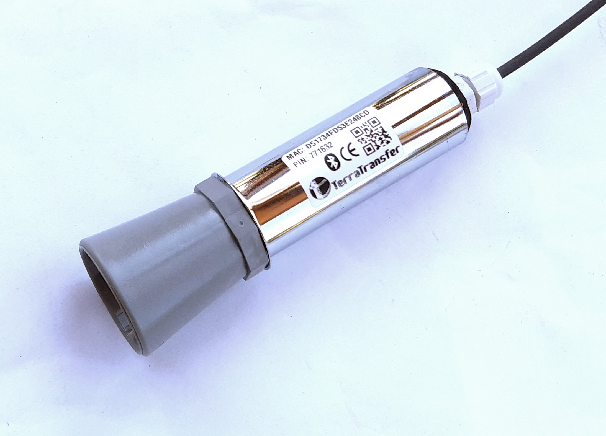

\noindent{\headingfont\fontsize{22}{25}\selectfont\color{GPInk}Produktprofil}\par
\vspace{4mm}

Der **Typ 430 Distance and Snow Depth** ist ein ultraschallbasierter Sensor für einfache berührungslose Distanzmessungen. Seine wesentliche Stärke liegt in der Schneehöhenerfassung: Die Varianten MB-002 und MB-003 kombinieren einen größeren Schallwandler mit einer für Schnee geeigneten Auswertung. Der Typ 430 kommuniziert über Low-Voltage SDI-12 nach Version 1.3 und Bluetooth Low Energy (BLE) für Inbetriebnahme, Diagnose und Konfiguration.

{width=125mm}

# Vorteile auf einen Blick

- Ultraschallbasierte, berührungslose Distanzmessung im Standardbereich von 0,5 bis 5 m
- Besonders geeignet für Schneehöhenmessungen mit den Varianten MB-002 und MB-003
- Auflösung 1 mm, typische Genauigkeit +/- 2 mm im dokumentierten Standardbereich
- Low-Power-Varianten für batteriebetriebene Messstellen
- MB-003 mit kontinuierlichem Vereisungs- und Kondensationsschutz durch Selbstreinigung
- Messwertausgabe als Distanz; per Skalierung auch als Pegel oder Schneehöhe konfigurierbar
- SDI-12 Version 1.3 und Bluetooth Low Energy für Logger-Integration und lokalen Service
- Sensorbauteil IP67 laut Originalunterlage

\newpage

# Technische Daten

| Eigenschaft | Wert |
|---|---|
| Messprinzip | Ultraschall |
| Messgröße | Distanz; per Skalierung und Offset auch Pegel oder Schneehöhe |
| Standardmessbereich | 0,5 bis 5 m |
| Auflösung | 1 mm |
| Typische Genauigkeit | +/- 2 mm |
| Messzeit | Typisch 1 bis 5 s, ausführung- und aufwärmzeitabhängig |
| Kommunikationsschnittstellen | SDI-12 Version 1.3 und Bluetooth Low Energy |
| SDI-12-Ausgabe | Distanz in mm; optional Versorgungsspannung |
| Sensor-Betriebstemperatur | -10 bis +65 °C |
| Betriebstemperatur Interface | -40 bis +65 °C |
| Schutzart Sensorbauteil | IP67 laut Originalunterlage |
| Einschaltbereitschaft Interface | Etwa 250 ms; Sensor-Aufwärmzeit nicht enthalten |

# Varianten für Abstand und Schnee

| Variante | Anwendung und Sensor | Versorgung | Energieprofil |
|---|---|---|---|
| MB-001 | Einfache Low-Power-Distanzmessung; standardmäßig MaxBotix MB7384 | 3,6 bis 16 V | Etwa 20 mA während der Messung für ca. 1 bis 5 s |
| MB-002 | Low-Power-Schneehöhe mit größerem Schallwandler; standardmäßig MaxBotix MB7374 | 3,6 bis 16 V | Bedarfsgerecht geschaltet; für Batteriebetrieb geeignet |
| MB-003 | Präzisions-Schneehöhe mit größerem Schallwandler; standardmäßig MaxBotix MB7574 | 7,5 bis 16 V | Dauerhaft etwa 30 bis 50 mA für Selbstreinigung und Vereisungsschutz |

Die Varianten MB-001 und MB-002 schalten das Ultraschallelement für die Messung ein und eignen sich deshalb für energieeffiziente, batteriegestützte Messstellen. MB-003 bleibt dagegen dauerhaft versorgt: Die regelmäßige Erwärmung der Wandlerfläche verhindert beziehungsweise reduziert Kondensation und Vereisung und verbessert die Erfassung weicher Schneeoberflächen. Der kontinuierliche Energiebedarf ist bei der Auslegung, beispielsweise mit einer kleinen Solarversorgung, zu berücksichtigen.

# Schneehöhenmessung mit Ultraschall

Schnee reflektiert Ultraschall anders als eine harte, glatte Oberfläche. Besonders nasser, lockerer oder vereister Schnee stellt höhere Anforderungen an den Sensor und die freie Wandlerfläche. Die Varianten MB-002 und MB-003 besitzen deshalb einen größeren Schallwandler. MB-003 ergänzt dies um eine selbstreinigende Betriebsweise: Der Wandler wird im Betrieb leicht erwärmt, sodass Feuchtigkeit und Kondensation von der Wandleroberfläche entfernt beziehungsweise ihr Aufbau vermindert wird.

Die Selbstreinigungsfunktion ist für Feuchtigkeit und Kondensation ausgelegt, nicht für Staub oder feste Ablagerungen. Für ihren wirksamen Betrieb muss MB-003 dauerhaft versorgt bleiben und weiter messen. Montageposition, freies Schallfeld, Abstand zur erwarteten Schneedecke und Energieversorgung sind bei der Projektierung gemeinsam zu betrachten.

# Abgrenzung zu präzisen Radar-Distanzsensoren

Der Typ 430 ist ein einfacher Ultraschall-Distanzsensor und besonders für Schneehöhenmessungen eine bewährte Wahl. Für präzise andere Distanzmessungen, etwa Flüssigkeitspegel oder Abstände zu geeigneten elektromagnetisch reflektierenden Grenzflächen, sind die 60-GHz-Radarsensoren **Typ 470** und **Typ 471** in der Regel besser geeignet. Diese erfassen Distanzen berührungslos mit typischer Genauigkeit von <= 2 mm und einer Auflösung von 1 mm; sie sind auf Pegel-, Füllstands- und präzise Distanzaufgaben ausgerichtet.

Bei Oberflächen wie Mauerwerk, Holz oder anderen festen Materialien hängt die Radareignung von Geometrie, Material, Feuchte, Einbau und vorhandenen Nebenreflexionen ab. Der konkrete Aufbau sollte daher projektspezifisch erprobt werden. Die Radarvarianten bieten zusätzlich Signalstärken sowie Raw-Scan- und Live-Plot-Funktionen für die Ausrichtung, während der Typ 430 eine einfache Distanzmessung mit Fokus auf Schnee bereitstellt.

| Anforderung | Typ 430 Ultraschall | Typ 470 / 471 60-GHz-Radar |
|---|---|---|
| Hauptanwendung | Einfache Distanz- und Schneehöhenmessung | Präzise Distanz-, Pegel- und Füllstandsmessung |
| Messprinzip | Ultraschall | 60-GHz-Radar |
| Standardbereich | 0,5 bis 5 m | Typisch ab 0,10 m beziehungsweise 0,15 m bis 12 m |
| Schneebetrieb | MB-002 und MB-003 speziell ausgelegt | Projektabhängig; nicht der Schwerpunkt dieses Datenblatts |
| Kondensationsschutz | MB-003 mit Selbstreinigung | Abhängig von Sensor- und Gehäuseausführung |
| Einrichtungsunterstützung | BLE-Diagnose | BLE, Signalstärke, Raw-Scan und Live-Plot |

# SDI-12, Skalierung und Bluetooth

Mit `aM!` oder CRC-gesichert mit `aMC!` startet der Datenlogger eine Messung. `aD0!` liefert anschließend die Distanz in Millimetern. `aM1!` beziehungsweise `aMC1!` ergänzt die Messung um die Versorgungsspannung. Eine Messung benötigt, abhängig von Variante und konfigurierter Aufwärmzeit, typischerweise 1 bis 5 s.

| Befehl | Funktion |
|---|---|
| `aM!` / `aMC!` | Distanzmessung starten |
| `aM1!` / `aMC1!` | Distanz und Versorgungsspannung erfassen |
| `aD0!` | Werte der vorangehenden Messung auslesen |
| `aI!` | Sensor identifizieren |
| `aAn!` | SDI-12-Adresse ändern |

Über die Koeffizienten K0 und K1 kann der Messwert skaliert und verschoben werden. Damit lässt sich die Distanz beispielsweise in Zentimeter ausgeben oder bei bekannter Einbauhöhe als Pegelwert umrechnen. Die BLE-Schnittstelle ermöglicht den Zugriff mit **BlueShell** oder dem browserbasierten **BLX Dashboard** für Inbetriebnahme, Diagnose, Parametrierung und Firmware-Updates.

\newpage

# Anschluss und Projektierung

| Kabelader | Funktion |
|---|---|
| Schwarz | GND |
| Braun | Versorgung: 3,6 bis 16 V für MB-001/-002; 7,5 bis 16 V für MB-003 |
| Blau | SDI-12-Signal |

Die Sensoraufwärmzeit ist projektierbar. Bei MB-001 und MB-002 lässt sich das Element bedarfsgerecht einschalten; bei MB-003 ist der Dauerbetrieb Bestandteil des Vereisungs- und Kondensationsschutzes. Bei internen Sensor- oder Verbindungsfehlern meldet der Typ 430 die Fehlerwerte `-999` oder `-998`.

# Typische Einsatzbereiche

- Schneehöhenmessung an meteorologischen und hydrologischen Messstellen
- Batteriebetriebene Schneemessungen mit MB-002
- Schnee- und Außenanwendungen mit erhöhtem Bedarf an Kondensationsschutz mit MB-003
- Einfache berührungslose Abstandsmessung in einem Bereich von 0,5 bis 5 m
- SDI-12-Messstellen mit lokaler BLE-Inbetriebnahme und Diagnose

# Konformität und weiterführende Informationen

Die Distance-and-Snow-Depth-Ausführung des Typ 430 entspricht laut Originalunterlage den grundlegenden Anforderungen der Funkanlagenrichtlinie RED 2014/53/EU sowie der Richtlinien 2011/65/EU (RoHS 2) und (EU) 2015/863 (RoHS 3). Das vollständige Originaldatenblatt ist im [LTX-Firmware- und Dokumentenarchiv](https://joembedded.de/x3/ltx_firmware/index.php) verfügbar. Weiterführende technische Informationen zur LTX-Integration: [joembedded/ltx_docu](https://github.com/joembedded/ltx_docu).