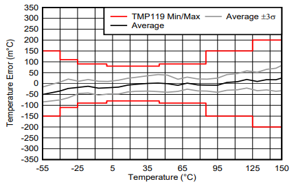
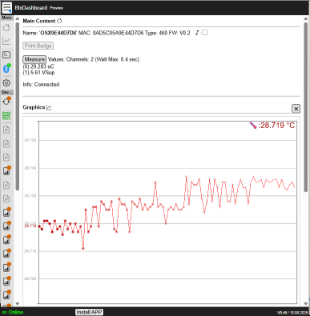

\noindent{\headingfont\fontsize{22}{25}\selectfont\color{GPInk}Produktprofil}\par
\vspace{4mm}

Der **Typ 460 High Precision Temperature** ist ein hochgenauer digitaler Temperatursensor auf Basis des TMP119. Er verbindet die Low-Voltage-Ausführung des SDI-12-Busses nach Version 1.3 mit Bluetooth Low Energy (BLE) für Inbetriebnahme, Parametrierung und Diagnose. Die Temperatur steht in weniger als einer Sekunde bereit; zusätzlich können Versorgungsspannung und ein Rohwert für Servicezwecke ausgegeben werden.

{width=125mm}

# Vorteile auf einen Blick

- Hochgenaue digitale Temperaturmessung mit TMP119-Sensorelement
- Sensorgenauigkeit je nach Ausführung bis +/- 0,08 °C
- Low-Voltage SDI-12 Version 1.3 für die Logger-Integration
- Bluetooth Low Energy für Konfiguration, Diagnose und lokalen Messwertzugriff
- Temperaturmessung in weniger als einer Sekunde
- Ausgabe von Versorgungsspannung und Rohwert für Service und Diagnose möglich
- Optionale Zweipunktkalibrierung über Temperatur-Multiplikator und -Offset
- Energieeffizienter Betrieb für batteriebetriebene Messstellen

\newpage

# Technische Daten

| Eigenschaft | Wert |
|---|---|
| Anwendung | Hochgenaue digitale Temperaturmessung |
| Sensorelement | TMP119 |
| Messgröße | Temperatur; optional Versorgungsspannung und Rohwert für Service |
| Sensorgenauigkeit | Je nach Ausführung bis +/- 0,08 °C |
| Messdauer | Unter 1 s |
| Kommunikationsschnittstellen | SDI-12 Version 1.3 und Bluetooth Low Energy |
| Versorgung, empfohlen | 3,6 bis 16 V DC |
| Mindestversorgung | 3,3 V DC |
| Messstrom | Unter 5 mA für etwa 500 ms |
| Bereitschaft mit BLE-Advertising | Im Mittel unter 15 µA bei 4 V |
| Aktive BLE-Verbindung | Im Mittel unter 50 µA bei 4 V |
| Einschaltbereitschaft | Etwa 250 ms |
| Betriebstemperatur | -40 bis +85 °C |

# Genauigkeitsdiagramm TMP119

Die folgende Originalkennlinie ist Bestandteil der TMP119-Unterlage für den Typ 460. Sie zeigt die minimale und maximale Temperaturabweichung, den Mittelwert sowie den Bereich von plus/minus drei Standardabweichungen. Die Achse der Temperaturabweichung ist in Milligrad Celsius angegeben; $1\,\mathrm{m^\circ C}$ entspricht $0{,}001\,^\circ\mathrm{C}$.

{width=145mm}

# SDI-12-Messwerte und Integration

Mit `aM!` oder CRC-gesichert mit `aMC!` wird eine Temperaturmessung gestartet. Anschließend steht der Temperaturwert mit `aD0!` bereit. `aM1!` beziehungsweise `aMC1!` ergänzt die Ausgabe um die Versorgungsspannung. Mit `aM9!` oder `aMC9!` werden Temperatur, Versorgungsspannung und der Rohwert des Sensors für Servicezwecke bereitgestellt.

| Befehl | Ausgabe |
|---|---|
| `aM!` / `aMC!` | Temperatur |
| `aM1!` / `aMC1!` | Temperatur und Versorgungsspannung |
| `aM9!` / `aMC9!` | Temperatur, Versorgungsspannung und Rohwert für Service |
| `aD0!` | Werte der vorangehenden Messung auslesen |
| `aI!` | Sensor identifizieren |
| `aAn!` | SDI-12-Adresse ändern |

Bei einer internen Sensor- oder Verbindungsstörung meldet der Typ 460 den Fehlerwert `-2000`. Diagnoseinformationen können zusätzlich in BlueShell oder im BLX Dashboard eingesehen werden.

# Bluetooth, Kalibrierung und Diagnose

Die BLE-Schnittstelle ermöglicht den lokalen Zugriff mit **BlueShell** oder dem browserbasierten **BLX Dashboard**. Damit lassen sich Sensor identifizieren, Messwerte prüfen, die SDI-12-Schnittstelle konfigurieren und Firmware-Updates ausführen. Die Bedienoberfläche visualisiert den aktuellen Messwert und einen Messverlauf für die Prüfung während der Inbetriebnahme.

{height=88mm}

Der Sensor wird werksseitig kalibriert ausgeliefert. Für projektspezifische Anforderungen können Temperatur-Multiplikator K0 und Temperatur-Offset K1 als Zweipunktkorrektur hinterlegt werden. Die Berechnung folgt der Form $\text{Wert} = (\text{Messwert} \times \text{Multiplikator}) - \text{Offset}$. Ab Werk gelten $K0 = 1{,}0$ und $K1 = 0{,}0$; angepasste Werte müssen dauerhaft gespeichert werden.

# Anschluss und Projektierung

| Kabelader | Funktion |
|---|---|
| Schwarz | GND |
| Braun | Versorgung, 3,6 bis 16 V DC empfohlen |
| Weiß | SDI-12-Signal |

Die Versorgung sowie die Aufwärmzeit müssen in die Energiebilanz der Messstelle einbezogen werden. Für den regulären Betrieb ist eine Versorgung von 3,6 bis 16 V vorgesehen; mindestens 3,3 V sind erforderlich. Die tatsächliche Gesamtgenauigkeit einer Anwendung wird zusätzlich von Sensoreinbau, thermischer Ankopplung, Schutzrohr, Umgebung und projektbezogener Kalibrierung beeinflusst.

# Typische Einsatzbereiche

- Referenz- und Vergleichsmessungen in Umwelt- und Klimamessstellen
- Temperaturüberwachung in Gewässern, Schächten, Anlagen und Schutzgehäusen
- Präzisionsmessungen mit batteriebetriebenen SDI-12-Datenloggern
- Messstellen mit lokaler BLE-Inbetriebnahme, Diagnose und Kalibrierung
- Temperaturmessung als Teil hydrologischer, geotechnischer und industrieller Monitoringsysteme

# Konformität und weiterführende Informationen

Die Temperaturausführung des Typ 460 entspricht laut Originalunterlage den grundlegenden Anforderungen der Funkanlagenrichtlinie RED 2014/53/EU sowie der Richtlinien 2011/65/EU (RoHS 2) und (EU) 2015/863 (RoHS 3). Das vollständige Originaldatenblatt und die Firmware sind im [LTX-Firmware- und Dokumentenarchiv](https://joembedded.de/x3/ltx_firmware/index.php) verfügbar. Weiterführende technische Informationen zur LTX-Integration: [joembedded/ltx_docu](https://github.com/joembedded/ltx_docu).