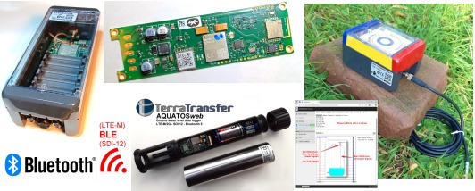

# LTX-Logger – Dokumentation

Technische Dokumentation für die LTX-Datenlogger-Serie (Typen 1500–3000) mit SDI-12-Unterstützung und optionaler Kommunikation über BLE, LTE, LTE-M, NB-IoT und LoRaWAN.

**Vollständige Dateiübersicht:** [editiert/ltx_docu_dateiliste.md](./editiert/ltx_docu_dateiliste.md)

---

## Wesentliche Dokumente im Überblick

| Dokument | Thema |
|---|---|
| [logger_Zusammenfassung.md](./editiert/ltx_typen/logger_Zusammenfassung.md) | Gerätetypen, Hardware, Funkoptionen |
| [LTX_T1720_LoRaWAN.MD](./editiert/ltx_typen/LTX_T1720_LoRaWAN.MD) | Datenblatt LTX Typ 1720 mit LoRaWAN |
| [blx_commands.md](./editiert/blx_dashboard/blx_commands.md) | BLX Dashboard – SysCommands, BLE-App |
| [LTX_Kommandos.md](./editiert/ltx_kommandos/LTX_Kommandos.md) | Alle Kommandos (BLE, UART, LoRa, Mobilfunk) |
| [ltx_parameter_referenz.md](./editiert/ltx_parameter/ltx_parameter_referenz.md) | Parameterdateien, Konfiguration |
| [ltx_fileformat_edt.md](./editiert/ltx_datenfiles/ltx_fileformat_edt.md) | EDT-Messdatenformat, Payload-Decoding |
| [ltx_lora_at_kommandos.md](./editiert/lora/ltx_lora_at_kommandos.md) | LoRaWAN-AT-Kommandos |
| [lora_payload.md](./editiert/lora/lora_payload.md) | LoRa-Payload, Uplink/Downlink |
| [energie_vergleich.md](./editiert/lora/energie_vergleich.md) | LoRa-Modul-Stromvergleich |
| [jesfs_zusammenfassung.md](./editiert/ltx_filesystem/jesfs_zusammenfassung.md) | JesFS-Dateisystem |
| [mobileErrors.md](./editiert/ltx_mobile/mobileErrors.md) | Mobilfunk-Fehlercodes |

---

## Anschliessbare Sensoren

Eine Übersicht mit Datenblättern zu unseren SDI-12-LowVoltage-Sensoren findet sich hier:
[Open-SDI12-Blue-Sensors](https://joembedded.de/x3/ltx_firmware/index.php?dir=./Open-SDI12-Blue-Sensors)

Es können zusätzlich alle anderen SDI-12-V1.3-kompatiblen Sensoren angeschlossen werden.

---

*Stand: Mai 2026 – V0.3*

